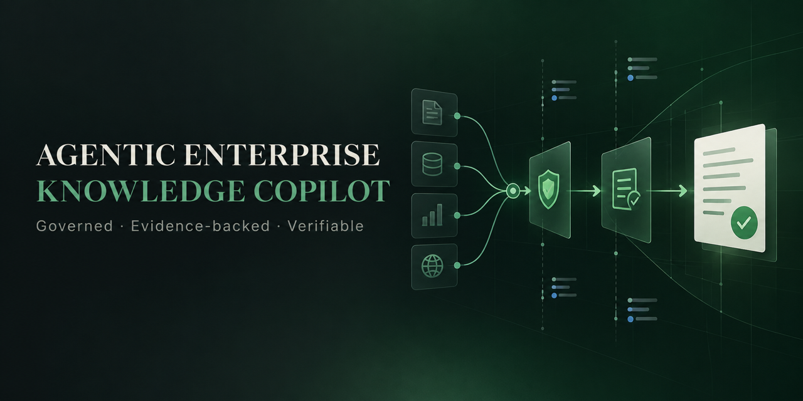
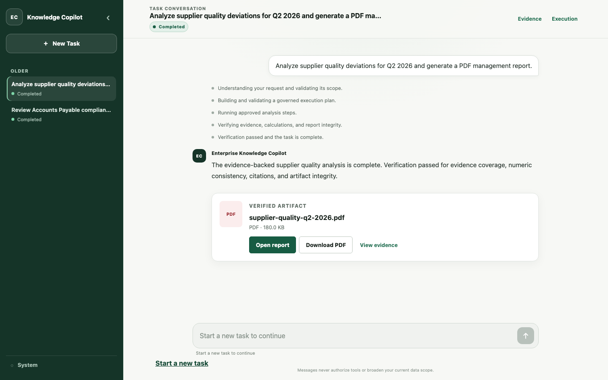
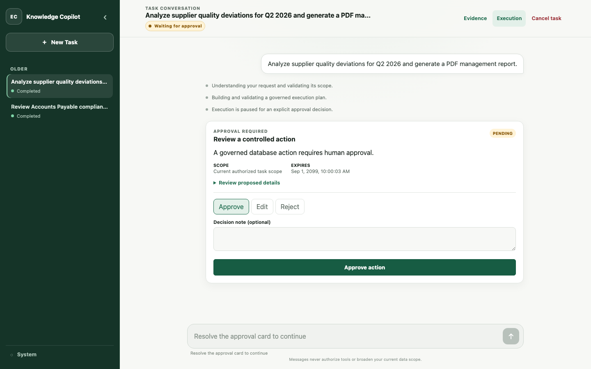
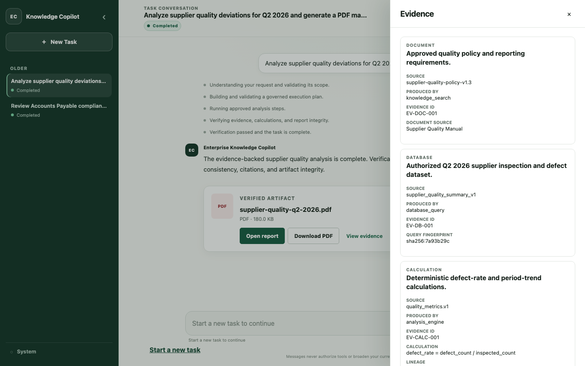
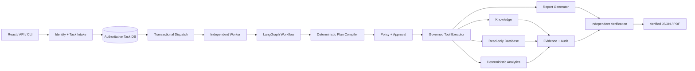

<p align="center">
  
</p>

<p align="center">
  <a href="https://www.python.org/"></a>
  <a href="https://fastapi.tiangolo.com/"></a>
  <a href="https://www.langchain.com/langgraph"></a>
  <a href="https://react.dev/"></a>
  <a href="https://www.postgresql.org/"></a>
  <a href="https://github.com/MaxLee1218/Agentic-Enterprise-Knowledge-Copilot/actions/workflows/ci.yml"></a>
</p>

<p align="center">
  <strong>A production-minded enterprise AI task-execution platform.</strong><br>
  It turns natural-language business requests into policy-checked, evidence-backed and independently verified JSON/PDF reports.
</p>

<p align="center">
  <a href="#product-tour"><strong>Product tour</strong></a> ·
  <a href="docs/assets/readme/product-tour.webm"><strong>Watch demo</strong></a> ·
  <a href="#architecture"><strong>Architecture</strong></a> ·
  <a href="#quick-start"><strong>Quick start</strong></a> ·
  <a href="docs/recruiter-overview.md"><strong>Recruiter overview</strong></a> ·
  <a href="docs/project-overview-zh.md"><strong>中文介绍</strong></a>
</p>

---

## Product tour

The interface presents one governed Task as one conversation: the user submits a business request,
the system clarifies missing scope, executes approved capabilities, exposes evidence and publishes
artifacts only after verification.

<p align="center">
  
</p>

<table>
  <tr>
    <td width="50%">
      
      <br><strong>Human approval</strong><br>
      Sensitive operations suspend durably and resume only from an explicit, scope-bound decision.
    </td>
    <td width="50%">
      
      <br><strong>Evidence lineage</strong><br>
      Documents, query fingerprints, deterministic formulas and upstream evidence remain inspectable.
    </td>
  </tr>
</table>

## The 30-second overview

Agentic Enterprise Knowledge Copilot is not a generic chatbot and does not hide a multi-step task
inside one model response. It uses typed contracts, deterministic validation and one governed
execution path to:

1. understand and constrain an enterprise request;
2. compile a bounded executable plan;
3. enforce identity, tenant, data, policy and approval rules;
4. run allowlisted knowledge, database, analytics and reporting tools;
5. record evidence, audit lineage and artifact integrity metadata; and
6. verify important claims and calculations before returning a result.

The repository contains two executable, read-only vertical slices:

- **Supplier Quality Analysis** — quarterly defect counts, inspection volume, defect rates and
  period-over-period trends.
- **Accounts Payable Investigation** — invoice compliance and six deterministic exception types
  inside an authorized finance scope.

The local and synthetic vertical slices are implemented. The repository deliberately does not
claim that production IAM, enterprise data ownership, capacity validation or disaster recovery are
provided out of the box.

## Why this is more than a RAG demo

| Typical RAG demo | This project |
|---|---|
| Produces a conversational answer | Completes a durable, inspectable business Task |
| Lets model output drive tool calls | Compiles untrusted proposals into a validated canonical plan |
| Treats retrieval text as sufficient grounding | Preserves document, database and calculation evidence separately |
| Checks permissions around the API | Reauthorizes every capability attempt inside the Tool Executor |
| Runs in the request process | Uses transactional dispatch, an independent Worker, leases and fencing |
| Treats generation as completion | Requires independent evidence, numeric, citation and artifact verification |
| Optimizes for broad autonomy | Uses bounded retries, bounded replanning and safe suspension |

## Engineering proof

| Signal | Current repository evidence |
|---|---|
| Business coverage | 2 end-to-end governed workflows |
| Backend tests | 696 test functions across unit, integration, contract, smoke and security suites |
| Architecture discipline | 23 documented Architecture Decision Records |
| Full-stack quality | Python, PostgreSQL and real-browser frontend CI jobs |
| Recovery model | Transactional dispatch, at-least-once delivery, leases, heartbeats and fencing |
| Interoperability | MCP `2025-11-25` is a frozen future Phase 5 boundary, not a current product capability |
| Artifacts | Deterministic JSON/PDF reports with SHA-256 integrity metadata |

The numbers above describe repository evidence, not production performance. See
[Evaluation](docs/evaluation.md), the [CI workflow](.github/workflows/ci.yml) and the committed
[evaluation baselines](evaluation/baselines/) for reproducible details.

## Architecture



Four boundaries are central to the design:

- **Task authority:** the Task database—not the queue, Worker memory or checkpoint—is authoritative.
- **Execution authority:** tools are reachable only through the Registry and Executor, which apply
  policy and approval before adapter execution.
- **Data authority:** Copilot persistence and the enterprise business database are separate trust
  boundaries; analytical access is read-only and template-based.
- **Reporting authority:** a generated report is only a candidate until evidence, numeric,
  citation, safety and file-integrity verification pass.

Detailed design:

- [Architecture rules](docs/architecture.md)
- [Asynchronous runtime architecture](docs/async-runtime-architecture.md)
- [Task lifecycle](docs/task-lifecycle.md)
- [Evidence and verification](docs/evidence-and-verification.md)
- [Security model](docs/security-model.md)
- [Architecture Decision Records](docs/adr/README.md)

## How one request becomes a verified report

```text
Natural-language request
  -> trusted identity and scope
  -> task understanding / bounded clarification
  -> proposed plan
  -> deterministic plan compilation and validation
  -> policy and approval
  -> governed tool execution
  -> evidence aggregation
  -> deterministic report generation
  -> independent verification
  -> durable result and JSON/PDF artifact
```

For an inspectable walkthrough, see the
[Supplier Quality design walkthrough](docs/design/walkthrough.md) or the
[Accounts Payable architecture](docs/use-cases/accounts-payable/architecture.md).

## Supported workflows

### Supplier Quality Analysis

**Input:** an authorized supplier scope plus an explicit year and quarter.<br>
**Execution:** approved policy retrieval, registered read-only queries and deterministic quality
metrics.<br>
**Output:** an internal JSON or PDF report with defect counts, inspection counts, defect rates,
period trends, citations and evidence references.

It does not infer causes, execute corrective actions or change supplier status.

### Accounts Payable Investigation

**Input:** an authorized legal-entity scope and bounded invoice-date range.<br>
**Execution:** controlled policy snapshots, five allowlisted read models and seven deterministic
analytics operations.<br>
**Output:** a JSON or PDF report covering supported duplicates, PO variance, missing PO, late or
materially early payment, and overpayment cases.

The local/synthetic vertical slice is implemented; formal production readiness remains **NOT
READY** until the deployment gates in the
[readiness review](docs/use-cases/accounts-payable/stage-12-production-readiness-review.md) pass.

## Project ownership

I designed and implemented this repository end to end as a portfolio project. The work covers:

- contract-first backend architecture and LangGraph orchestration;
- deterministic plan compilation, governed tool execution and human approval;
- PostgreSQL persistence, asynchronous dispatch, Worker recovery and fencing;
- evidence, audit, verification and deterministic report generation;
- React/TypeScript task workspace and real-browser E2E coverage; and
- security regression, evaluation baselines, CI gates and operational documentation.

The most important design choice was to keep probabilistic model reasoning inside deterministic
control boundaries. The model may interpret and propose; code owns authorization, validation,
calculation, state transitions and completion.

For a two-minute portfolio summary and suggested interview route, see
[Recruiter and interviewer overview](docs/recruiter-overview.md). For a reproducible presentation
sequence, see the [Interview demo guide](docs/interview-demo.md).

## Technology stack

| Layer | Technology |
|---|---|
| API and CLI | FastAPI, Pydantic, Typer |
| Agent runtime | LangGraph, structured model adapters |
| Persistence | SQLAlchemy, Alembic, PostgreSQL 16, SQLite for controlled tests |
| Frontend | React 19, TypeScript, TanStack Query, Vite |
| Browser testing | Playwright, Vitest, Testing Library, MSW |
| Reporting | Deterministic JSON and ReportLab PDF renderers |
| Future interoperability | MCP `2025-11-25` contracts and approved package boundaries |
| Quality | Ruff, Mypy, Pytest, evaluation regression gates, GitHub Actions |

## Quick start

### Prerequisites

- Python 3.11 or later
- PostgreSQL 16 for the asynchronous service runtime
- Node.js 22 for frontend development
- Docker Engine with Compose v2 for the full local topology

### Fastest offline verification

```bash
python3.11 -m venv .venv
source .venv/bin/activate
python -m pip install --upgrade pip
python -m pip install -e '.[dev]'
python scripts/smoke_agent.py
```

This path uses deterministic local adapters and requires no production service or credentials.

### Run the frontend

```bash
cd frontend
npm ci
npm run dev
```

The development UI runs at [http://127.0.0.1:5173](http://127.0.0.1:5173). Follow
[Local Enterprise E2E](docs/local-enterprise-e2e.md) to connect the complete browser-to-artifact
topology.

<details>
<summary><strong>Full Docker Compose environment</strong></summary>

The full development topology expects an approved or locally built independent Enterprise RAG
image:

```bash
export RAG_IMAGE=enterprise-rag-engine:local
cp .env.example .env
docker compose config
docker compose build
docker compose up -d
docker compose ps
curl --fail http://127.0.0.1:8000/health/ready
```

Stop the stack without deleting named volumes:

```bash
docker compose down
```

</details>

<details>
<summary><strong>Submit and inspect a Task through the API</strong></summary>

```bash
curl -X POST http://127.0.0.1:8000/v1/tasks \
  -H 'Content-Type: application/json' \
  -H 'Idempotency-Key: supplier-quality-q2-2026' \
  -d '{
    "task": "Analyze Q2 2026 supplier quality deviations and generate a JSON report."
  }'
```

The API returns `202 Accepted`. Use the returned identifiers to inspect state, steps, evidence and
artifacts:

```bash
curl http://127.0.0.1:8000/v1/tasks/TASK_ID
curl http://127.0.0.1:8000/v1/tasks/TASK_ID/steps
curl http://127.0.0.1:8000/v1/tasks/TASK_ID/evidence
curl http://127.0.0.1:8000/v1/tasks/TASK_ID/artifacts
```

See the [HTTP API guide](docs/api.md) for clarification, approval, cancellation and stable error
contracts.

</details>

## Quality gates

```bash
ruff check .
ruff format --check .
mypy
pytest tests/unit
pytest tests/integration tests/contract tests/smoke
pytest tests/security
python scripts/check_docs.py
python scripts/check_architecture.py
python -m build
```

The CI workflow additionally runs frontend unit and real-browser E2E tests, PostgreSQL migration
and persistence tests, recovery/restore checks, protocol-boundary safety checks and deterministic evaluation
regression suites.

README screenshots are reproducible against the real React application with deterministic API
fixtures:

```bash
cd frontend
npm run dev -- --host 127.0.0.1 --port 4173
npm run readme:screenshots
```

## Repository map

```text
src/copilot/
├── api/              FastAPI transport and stable error mapping
├── agent/            LangGraph state, routing and nodes
├── contracts/        Typed, provider-neutral boundaries
├── evidence/         Evidence lineage and verification inputs
├── mcp/              Optional governed interoperability boundary
├── persistence/      Task, dispatch, checkpoint, audit and artifact state
├── policies/         Permissions, data scope, risk and approvals
├── services/         Application orchestration and workflow control
├── tools/            Governed capability adapters
└── worker/           Independent queue Worker runtime

frontend/             React/TypeScript task workspace
tests/                Unit, integration, contract, smoke and security suites
evaluation/           Versioned datasets, evaluators, baselines and reports
docs/                 Architecture, operations, security and use-case design
```

## Current boundaries

- No arbitrary SQL or Python execution.
- No business-database writes, payment execution, CAPA execution or external publication.
- No bundled enterprise IAM/SSO, secret manager, object store or complete HA/DR platform.
- No claim of distributed exactly-once execution or forced interruption of an in-flight external
  call.
- MCP remains a future Phase 5 extension. Its scaffold and contracts do not constitute a current
  user-facing capability.
- Synthetic and local evaluation results are not evidence of live enterprise-data or production
  load quality.

These are intentional boundaries, not hidden omissions. See [Deployment](docs/deployment.md),
[Operations](docs/operations.md) and [Troubleshooting](docs/troubleshooting.md) before operating the
system outside a controlled local environment.

## Roadmap

- Validate the complete workflow against production-owned identity, policy, RAG and business-data
  boundaries.
- Add shared artifact storage, centralized telemetry, capacity evidence and formal recovery drills.
- Expand business coverage only through versioned contracts, policy review and evaluation gates.
- Productize approved MCP connections without broadening Planner authority or bypassing governance.

## Documentation

| Start here | Document |
|---|---|
| Recruiter / interviewer | [Portfolio overview](docs/recruiter-overview.md) |
| Chinese introduction | [项目通俗导览](docs/project-overview-zh.md) |
| Architecture | [Architecture rules](docs/architecture.md) |
| API | [HTTP API](docs/api.md) |
| Security | [Security model](docs/security-model.md) |
| Evaluation | [Evaluation framework](docs/evaluation.md) |
| Operations | [Operations guide](docs/operations.md) |
| Decisions | [ADR index](docs/adr/README.md) |

## License

Copyright © 2026 MaxLee1218. All rights reserved. No open-source license is granted; see
[LICENSE](LICENSE) for the repository terms.
