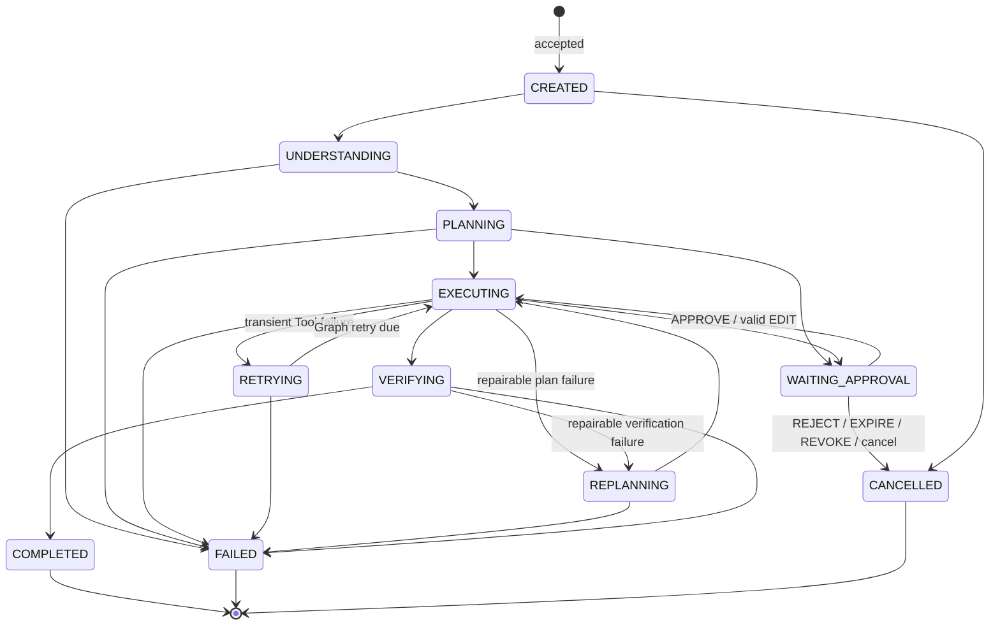
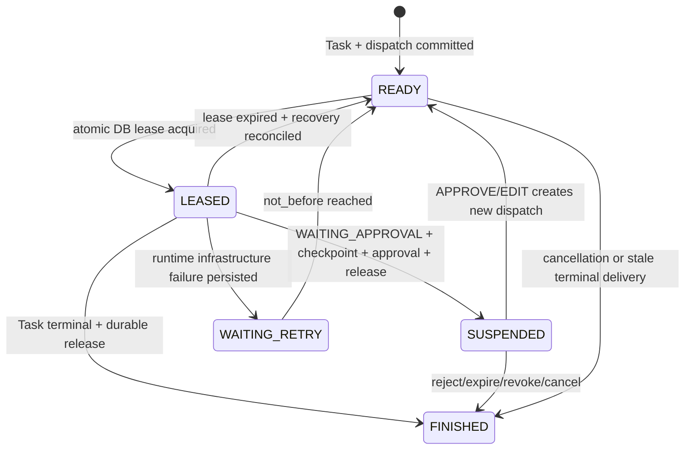
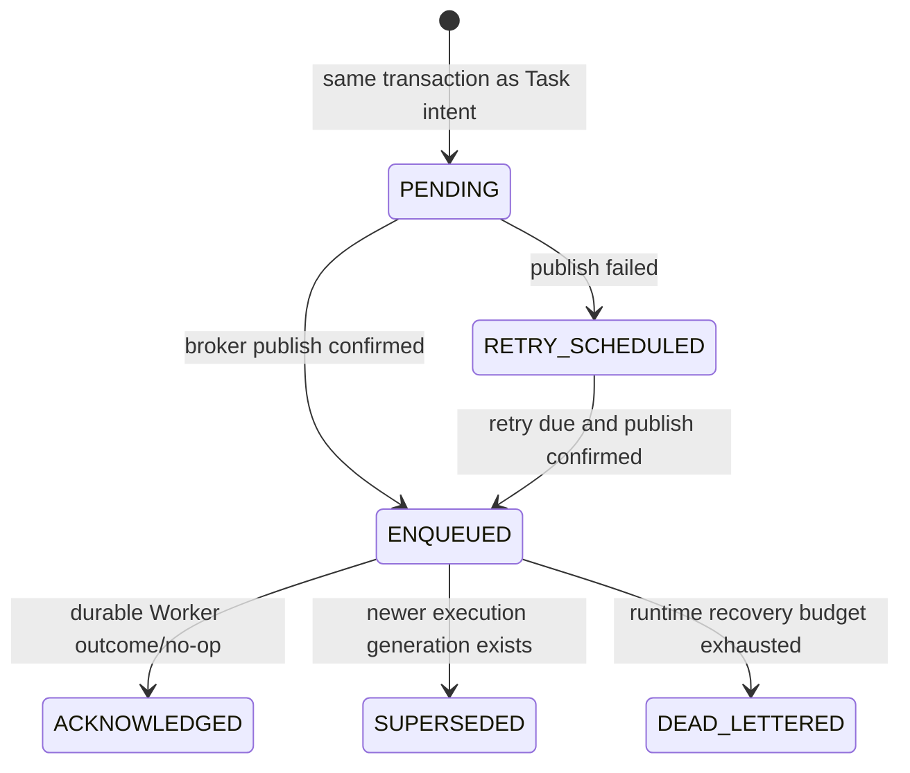
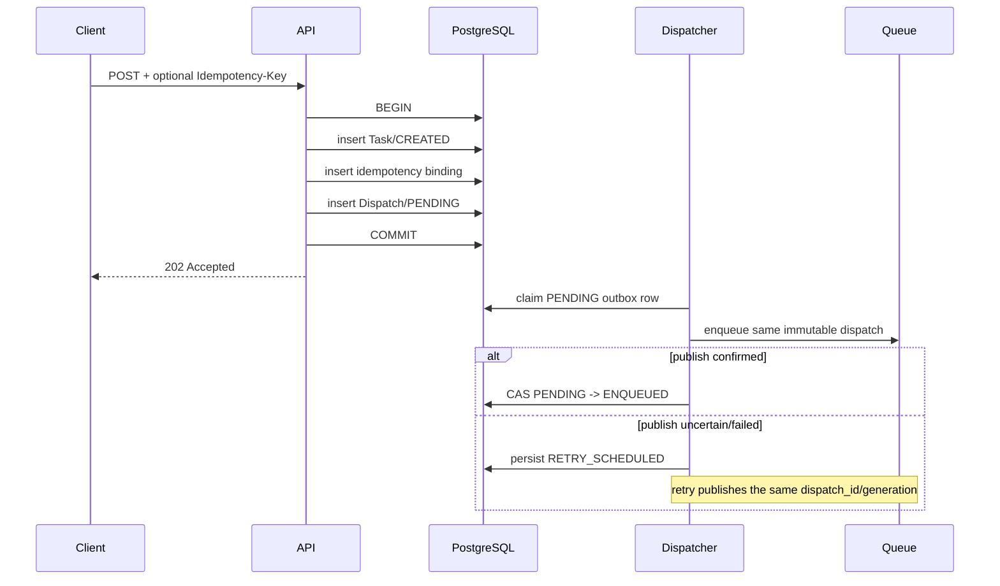
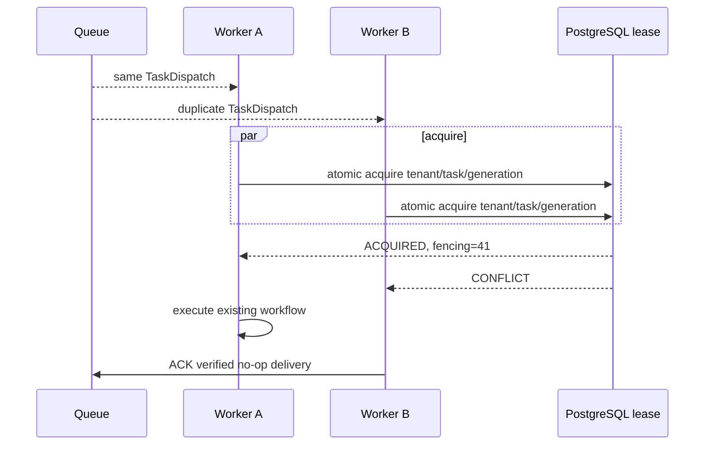

# Async Task Runtime Architecture and Contract Freeze

**Decision date:** 2026-08-25  
**Scope:** architecture, contracts, ports, schema proposal, invariants, and rollout gates  
**Implementation status:** contract freeze only; no broker, dispatcher daemon, worker daemon, or API cutover

This document is the implementation authority for the future asynchronous runtime layer. It does
not change the frozen Supplier Quality v1.1 or Accounts Payable v1 business state machines. When a
business-domain document and this runtime document address different concerns, both apply. If a
future implementation would change a frozen business contract, the domain design-change process
must complete first.

## 1. Goals

The runtime must let an API accept durable work quickly and let replaceable workers execute or
resume it without making a queue, worker process, or LangGraph checkpoint authoritative. It
freezes:

- `202 Accepted` submission semantics;
- minimal at-least-once queue delivery;
- transactional dispatch/outbox behavior;
- worker ownership and reuse of the existing application service and LangGraph;
- atomic execution leases, heartbeat, expiry, takeover, and monotonic fencing;
- approval suspension without a resident worker;
- durable cancellation plus cooperative acceleration and late-result suppression;
- Task-DB-first checkpoint reconciliation and automatic crash recovery decisions;
- distinct runtime and Graph/Tool retry owners;
- submission, dispatch, step, finalization, and Artifact idempotency;
- tenant isolation, observability, backpressure boundaries, tests, and rollout gates.

The defining correctness equation is:

```text
execution authority
  = authoritative Task DB state
  + current execution generation
  + unexpired database lease
  + current fencing token
  + idempotent fenced commit
```

Queue receipt, queue ACK, worker memory, and checkpoint presence are not terms in that equation.

## 2. Non-goals

This stage does not implement or deploy Redis, Celery, RQ, Kafka, RabbitMQ, SQS, a real queue
adapter, a dispatcher loop, a worker daemon, background threads, Kubernetes, cloud infrastructure,
autoscaling, scheduled monitoring, Multi-Agent execution, write tools, external report delivery,
or distributed exactly-once side effects. It does not switch `POST /v1/tasks`, change the current
frontend, or add a production migration.

## 3. Current state audit

### 3.1 Current `POST /v1/tasks`

The implemented call path is synchronous in the request thread:

```text
FastAPI POST /v1/tasks
  -> NaturalLanguageTaskService.prepare
  -> immutable TaskRequest + TrustedTaskContext
  -> LangGraphWorkflowEngine.submit
  -> WorkflowRepository.initialize(TaskRequest, CREATED)
  -> TASK_SUBMITTED audit
  -> acquire current workflow lease
  -> LangGraph invoke in the HTTP request thread
  -> understanding -> planning -> policy -> tools -> evidence
  -> report Artifact -> verification -> terminal TaskResult
  -> release lease
  -> HTTP response
```

Ordinary terminal workflows return `201 Created` with the existing API
`TaskSubmissionResponse`, including final status, summary, errors, and Artifacts. A durably
checkpointed `WAITING_APPROVAL` interruption returns `202 Accepted` with the pending approval ID.
The current `202` therefore means approval suspension, not background execution.

The Task row is first persisted as `CREATED`, with no Contract or Plan, immediately before graph
execution. Understanding later persists the Contract and planning persists the Plan. LangGraph
writes its first checkpoint during graph invocation and continues checkpointing node transitions;
there is a real crash window after Task persistence and before the first checkpoint.

The workflow lease is acquired after Task initialization and submission audit and before
`graph.invoke`. The HTTP process and request thread are the graph execution host until a terminal
result or interruption is returned.

### 3.2 Current execution lease

The existing mechanism is `workflow_leases`, accessed through
`WorkflowRepository.acquire_execution` and `release_execution`. It protects prepared starts,
natural-language starts, ordinary `engine.resume`, and approval resume. It is not a Queue claim.

Current persisted fields are `tenant_id`, `task_id`, `owner_id`, and `expires_at`. `task_id` is the
table primary key; the Task table also has a tenant/task unique identity and repository calls
always require tenant plus task. Acquisition checks that the Task exists and has no TaskResult,
deletes expired lease rows, and inserts a new row in one database transaction. The primary-key
constraint makes concurrent inserts single-winner. Release deletes only the matching
tenant/task/owner row. The in-memory mode uses `RLock` only for local tests; it is not a distributed
correctness mechanism.

The current lease expires after a hard-coded ten minutes. It has no lease ID distinct from owner,
no renew operation, heartbeat timestamp, dispatch binding, execution generation, task-version
binding, or fencing token. A late owner can therefore be stopped by TaskState compare-and-swap in
some paths, but stale-worker rejection is not uniformly enforced on every authoritative mutation.
The future design extends this table; it does not add a second lease system.

### 3.3 Current checkpoint

Local/test deployments use `SqliteSaver`; PostgreSQL deployments use the official synchronous
PostgreSQL saver. The tenant-qualified LangGraph `thread_id` is exactly
`{tenant_id}:{task_id}`. Checkpoints contain the bounded `AgentGraphState`: trusted intake and
request references, Contract/Plan and domain-state snapshots, node position, normalized execution
results and counters, Evidence identifiers, approval binding, and Artifact metadata needed for
continuation. Raw Evidence content, Artifact bytes, credentials, and unrestricted source payloads
are not the checkpoint authority.

LangGraph saves at graph/node boundaries. Existing workflow code also persists authoritative
domain transitions and tool/step/final results separately. On ordinary or approval resume, the
engine loads the tenant/task checkpoint, compares its `domain_state` for exact equality with the
repository `TaskState`, validates plan/approval/target bindings, and fails with
`WorkflowRecoveryError` on disagreement. The relational Task DB is already authoritative;
checkpoint content cannot overwrite it.

### 3.4 Current cancellation

`POST /v1/tasks/{task_id}/cancel` authorizes the caller, signals all currently registered
in-process invocation tokens for that Task, compare-and-swaps the Task to `CANCELLED`, revokes
pending approvals, writes a terminal `TaskResult` if absent, and appends audit events. The durable
facts today are `TaskState=CANCELLED`, the TaskResult, approval resolution, and audit; there is no
separate `cancellation_requested_at` column or durable worker-poll record.

The in-process `CancellationToken` is truthful and cooperative. Analytics checks safe points.
Knowledge HTTP, Database, and Report calls are non-cancellable at the Python-thread boundary. If
cancellation wins before such a call returns, `ToolExecutor` discards the late result, produces no
Evidence, and reports cancellation only after the underlying call returns. Terminal-state and
compare-and-swap protection prevent TaskResult publication from overwriting `CANCELLED`.

Current graph nodes do not poll durable cancellation on the complete future worker boundary list;
the API signal accelerates only work in the same process. The asynchronous target closes this gap
by reloading Task DB state at heartbeat, node, invocation, commit, and publication boundaries.

Repeated cancellation on `CANCELLED` returns the current Task. `COMPLETED` and `FAILED` return the
stable HTTP 409 `TASK_NOT_CANCELLABLE` response and never mutate the terminal result. This is the
retained idempotent effect contract.

### 3.5 Current recovery

Approval recovery and ordinary crash recovery are different capabilities:

- Approval resolution is implemented. It atomically resolves one approval, validates tenant,
  role, task status, plan, step, schema, fingerprint, and checkpoint, then synchronously invokes
  `resume_approval` in the approval HTTP request. The prior execution lease was released when the
  workflow entered `WAITING_APPROVAL`.
- Ordinary `engine.resume(task_id, tenant_id)` is an internal/test recovery primitive. It acquires
  the same workflow lease, reconciles TaskState and checkpoint, and continues without replaying
  successful nodes.
- There is no startup sweeper, background recovery scanner, queue redelivery path, automatic
  expired-execution takeover, or poison-task dead-letter accounting.

No current behavior may be described as deployed automatic crash recovery.

### 3.6 Current retry ownership risk

The Graph owns bounded Tool attempts through `WorkflowRetryPolicy` and the frozen step
`RetryPolicy`. The HTTP Knowledge client also has its own bounded transport retry loop. In the
current composition these layers can multiply requests. The asynchronous target makes the Graph
the sole owner of business Tool retry; a task-execution adapter performs one external request per
ToolCall, or reports every inner transport attempt against the same persisted Graph attempt budget.
No Queue or Worker retry may rerun a business failure.

## 4. Architecture

```text
Client
  -> API: authenticate, validate, persist Task + dispatch in one transaction
  -> 202 Accepted

Transactional outbox dispatcher
  -> publish minimal TaskDispatch
  -> at-least-once Queue

Worker runtime host
  -> reload authoritative Task and trusted context
  -> reconcile dispatch/generation/status/cancellation/checkpoint
  -> atomically acquire database lease and fencing token
  -> existing NaturalLanguageTaskService / LangGraph / Registry / Executor
  -> fenced authoritative commits
  -> release lease
  -> ACK only after a durable outcome
```

The API owns acceptance, validation, atomic persistence, and scheduling intent. A Worker owns
loading, claiming, executing or resuming, heartbeat, persistence, and safe delivery disposition.
The Worker is a runtime host; it does not duplicate planning, policy, approval, tool, evidence,
audit, Artifact, or verification logic.

### A. Normal asynchronous execution

```mermaid
sequenceDiagram
  participant C as Client
  participant A as API
  participant P as PostgreSQL
  participant Q as Queue
  participant W as Worker
  participant L as Lease Repository
  participant G as LangGraph
  participant T as Tools
  C->>A: POST /v1/tasks
  A->>P: BEGIN; Task(CREATED) + Dispatch(PENDING); COMMIT
  A-->>C: 202 TaskSubmissionResponse
  P-->>Q: Dispatcher publishes minimal TaskDispatch
  Q-->>W: at-least-once delivery
  W->>P: reload Task + trusted authorization facts
  W->>L: atomic try_acquire_lease
  L-->>W: lease + fencing token
  W->>G: execute/resume existing workflow
  G->>T: Registry -> Policy/Approval -> Executor
  T-->>G: ToolResult/Evidence drafts
  G->>P: fenced state/step/result/Artifact publication commits
  W->>L: release exact lease
  W->>Q: ACK durable terminal/suspended/no-op outcome
```

## 5. Task submission contract

After the Stage E migration, every successfully persisted asynchronous task returns:

```http
HTTP/1.1 202 Accepted
```

The frozen `copilot.contracts.async_runtime.TaskSubmissionResponse` contains:

| Field | Decision |
|---|---|
| `task_id` | durable Task identity |
| `trace_id` | end-to-end correlation identity |
| `task_status` | exactly `CREATED` at acceptance |
| `runtime_status` | exactly `READY` at acceptance |
| `accepted_at` | UTC commit time |
| `status_url` | `/v1/tasks/{task_id}` |
| `artifacts_url` | `/v1/tasks/{task_id}/artifacts`; no storage location |

The response contains no final result, Artifact metadata, approval ID, queue receipt, worker ID,
lease, checkpoint, or storage path. `GET /v1/tasks/{task_id}` is the authoritative read API.

`Idempotency-Key` is scoped by `(tenant_id, authenticated caller identity, key)`. The persisted
record binds that scope to the canonical validated submission fingerprint. Same key and same
fingerprint returns the original accepted Task identity and original acceptance response. Same key
and a different fingerprint returns HTTP 409. Missing key creates a new Task. A text hash alone is
not an idempotency key.

## 6. Runtime state model

### 6.1 Business Task state machine

The frozen `TaskStatus` set remains unchanged:



### 6.2 Runtime and dispatch state machine

`RuntimeStatus` is not user/business truth. It expresses hosting readiness and is derived from
authoritative runtime rows:



The dispatch/outbox lifecycle is independent:



`LEASED` does not mean a broker message is claimed. A broker claim without a database lease is a
no-op execution attempt.

## 7. Queue contract

The Queue stores a minimal immutable `TaskDispatch`, never the full Task. Its schema is:

```text
schema_version = task-dispatch.v1
tenant_id
task_id
trace_id
dispatch_id
execution_generation
predecessor_execution_generation  # approval resume only; immediately prior generation
resume_checkpoint_id              # approval resume only; exact durable checkpoint binding
expected_task_version
enqueued_at              # durable enqueue-intent timestamp
not_before
```

`expected_task_version` lets a Worker reject a stale message before execution. `not_before`
supports runtime delivery delay without embedding broker types. Priority is excluded from v1
because no approved fairness policy exists. Full TaskState, Contract/Plan, Evidence, Approval,
credentials, business rows, prompts, Artifact bytes, roles, scopes, or authorization claims are
forbidden. Unknown fields are rejected by the contract.

Delivery is at least once. Duplicate, delayed, stale, and redelivered messages are normal. The
Queue port supplies `enqueue`, bounded `receive`, `ack`, and `nack`; it uses the opaque
`QueueDelivery.delivery_id`, not a provider SDK type.

ACK is allowed only after one of these durable outcomes:

1. Task reached a terminal state and release/finalization committed;
2. Task reached `WAITING_APPROVAL`, approval/checkpoint persisted, and lease released;
3. runtime retry and its replacement dispatch committed;
4. the message was authoritatively stale, cancelled, terminal, or lost the lease race and was a
   verified no-op.

ACK is not Task completion. A process crash before ACK causes harmless redelivery.

## 8. Dispatch and transactional outbox

The Task row, initial `CREATED` state, submission-idempotency binding, and initial
`task_dispatches(PENDING)` row commit in the same PostgreSQL transaction. The API never uses
`save_task(); queue.publish()` as the correctness boundary.

### F. Task creation and outbox



If the API dies before commit, neither Task nor dispatch exists. If it dies after commit, the
dispatcher finds the PENDING record. If publish succeeds but marking ENQUEUED fails, the same
dispatch may be published again; at-least-once delivery plus lease and idempotency absorb it.

An execution generation identifies one durable execution intent. Initial submission is generation
1. A valid approval resume creates the next generation and binds it to the immediately preceding
checkpoint with `predecessor_execution_generation` plus `resume_checkpoint_id`; creation and
supersession are one transaction. Queue republish, crash takeover, and due runtime retry preserve
the existing dispatch ID and generation because they continue the same execution intent. A
unique tenant/task/generation constraint prevents unbounded active dispatch creation. Takeover
freshness comes from a higher fencing token, not an invented generation.

## 9. Worker execution model

A Worker performs exactly this orchestration:

1. receive a minimal delivery;
2. reload Task, dispatch, trusted caller/task context, cancellation, current plan, approval, and
   checkpoint identities from authoritative stores using tenant plus task;
3. reject terminal, cancelled, stale-version, stale-generation, cross-tenant, suspended, or
   not-yet-due work;
4. atomically acquire the database lease;
5. reconcile checkpoint and durable successful-step set;
6. invoke the existing NaturalLanguageTaskService/LangGraph path;
7. heartbeat and recheck cancellation at all required safe boundaries;
8. attach generation and fencing token to every authoritative mutation;
9. persist a terminal, suspended, retry, or fail-closed outcome;
10. release the exact lease and ACK/NACK according to the durable result.

The Worker must not call a tool adapter, database, RAG client, renderer, or MCP capability
directly. Queue payload roles, scopes, approval claims, and tenant claims are transport data only;
authorization is rebuilt from durable trusted state.

## 10. Lease, heartbeat, and fencing

The future `ExecutionLease` extends `workflow_leases` with:

```text
tenant_id, task_id, dispatch_id, execution_generation, task_version,
worker_id, lease_id, fencing_token, acquired_at, heartbeat_at, expires_at
```

`try_acquire_lease` is one atomic conditional database operation. It succeeds only when the Task
is nonterminal, not cancelled, the dispatch/generation/version is current, and no lease exists
with `expires_at > database_now`. Competing Workers produce one winner. Acquisition after expiry
increments a task-scoped monotonic fencing counter and returns the new token. Reentrant acquisition
does not create a second lease.

Initial operational defaults are:

| Setting | Default | Validation |
|---|---:|---|
| heartbeat interval | 15 seconds | integer 1..300 |
| lease TTL | 60 seconds | integer 5..900; at least three heartbeat intervals |
| takeover eligibility | `database_now >= expires_at` | never before expiry |

Both settings are typed configuration, not business rules. Database time determines expiry. A
heartbeat renews only the exact `(tenant, task, lease_id, worker_id, generation, fencing_token)`
lease. A stale heartbeat or release fails safely and cannot change the replacement lease.

Every TaskState, step-success, TaskResult, dispatch, approval-resume, and Artifact-publication
mutation checks the current execution generation and fencing token in the same transaction as the
mutation. The old Worker may finish local work, but its commit is rejected.

### B. Duplicate delivery



### C. Worker crash and takeover

```mermaid
sequenceDiagram
  participant A as Worker A
  participant P as PostgreSQL
  participant R as Recovery Coordinator
  participant B as Worker B
  participant G as LangGraph checkpoint
  A->>P: acquire lease, fencing=41
  A->>P: heartbeat
  A-xP: process crashes; heartbeat stops
  R->>P: scan before expires_at
  P-->>R: active lease; WAIT
  R->>P: scan at/after expires_at
  P-->>R: recovery eligible
  R->>P: make same dispatch/generation recoverable
  B->>P: acquire replacement lease, fencing=42
  B->>G: load and reconcile checkpoint
  B->>P: resume; fenced commits use 42
  A-->>P: late commit with fencing=41
  P-->>A: STALE_FENCING_TOKEN
```

## 11. Approval suspension and resume

`WAITING_APPROVAL` never occupies a Worker, process thread, Queue visibility timeout, or execution
lease.

### D. `WAITING_APPROVAL`

```mermaid
sequenceDiagram
  participant W as Worker
  participant G as LangGraph
  participant P as PostgreSQL
  participant Q as Queue
  participant A as Approval API
  W->>G: execute until approval gate
  G->>P: transaction: approval + checkpoint + WAITING_APPROVAL
  W->>P: release exact lease
  W->>Q: ACK current dispatch
  Note over W: Worker is free
  A->>P: CAS resolve APPROVE or valid EDIT
  A->>P: validate tenant/role/scope/status/checkpoint
  A->>P: transaction: next generation + prior checkpoint binding + PENDING dispatch
  P-->>Q: dispatcher enqueues resume
  Q-->>W: new dispatch
  W->>P: acquire new lease/fencing token
  W->>G: resume checkpoint; skip durable-success steps
```

`APPROVE` and valid `EDIT` create a new dispatch only after the immutable approval resolution,
current Task state, target not executed, plan, schema, action fingerprint, and checkpoint all
match. `REJECT`, `EXPIRED`, and `REVOKED` preserve existing `CANCELLED` semantics and create no
executable dispatch.

## 12. Cancellation

Cancellation correctness is durable. The cancellation request record and authoritative Task
transition to `CANCELLED` commit atomically. The request records tenant, task, stable request ID,
authenticated requester, UTC time, and safe reason code. Approval revocation and terminal
TaskResult follow the same current state-machine semantics.

An in-process token, process signal, or future pub/sub wake-up is optional acceleration. Even if
every acceleration signal is lost, the Worker reloads durable cancellation/terminal state:

- at lease heartbeat;
- at every graph node boundary;
- before and after each Tool invocation;
- before state, step, or TaskResult commit;
- before Artifact commit and publication;
- before dispatch ACK.

Cancellation means “stop further controlled execution and prevent stale result publication.” It
does not promise immediate thread or process termination. Non-cancellable external I/O may finish;
its result is discarded and cannot commit Evidence, Artifact publication, or TaskResult.

| Task condition | Frozen cancellation behavior |
|---|---|
| READY/queued | persist `CANCELLED`; later message reloads terminal state and ACKs no-op |
| EXECUTING | durable cancel wins; Worker stops at next safe boundary; late commits fail |
| WAITING_APPROVAL | revoke pending approval, create no resume dispatch, finalize `CANCELLED` |
| already CANCELLED | return current Task; no new effect |
| COMPLETED/FAILED | stable 409 `TASK_NOT_CANCELLABLE`; no mutation |

### E. Durable cancellation and cooperative stop

```mermaid
sequenceDiagram
  participant C as Client
  participant A as API
  participant P as PostgreSQL
  participant W as Worker
  participant T as Non-cancellable Tool
  C->>A: POST /tasks/{id}/cancel
  A->>P: transaction: cancellation + CANCELLED + approval revoke
  A-->>C: authoritative CANCELLED Task
  A-->>W: best-effort cooperative signal
  W->>P: boundary poll / heartbeat
  P-->>W: Task is CANCELLED
  T-->>W: possible late underlying result
  W->>P: attempted fenced publication
  P-->>W: TASK_ALREADY_TERMINAL; discard
```

## 13. Retry ownership

Runtime recovery and Graph/Tool retry are disjoint. Runtime retry knows delivery and process
health; it cannot interpret RAG, SQL, analytics, report, policy, or verification meaning.

| Layer | Sole responsibility | Budget and persistence | Explicitly forbidden |
|---|---|---|---|
| submission client | retry transport submission only with same Idempotency-Key | caller policy; server idempotency row | creating multiple logical Tasks |
| API | no execution retry | request validation only | running Graph after async cutover |
| outbox dispatcher | publish same dispatch after broker failure/uncertainty | persisted dispatch attempt/backoff | creating new business attempts |
| Queue | visibility/redelivery for delivery or Worker loss | provider policy mapped to same dispatch | interpreting Task/Tool errors |
| Worker host | one claim/reconcile/execute disposition per delivery | no independent business loop | wrapping the Graph in an extra retry loop |
| runtime recovery | expired lease, crashed process, due runtime retry | default max 3 recoveries; persistent count; 5/10/20-second bounded exponential schedule | retrying business failures |
| Graph/Tool | transient, recoverable, idempotent Tool failures | frozen per-step attempts: Knowledge/DB 3 total, Analytics/Report 2 total; persisted ToolResults | retrying permission, validation, or business results |
| HTTP/DB adapter | one transport attempt per persisted Tool attempt in target runtime | errors normalized to Graph owner | hidden multiplicative retries |
| LLM planning | existing separately bounded provider/repair/replan policy | persisted Graph counters | Queue-based replanning |

The existing Knowledge client inner retry is a migration risk: before Stage E, task-execution
composition must set it to one request or charge its attempts to the single persisted Tool budget.

## 14. Checkpoint authority

The Copilot PostgreSQL Task DB wins every disagreement. It owns externally visible TaskStatus,
tenant, TaskState version, current Contract and plan version, approval and cancellation, dispatch,
execution lease, durable successful steps, final TaskResult, and published Artifact references.

LangGraph checkpoint owns only workflow continuation position and bounded state required to
continue. Before every resume or recovery, reconciliation checks tenant, task, terminal status,
cancellation, task/plan version, checkpoint/thread identity, current step, durable-success set,
approval binding, execution generation, lease, and fencing token.

Rules are deterministic:

- DB `CANCELLED` or terminal plus nonterminal checkpoint: no-op; DB wins.
- checkpoint from another tenant/task: reject and audit.
- checkpoint plan version differs: fail closed with `CHECKPOINT_PLAN_MISMATCH`.
- checkpoint generation must equal the current generation, except a new approval-resume dispatch
  may reference the immediately preceding generation and exact checkpoint ID through its durable
  predecessor binding; every unbound or non-adjacent difference fails closed with
  `CHECKPOINT_GENERATION_MISMATCH`.
- checkpoint claims a successful step absent from DB: checkpoint is ahead; fail closed.
- DB has extra durable-success steps: preserve and skip them; checkpoint cannot replay them.
- checkpoint missing for an expired active execution: fail closed; do not guess position.
- Task accepted but never started and has no checkpoint: redispatch from authoritative intake.

## 15. Recovery

`RecoveryCoordinator` applies `decide_recovery` to bounded candidate snapshots. A future
`RecoveryScanner` finds only:

- READY Tasks with missing/orphaned active dispatch;
- EXECUTING/active Tasks whose lease expired;
- WAITING_RETRY Tasks whose `not_before` is due;
- PENDING/RETRY_SCHEDULED outbox records requiring publication.

It excludes terminal Tasks, `WAITING_APPROVAL` with unresolved approval, and Tasks with a valid
active lease. Approval resolution creates its own dispatch transaction; the scanner does not poll
humans.

Recovery attempts are persistent. The initial default is three runtime recoveries. On exhaustion,
the current business Task moves to existing `FAILED` through a typed
`RUNTIME_RETRY_EXHAUSTED` event/result, while the dispatch is `DEAD_LETTERED`. No new user-visible
TaskStatus is added. Operators can inspect and create a new related Task after correction; the
original terminal Task never revives.

## 16. Idempotency

| Operation | Stable identity | Duplicate behavior |
|---|---|---|
| Task submission | tenant + caller + Idempotency-Key + request fingerprint | same fingerprint returns original Task; mismatch 409 |
| dispatch creation | tenant + task + execution generation | returns existing equivalent record; conflicting content fails |
| outbox publish | dispatch ID | duplicate broker messages permitted |
| lease acquire | tenant + task + generation + worker/lease request | one current winner; repeated exact acquire safe |
| heartbeat | lease ID + generation + fencing token | same/later valid heartbeat renews; stale fails |
| lease release | lease ID + generation + fencing token | repeated exact release is no-op; stale cannot release replacement |
| cancellation | tenant + task + cancellation request ID | repeats preserve terminal state/result |
| approval resolution | existing approval CAS version | one resolution; repeats return existing/conflict semantics |
| step success commit | tenant + task + plan version + step + execution generation + attempt | one durable success; recovery skips it |
| Task finalization | tenant + task + expected Task version + terminal result fingerprint | same final result is no-op; different result fails |
| Artifact publication | tenant + task + plan/step + stable Artifact command ID + canonical input fingerprint | one logical published Artifact; orphan temp content is reconciled/deleted |

Future write tools must add a stable command ID, external idempotency key, exact approval binding,
external-operation reconciliation, and compensation policy where applicable. At-least-once runtime
must never invoke an unprotected non-idempotent external side effect and never claim distributed
exactly once.

## 17. Persistence schema proposal

No migration is added in this contract-freeze stage. Stage B must evolve the existing lease table
and add dispatch/idempotency state in one reviewed Alembic migration. The normative logical schema
is:

```sql
CREATE TABLE task_dispatches (
    tenant_id              varchar(200) NOT NULL,
    task_id                varchar(200) NOT NULL,
    dispatch_id            varchar(200) NOT NULL,
    execution_generation   bigint NOT NULL CHECK (execution_generation >= 1),
    predecessor_execution_generation bigint,
    resume_checkpoint_id   varchar(200),
    expected_task_version  bigint NOT NULL CHECK (expected_task_version >= 1),
    trace_id               varchar(200) NOT NULL,
    status                 varchar(32) NOT NULL CHECK (status IN (
        'PENDING','ENQUEUED','ACKNOWLEDGED','RETRY_SCHEDULED','SUPERSEDED','DEAD_LETTERED'
    )),
    available_at           timestamptz NOT NULL,
    attempt_count          integer NOT NULL DEFAULT 0 CHECK (attempt_count >= 0),
    last_error_code        varchar(200),
    created_at             timestamptz NOT NULL,
    updated_at             timestamptz NOT NULL,
    PRIMARY KEY (tenant_id, dispatch_id),
    UNIQUE (tenant_id, task_id, execution_generation),
    CHECK (
      (predecessor_execution_generation IS NULL AND resume_checkpoint_id IS NULL)
      OR (
        predecessor_execution_generation = execution_generation - 1
        AND resume_checkpoint_id IS NOT NULL
      )
    ),
    FOREIGN KEY (tenant_id, task_id)
      REFERENCES workflow_tasks (tenant_id, task_id) ON DELETE CASCADE
);

CREATE INDEX ix_task_dispatches_due
  ON task_dispatches (status, available_at, tenant_id);

-- Evolve workflow_leases; do not create a parallel lease table.
-- Target key and fields:
-- PRIMARY KEY (tenant_id, task_id)
-- UNIQUE (tenant_id, lease_id)
-- worker_id, dispatch_id, execution_generation, task_version,
-- fencing_token CHECK > 0, acquired_at, heartbeat_at, expires_at
-- FK (tenant_id, dispatch_id) -> task_dispatches

CREATE TABLE task_submission_idempotency (
    tenant_id             varchar(200) NOT NULL,
    caller_id             varchar(200) NOT NULL,
    idempotency_key       varchar(200) NOT NULL,
    request_fingerprint   char(64) NOT NULL,
    task_id               varchar(200) NOT NULL,
    response_json         text NOT NULL,
    created_at            timestamptz NOT NULL,
    PRIMARY KEY (tenant_id, caller_id, idempotency_key),
    FOREIGN KEY (tenant_id, task_id)
      REFERENCES workflow_tasks (tenant_id, task_id) ON DELETE CASCADE
);
```

`workflow_tasks` also gains structured runtime generation/status, recovery count/error, and
cancellation request columns or an equivalently constrained one-to-one runtime row. Stage B must
choose the physical layout without weakening the atomic Task+dispatch transaction. Fencing
counters must never reset when a lease row is deleted. A task-scoped counter on the authoritative
runtime row is therefore required.

The Stage B migration must backfill existing lease `owner_id` into the new worker identity,
preserve current Task rows, add constraints in a safe order, and demonstrate downgrade/restore
behavior. It must not create or change business Database Tool tables.

## 18. Failure matrix

| Failure | Authoritative state | Retry/recovery | Idempotency | Audit | Final Task outcome |
|---|---|---|---|---|---|
| API dies before Task transaction commit | no Task, key, or dispatch | client may retry with same key | transaction leaves no partial identity | request failure only if observable | no Task |
| API dies after Task commit | Task `CREATED`, dispatch `PENDING` | dispatcher publishes later | unique generation prevents second intent | accepted/dispatch-pending correlation | proceeds normally |
| enqueue fails | dispatch `RETRY_SCHEDULED` | dispatcher retries same dispatch | same dispatch ID/generation | publish failure and next attempt | remains nonterminal |
| duplicate enqueue | one dispatch row, multiple deliveries | each Worker reconciles | lease and commit identities suppress execution effects | duplicate delivery/no-op | one logical outcome |
| Worker dies before lease | Task/dispatch unchanged | Queue redelivery or scanner | no attempt owns execution | delivery without lease | unchanged then recovered |
| Worker dies immediately after lease | unexpired lease until TTL | takeover only at expiry, same dispatch/generation | new fencing token on takeover | lease expiry/recovery | resumed or typed failure |
| Worker dies after one successful step | DB step success + checkpoint | reconcile and skip success | step unique identity | recovery preserves step IDs | resumed downstream |
| Worker hangs but process lives | heartbeat eventually stops | eligible at `expires_at` | replacement fencing rejects old process | lease expiration | replacement continues |
| heartbeat DB unavailable | no safe renewal/commit authority | Worker stops commits; delivery redelivers after DB/TTL | no local-memory renewal | heartbeat failure; later gap audit | nonterminal until recovery or exhausted |
| lease expires | expired row plus Task snapshot | recovery requires reconciliation | fencing increments | lease_expired/task_recovered | resume or fail closed |
| old Worker comes back | replacement lease/fencing authoritative | no retry by old Worker | every old commit rejected | stale_worker_commit_rejected | replacement result wins |
| Queue redelivers same message | existing dispatch/generation | claim or verified no-op | lease single winner | dispatch_received duplicate | unchanged/one execution |
| checkpoint missing | DB remains authoritative | accepted-never-started redispatches; expired execution fails closed | no blind step replay | CHECKPOINT_REQUIRED when needed | READY continues or FAILED after operator-safe policy |
| checkpoint stale | current DB plan/generation wins | reject recovery | no old work reused | typed mismatch | fail closed/nonterminal for operator decision, then bounded FAILED |
| checkpoint newer than Task DB | DB wins | reject recovery | uncommitted checkpoint success ignored | CHECKPOINT_AHEAD_OF_TASK_DB | bounded fail closed |
| cancel while queued | Task/cancellation atomically `CANCELLED` | stale delivery ACK no-op | cancellation request/result stable | request + stale delivery | `CANCELLED` |
| cancel while executing | DB `CANCELLED` wins | cooperative stop; no business retry | fenced late commits rejected | request, observation, rejected late commit | `CANCELLED` |
| cancel while waiting approval | Task `CANCELLED`, approval revoked | no resume dispatch | approval/cancel CAS | revoke + cancel | `CANCELLED` |
| approval during service restart | pending approval/checkpoint durable | resolution transaction creates dispatch after restart | one approval resolution | resolve/resume dispatch | resumes or existing cancellation |
| approval resolves twice | first immutable decision wins | no second enqueue | approval CAS | conflict/duplicate decision | first outcome only |
| Artifact generated before Worker crash | temp/unpublished or command-bound metadata | reconcile command ID/checksum; publish once | Artifact command unique | orphan/reuse/delete event | no duplicate published Artifact |
| final result committed but ACK lost | terminal DB state authoritative | message redelivers and ACKs no-op | finalization fingerprint stable | terminal redelivery | original terminal result |
| cross-tenant stale message | tenant-qualified lookup finds no matching dispatch/Task | no retry as another tenant | composite keys prevent collision | security denial without payload | no cross-tenant effect |

## 19. Security and multi-tenancy

Every runtime repository operation is tenant-qualified. Dispatch, lease, cancellation,
idempotency, recovery, and checkpoint identities include tenant. Composite FKs bind child rows to
the same Task tenant. A Worker never treats a Queue claim as authorization and never accepts role,
scope, supplier, finance, approval, or permission facts from the Queue.

Before each Tool call the existing Registry, current-context Policy, exact Approval, Executor,
Evidence, Audit, output guard, and Verifier path remains mandatory. MCP imported or exported calls
remain governed by the same path; async hosting creates no protocol shortcut.

Required isolation tests are:

- Tenant A dispatch cannot acquire a lease for Tenant B Task;
- Tenant A message cannot load Tenant B Task or trusted context;
- Tenant A checkpoint cannot resume Tenant B Task;
- same-shaped task IDs cannot bypass tenant-qualified repositories;
- stale Worker mutations cannot cross tenant or generation;
- runtime logs never contain credentials, raw rows, prompts, or unrestricted content.

## 20. Observability

Every runtime event can correlate `tenant_id`, `task_id`, `trace_id`, `dispatch_id`, `worker_id`,
`lease_id`, `fencing_token`, `execution_generation`, `runtime_attempt`, and `step_id` when
applicable. The contract reserves the event and metric names in
`copilot.contracts.async_runtime`.

Heartbeat success is primarily a metric/gauge. Logs are rate-limited to acquisition, renewal
failure, expiry-risk, and state change so a healthy Worker does not generate unbounded records.
Labels exclude raw tenant/user IDs when the exporter cannot safely bound cardinality; audit keeps
the durable identifiers.

Time metrics are distinct:

- queue wait: accepted/available to lease acquisition;
- execution: active leased execution only;
- approval wait: suspension to valid resolution/termination;
- total wall clock: accepted to terminal Task.

No metric or event changes Task state or substitutes for audit.

## 21. Backpressure

Stage H must configure finite positive values for maximum queued Tasks per tenant, maximum active
Tasks per tenant, maximum global active Workers, maximum runtime attempts, and maximum Task age
before the async API is enabled in a production environment. No unreviewed business quota number
is frozen in this stage.

The behavior is frozen:

- tenant queue/concurrency limit: HTTP 429 with bounded `Retry-After`;
- global runtime/dispatcher capacity unavailable: HTTP 503 with bounded `Retry-After`;
- readiness false or authoritative DB unavailable: HTTP 503 and no partial Task;
- already accepted Tasks are never dropped to make capacity;
- approval-suspended Tasks count toward retained Task limits but not active Worker concurrency.

## 22. API and frontend migration

The steady-state path remains `/v1/tasks`, but its submission behavior changes from synchronous
201/approval-only 202 to always-202 for every durably accepted async Task. There is no mixed-mode
steady state. Stage E updates OpenAPI and server together; Stage F updates the console before the
cutover release.

The future frontend performs:

```text
POST -> receive task_id -> navigate to detail -> poll GET /v1/tasks/{task_id}
```

User labels derive from `TaskStatus + RuntimeStatus`: Queued, Running, Waiting Approval, Retrying,
Completed, Failed, or Cancelled. The frontend never receives worker ID, lease ID, fencing token,
checkpoint, or Queue implementation. Approval is no longer distinguished in the POST response;
polling observes `TaskStatus=WAITING_APPROVAL` and `RuntimeStatus=SUSPENDED`.

## 23. Testing strategy and invariants

The Stage A executable tests cover envelope serialization/unknown-field rejection, acceptance
shape, lease timing, expiry boundary, WAITING_APPROVAL/terminal lease exclusion, recovery
reconciliation, mismatch failure, recovery exhaustion, cancellation shape, retry backoff, and
stale fencing/generation/tenant/terminal commits. Port tests prevent provider types from entering
application contracts.

The following invariants are mandatory Stage B database contract gates:

| ID | Invariant |
|---|---|
| I1 | at most one valid execution lease per tenant/task |
| I2 | old fencing token cannot commit authoritative state |
| I3 | duplicate Queue delivery cannot produce duplicate Task execution effects |
| I4 | terminal Task never executes again |
| I5 | WAITING_APPROVAL holds no Worker lease |
| I6 | cancelled Task cannot publish late Artifact or TaskResult |
| I7 | expired old Worker cannot overwrite takeover Worker |
| I8 | recovery cannot replay durable-success steps |
| I9 | checkpoint cannot overwrite authoritative Task DB |
| I10 | dispatch/lease/recovery never crosses tenant |

Because this stage deliberately adds no persistence migration, real PostgreSQL simultaneous-
acquisition and fenced-CAS tests are a blocking Stage B gate, not claimed evidence. Stage B must
run two independent database connections at the same instant, prove exactly one lease winner,
expire it with a fake/database clock, acquire a higher fencing token, and prove the old token's
state/step/Artifact commits fail. Sleep-heavy timing tests are forbidden.

The executable inheritance scaffold is
`tests/contract/async_runtime_repository_contract.py`. The Stage B PostgreSQL adapter must
subclass it, supply a migrated disposable-database harness with two independent connections, and
collect the inherited tests unchanged. Passing only an in-memory implementation does not satisfy
the gate.

## 24. Rollout strategy

1. **Stage A — Contract freeze:** this document, ADRs, broker-neutral contracts/ports, and pure
   invariant tests.
2. **Stage B — Persistence/outbox/lease:** reviewed Alembic migration, transactional submission,
   atomic lease/heartbeat/fencing, durable cancellation, and real PostgreSQL concurrency tests.
3. **Stage C — Queue adapter:** one broker adapter behind `TaskQueue`; at-least-once/redelivery and
   unavailable-broker tests.
4. **Stage D — Worker runtime:** reusable existing service/Graph host, boundary polling, fenced
   commits, graceful shutdown, and failure injection.
5. **Stage E — API async migration:** switch POST to always-202; add idempotency and authoritative
   runtime read projection.
6. **Stage F — Frontend async UX:** immediate navigation, polling, status composition, approval and
   cancellation UX.
7. **Stage G — Recovery scanner:** bounded due-candidate discovery, takeover, poison accounting,
   and operator controls.
8. **Stage H — Backpressure:** reviewed finite tenant/global limits and Retry-After.
9. **Stage I — Load/failure/soak:** concurrency, crash, network partition, rolling-restart, queue,
   database, Artifact, and checkpoint failure evidence.
10. **Stage J — Production rollout:** controlled migration, monitoring, rollback, restore, and
    organizational approvals.

No later stage may bypass an earlier correctness gate.

## 25. Explicit decision table

| Question | Frozen decision | Reason | Enforced by |
|---|---|---|---|
| What does `POST /v1/tasks` return? | future steady state always `202` with acceptance-only response | API must not host long work | API contract + Stage E tests |
| Who executes a Task? | Worker hosting the existing application service/LangGraph | one business path | Worker composition boundary |
| Queue stores task ID or full Task? | minimal TaskDispatch identity only | DB is authoritative and sensitive payload stays out | strict Pydantic envelope |
| Queue delivery semantics? | at least once | duplicates/redelivery are unavoidable | Queue adapter contract + idempotency |
| How does Worker claim work? | reload DB, reconcile, then atomic lease acquire | delivery is not ownership | LeaseRepository |
| How are two Workers prevented? | one tenant/task DB lease plus unique constraint/CAS | process locks are insufficient | PostgreSQL transaction |
| Lease TTL? | configurable 60-second default, valid 5..900 and >=3 heartbeats | bounded takeover with jitter margin | LeaseTimingPolicy |
| Heartbeat interval? | configurable 15-second default, valid 1..300 and < TTL | renew before expiry | LeaseTimingPolicy |
| When is takeover allowed? | at `database_now >= expires_at`, never before | deterministic ownership | atomic acquire condition |
| Does WAITING_APPROVAL occupy Worker? | no | human waits may last days | checkpoint + lease release + ACK |
| How does approval resume? | atomic resolution/revalidation plus new dispatch/generation, then checkpoint resume | no resident Worker or replay | Approval service + outbox |
| How does cancel notify Worker? | durable Task/cancel record; token/pub-sub only acceleration | notifications can be lost | RuntimeRepository + boundary polling |
| Durable cancel source of truth? | Task DB terminal state and cancellation record | memory/pub-sub is not durable | one DB transaction |
| Checkpoint or Task DB authority? | Task DB always wins | checkpoint is continuation only | recovery reconciliation |
| Queue retry vs Graph retry? | Queue/runtime only delivery/process faults; Graph owns Tool/business transient retry | prevents multiplicative retries | retry matrix + persisted counters |
| Which operations are idempotent? | submission, dispatch, lease acquire/heartbeat/release, cancel, approval, step commit, finalization, Artifact publication | at-least-once safety | stable identities + unique/CAS constraints |
| How is stale Worker commit prevented? | generation and monotonic fencing checked in every commit transaction | old process may return after takeover | fenced repositories |
| How is persisted-but-not-enqueued avoided? | Task and PENDING dispatch commit together | closes lost-task window | transactional outbox |
| How is duplicate message handled? | loser/no-current Worker ACKs authoritative no-op; winner commits once | duplicates are expected | reload + lease + idempotency |
| How is poison Task handled? | default 3 runtime recoveries, then Task `FAILED` and dispatch `DEAD_LETTERED` | no infinite crash loop/new TaskStatus | persistent recovery count |
| How is tenant isolation guaranteed? | tenant-qualified envelope, repositories, FKs, checkpoint thread and Worker reload | Queue data cannot authorize | composite constraints + security tests |

## 26. Explicit non-claims

The async runtime architecture and contracts are frozen and validated at the model/port level.
Background Workers are not implemented. Automatic crash recovery is not deployed. Horizontal
scaling, high availability, production readiness, and exactly-once external side effects are not
claimed. The current API remains synchronous until Stage E completes all preceding gates.
