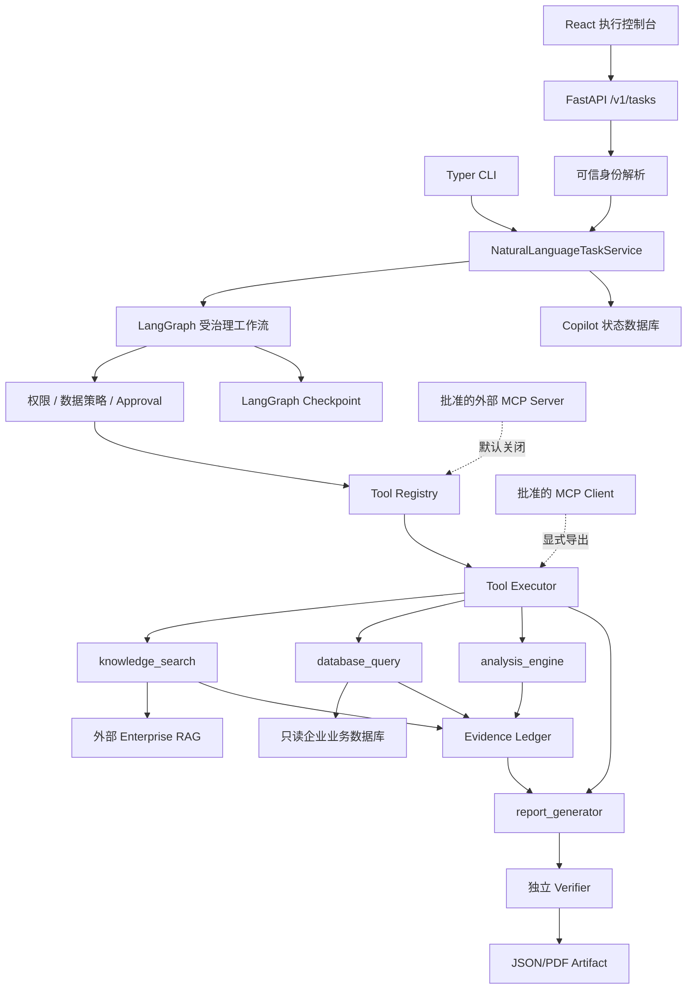

# Agentic Enterprise Knowledge Copilot 当前项目功能审阅报告

> 审阅日期：2026-08-25（Asia/Shanghai）  
> 审阅基线：`f95eb9b40e4d9298f9079865d50bb31e49288175`（`main`）  
> 项目版本：`0.1.0`  
> 工作区状态：审阅开始前仅有用户已有改动 `docs/use-cases/.DS_Store`  
> 判定原则：代码、测试和本次实测优先；设计、路线图和空文件不能单独证明功能已实现。

---

## 1. 审阅结论

当前仓库不是初始脚手架，也不是通用聊天机器人。它已经实现了一个受治理、可审批、
可追溯、可验证的企业任务完成系统，包含两个可执行的只读业务纵切：

1. `supplier_quality_analysis.v1`：Supplier Quality Analysis v1.1；
2. `accounts_payable_analysis.v1`：Accounts Payable Invoice Compliance & Exception
   Investigation v1。

两者复用同一套 Task API、LangGraph 工作流、四类冻结能力、权限/审批、Evidence、Audit、
Artifact、持久化和前端控制台。项目还实现了默认关闭的 MCP `2025-11-25` 双角色互操作边界。

准确的成熟度判断是：

- **代码与本地/合成验证层面：功能纵切完整。** 两个场景都能从自然语言任务执行到
  JSON/PDF Artifact，并经过证据和确定性验证。
- **Supplier Quality：已实现并通过当前离线回归。** 仍只覆盖冻结季度质量分析范围。
- **Accounts Payable：合成/本地纵切已完成，但生产发布明确为 `NOT READY`。** 阻塞项包括
  真实身份和财务授权、生产政策所有权、真实数据/模型/RAG 验证、恢复/留存、容量与正式签字。
- **MCP：协议能力已实现，不是空脚手架。** 但默认关闭、没有主 API 管理面，也没有被两个业务
  Planner 当作任意扩展工具使用。
- **平台尚不能作为通用企业 Agent 或生产级高可用系统直接开放。** 当前没有后台任务队列、
  多 Agent、业务写操作、通用连接器、对象存储、完整企业 IAM、自动跨存储清理和 HA/DR 闭环。

## 2. 审阅范围与规模

本次检查了：

- 根目录 `AGENTS.md` 和 Supplier Quality v1.1 七份冻结设计；
- Accounts Payable v1 全套设计、Stage 1–12 实施/验收记录；
- `src/copilot` 下 contracts、services、agent、tools、policies、security、evidence、
  persistence、observability、MCP、API、CLI 和 bootstrap；
- FastAPI OpenAPI、React/TypeScript 前端、Alembic 迁移、Compose/Docker、脚本；
- unit、contract、integration、security、smoke、E2E 测试和三套评测入口；
- 已提交评测报告与本次现场运行结果。

代码库静态规模（不含 `__pycache__`）：

| 类别 | 数量 |
|---|---:|
| `src/copilot` Python 文件 | 229 |
| `test_*.py` 测试文件 | 127 |
| Markdown 文档 | 86 |
| 前端 TypeScript/TSX 文件 | 40 |
| Evaluation Python 文件 | 30 |
| Python/TS/TSX 代码与测试合计 | 约 83,396 行 |

## 3. 当前系统架构

核心边界符合仓库架构约束：接口层不直接访问数据库/工具；Agent 节点经 Registry 和 Executor；
工具执行前检查策略和审批；物质输出进入 Evidence、Audit、Output Guard 和 Verifier；MCP SDK 类型
限制在 `src/copilot/mcp/protocol.py`。

## 4. 功能总览矩阵

| 能力域 | 当前状态 | 实现说明 | 主要边界 |
|---|---|---|---|
| Supplier Quality v1.1 | 已实现 | 自然语言、4 步计划、2 个只读查询、确定性质量指标、JSON/PDF、证据验证 | 仅明确年份/季度和授权供应商范围 |
| Accounts Payable v1 | 已实现（本地/合成） | 14 步计划、5 个只读读模型、7 个分析操作、6 类异常、JSON/PDF | 生产发布 `NOT READY` |
| Task API | 已实现 | 提交、列表、详情、步骤、Evidence、取消、审批、Artifact、健康检查 | 同步执行到终态或审批点 |
| CLI | 已实现 | 同一 Task Service；dry-run、格式/步骤收紧、显式 `--demo` | 生产任务必须走认证 API |
| Web 控制台 | 已实现 | 任务列表/创建/详情、步骤、Evidence、报告、审批、取消、系统页 | 不允许浏览器自选 tenant/role/tool |
| LangGraph 工作流 | 已实现 | 理解、分类、计划、校验/修复、策略、执行、证据、报告、验证、持久化 | 有界重试和重规划 |
| 人工审批 | 已实现 | APPROVE/EDIT/REJECT、持久化、过期、并发解决、Checkpoint 恢复 | EDIT 只能收紧允许字段 |
| Knowledge Tool | 已实现 | Mock 或外部 RAG HTTP `/ask`；来源/上下文转 Document Evidence | Copilot 不内置 RAG 引擎 |
| Database Tool | 已实现 | SQLite/PostgreSQL；批准模板；只读事务；租户/字段/行数/超时控制 | 无任意 SQL、无业务写入 |
| Analytics Tool | 已实现 | Supplier 与 AP 的确定性 Decimal/日期计算和 lineage | 无任意 Python/LLM 算数 |
| Reporting Tool | 已实现 | 强类型报告、确定性 JSON/PDF、原子 Artifact、checksum | 不发送或发布外部系统 |
| Evidence/Verification | 已实现 | 文档/数据库/计算证据、引用、数字、安全和 Artifact 校验 | 验证通过才 COMPLETED |
| Persistence | 已实现 | SQLite 开发、PostgreSQL 部署、Alembic、租户隔离、leases/checkpoints | Artifact 字节仍在文件系统 |
| Security/Governance | 已实现基础 | 可信上下文、权限、数据范围、注入/敏感数据检测、输出守卫、审计 | 不是完整 IAM/合规平台 |
| Observability | 已实现本地基础 | 结构日志、ContextVar 关联、进程内 spans/metrics、readiness | 无集中 exporter/SLO/告警平台 |
| MCP 双角色 | 已实现、默认关闭 | stdio/Streamable HTTP、JWT、导入/导出、资源/提示、隔离/恢复 | 无自动信任、无 Planner 自动采用 |
| Evaluation/CI | 已实现 | Supplier/AP/MCP 基线、精确指标、安全、迁移、前端、容器门禁 | 主要为离线/合成证据 |
| 生产 HA/DR | 暂未完成 | 有部署与备份指导、CI restore dry-run | 无正式 RPO/RTO、故障演练和多实例证据 |

## 5. 已实现的通用任务生命周期

工作流使用以下冻结状态：

`CREATED`、`UNDERSTANDING`、`PLANNING`、`EXECUTING`、`WAITING_APPROVAL`、
`RETRYING`、`REPLANNING`、`VERIFYING`、`COMPLETED`、`FAILED`、`CANCELLED`。

已实现的控制行为包括：

- 保存原始 `TaskRequest`，并将用户文本与可信身份/租户上下文分离；
- 将自然语言收敛为版本化 `TaskContract`；
- 按任务类型解析 deny-by-default `DomainCapabilityManifest`；
- 生成轻量、非可执行 `ProposedPlan`，由确定性 `PlanCompiler` 绑定 Registry/Profile/Schema
  并生成既有 `TaskPlan`，随后校验 DAG、依赖、步骤上限和权限；
- 对可修复的计划输出进行有界 plan repair；
- 每个步骤前执行策略检查，每个实际工具尝试由 Executor 再次授权；
- 对瞬时、可重试且幂等的技术故障执行有界重试；
- 对允许修复的验证问题进行有界 replan，不形成无限循环；
- 在审批点持久化 `WAITING_APPROVAL` 和 checkpoint；
- 审批通过/编辑后从 checkpoint 恢复，不重放已成功前置步骤；
- 合作式取消和迟到结果丢弃；终态不能被迟到调用改写；
- 生成候选报告后独立验证，验证通过才发布 `TaskResult` 和 Artifact。

当前 API 是同步模型：`POST /v1/tasks` 会运行到终态，或在审批点以 HTTP 202 返回。不存在独立
队列/worker 在提交后后台持续执行。

## 6. 已实现业务场景一：Supplier Quality Analysis v1.1

### 6.1 输入与范围

- 任务类型：`supplier_quality_analysis.v1`；
- 必须明确年份和季度，不会根据当前日期静默推断；
- 支持调用者授权范围内的供应商筛选；
- 输出为内部 JSON 或 PDF 质量分析报告；
- 默认计划为知识检索、数据库查询、确定性分析、报告生成四步。

### 6.2 数据能力

只读数据库支持两个批准模板：

1. `supplier_quality_summary_v1`；
2. `supplier_quality_trend_v1`。

分析能力包括：

- 缺陷数量；
- 检验数量；
- `defect_rate = defect_count / inspected_count`；
- 当前期与前期缺陷率变化；
- 供应商和期间维度的确定性聚合；
- 零分母返回 `null` 和限制说明，而不是伪造 0%；
- 空数据库结果是成功业务事实，可生成明确空数据报告。

### 6.3 报告与验证

报告包含任务范围、数据覆盖、质量指标、趋势、发现、限制和 Evidence 引用。Verifier 检查
Contract 范围、数据库只读标记、计算 checksum/公式、引用覆盖、数值一致性、敏感信息和 Artifact
文件完整性。

### 6.4 明确不支持

不支持预测、因果证明、根因定论、供应商风险排名、任意指标、任意数据库表、任意代码、CAPA、
供应商状态变更、采购动作、Email/外部发布或数据库写入。

## 7. 已实现业务场景二：Accounts Payable v1

### 7.1 业务范围

任务类型为 `accounts_payable_analysis.v1`。授权的 finance/procurement 用户可在受信财务范围和
最长 366 天发票日期窗口内，比较受控政策和业务事实，生成内部 JSON/PDF 合规与异常报告。

### 7.2 已实现数据模型与政策

- 独立的 tenant-scoped AP 业务表、Alembic 迁移和确定性合成 seed；
- `NUMERIC(20,4)` 金额精度，不跨币种聚合、不做 FX 转换；
- 受控 AP/采购/付款政策文档；
- `ap_rules.2026.1` 规则清单、文档版本/effective date/checksum 精确绑定；
- tenant-bound 不可变政策快照发布工具；生产配置要求显式已发布快照。

### 7.3 五个批准的 AP 只读模板

1. `ap_invoice_population_v1`；
2. `ap_duplicate_invoice_candidates_v1`；
3. `ap_invoice_po_variance_v1`；
4. `ap_payment_terms_v1`；
5. `ap_payment_amount_v1`。

### 7.4 七个确定性 AP 分析操作

1. exact duplicate invoice detection；
2. invoice-to-PO amount variance detection；
3. missing required PO detection；
4. payment-term compliance detection；
5. overpayment detection；
6. exception summary；
7. supplier exception rate。

支持六类异常：`EXACT_DUPLICATE_INVOICE`、`PO_AMOUNT_VARIANCE`、
`MISSING_REQUIRED_PO`、`LATE_PAYMENT`、`MATERIAL_EARLY_PAYMENT`、`OVERPAYMENT`。

### 7.5 工作流、报告和权限

- 使用共享 Graph 的精确 14 步 AP 计划；
- 复用四个 capability 名称，通过 AP contract profile 选择具体实现；
- 拥有独立 AP Evidence lineage、政策/数值/一致性/Safety verifier profile；
- 拥有强类型 AP 报告模型和确定性 JSON/PDF renderer；
- Task API 和前端已公开 AP 任务选择、徽标、安全摘要和审批处理；
- Stage 10 合成评测为 25/25，Stage 11 保存了浏览器到真实 PostgreSQL/RAG/Artifact 的本地 E2E
  验收记录。

### 7.6 明确不支持

不支持自动付款、发票/PO/供应商/银行主数据写入、业务审批付款、银行指令、ERP/SAP 集成、OCR、
邮件摄取、多次或部分付款、credit note、三方匹配、行级匹配、模糊重复、未批准供应商、拆单规避、
税务/银行变更分析、开放 SQL、任意 Python、跨领域风险评分或多 Agent。

## 8. 已实现的工具、证据和执行控制面

### 8.1 Tool Registry

- 四个本地冻结工具：`knowledge_search`、`database_query`、`analysis_engine`、
  `report_generator`；
- 版本/Profile 解析、Schema 指纹、线程安全注册；
- MCP namespace、origin、provenance、generation；
- namespace 原子 refresh 和 revoke；
- 未注册工具、未知 Profile 和不批准 namespace 失败关闭。

### 8.2 Tool Executor

- 强制 `ExecutionContext` 绑定 task/trace/step/user/tenant/roles/scopes/data scope/purpose/deadline；
- 输入/输出 JSON Schema 校验；
- 权限、数据访问、审批指纹和过期校验；
- 超时、合作式取消、迟到结果丢弃；
- Output Guard、Evidence 登记、结构化 Audit 和 observability；
- 统一映射成功、业务失败、技术失败、超时和权限拒绝。

### 8.3 Knowledge Tool

- 开发可使用 `MockKnowledgeClient`；真实路径使用 `HttpKnowledgeClient`；
- RAG 健康检查、`POST /ask`、超时、有限重试和安全错误映射；
- 仅保留批准的 source/context 元数据和受限 excerpt；
- 生成 `DOCUMENT` Evidence，记录文档、版本、chunk/page、index snapshot、trace/checksum；
- RAG 自然语言 answer 不直接成为报告事实。

Enterprise RAG Engine 是外部服务/仓库；本仓库没有实现向量索引、chunking、embedding、BM25、
reranker 或文档摄取引擎。

### 8.4 Database Tool

- SQLAlchemy `Select` 模板，支持 SQLite 和 PostgreSQL；
- 禁止原始 SQL/TextClause、多语句、DML/DDL/DCL、未注册表列和不批准函数；
- tenant、时间、供应商/财务范围、字段、行数和 statement timeout 控制；
- PostgreSQL transaction read-only；
- 生成含 query fingerprint、schema snapshot、row count、dataset checksum 的 `DATABASE` Evidence；
- Copilot persistence DB 与企业业务 DB 物理/逻辑分离。

### 8.5 Analytics 与 Reporting

- 两个场景均使用确定性 Decimal/日期算法，不调用 LLM 计算核心数字；
- Calculation Evidence 引用输入 Database Evidence 和 dataset checksum；
- 报告组合、chart/table、JSON/PDF renderer、预渲染/渲染后/文件级 validator；
- 临时写入后原子提交，记录媒体类型、大小、SHA-256、模板/生成器版本和 Evidence IDs；
- 报告成功不等于任务完成，必须再经过独立 Verifier。

## 9. API、CLI 与前端

### 9.1 当前 HTTP API

| 方法 | 路径 | 功能 |
|---|---|---|
| GET | `/health` | 兼容健康状态 |
| GET | `/health/live` | 进程存活 |
| GET | `/health/ready` | 数据库、Artifact、RAG 等依赖 readiness |
| GET | `/v1/tasks` | tenant/owner 范围的任务分页列表 |
| POST | `/v1/tasks` | 提交 Supplier/AP 自然语言任务 |
| GET | `/v1/tasks/{task_id}` | 任务摘要 |
| GET | `/v1/tasks/{task_id}/steps` | 计划步骤与执行结果 |
| GET | `/v1/tasks/{task_id}/evidence` | 最小化 Evidence 与 lineage |
| POST | `/v1/tasks/{task_id}/cancel` | 请求合作式取消 |
| GET/POST | `/v1/tasks/{task_id}/approvals/{approval_id}` | 审批详情与解决 |
| GET | `/v1/tasks/{task_id}/artifacts` | Artifact 元数据 |
| GET | `/v1/tasks/{task_id}/artifacts/{artifact_id}` | 授权下载并返回 ETag/checksum |

没有单独 finance API，也没有 MCP 连接管理 REST API。

### 9.2 CLI

Typer CLI 支持自然语言任务、`--output-format`、`--max-steps`、`--read-only`、
`--require-approval`、`--session-id`、`--dry-run` 和显式 `--demo`。CLI 与 API 共用 composition
root；生产不允许 demo identity。

### 9.3 React 控制台

已实现页面：任务列表、新建任务、任务概览/步骤、Evidence、报告/下载、审批、系统健康和 404。
TanStack Query 负责查询/轮询；React Hook Form + Zod 负责表单；OpenAPI 生成 TypeScript 合同；
MSW/Vitest 提供组件测试；Nginx 同源 `/api` 反向代理 FastAPI。

## 10. 身份、权限、审批与安全

已实现：

- 开发/测试 `DemoIdentityProvider`；
- 生产 `trusted_headers`：验证上游网关签名、时效、用户、tenant、roles、scopes 和 data scope；
- Supplier/Finance/Procurement/Approver 的 deny-by-default 权限矩阵；
- 每次工具尝试重新验证当前权限和 tenant/data scope；
- Approval 与 plan version、step、tool、Schema、原始/最终参数指纹、范围、approver、TTL 绑定；
- APPROVE、EDIT、REJECT；EDIT 只允许完整替换参数且只能收紧批准字段；
- prompt injection 检测、untrusted metadata 清理、敏感数据注册表、secret/redaction 和 Output Guard；
- API 安全错误映射，不直接回显栈、连接串、SQL、Authorization header 或原始敏感结果；
- tenant-scoped Task/Evidence/Approval/Artifact/Audit/MCP persistence 和跨租户拒绝测试。

这些控制不能等同于完整企业 IAM、DLP、SIEM、KMS、合规留存或零信任网络平台。

## 11. Evidence、Audit、持久化与可观测性

### 11.1 Evidence 与 Verification

- Evidence 类型：`DOCUMENT`、`DATABASE`、`CALCULATION`；
- append-only、稳定 ID、checksum、来源/信任/分类、父子 lineage、task/tenant 绑定；
- Composite verifier 覆盖 Evidence、Deliverable、Citation、Numeric、Safety、Artifact；
- Supplier 和 AP 使用独立 verifier profile；
- 安全错误属于失败，不会降级为 warning 后 `COMPLETED`。

### 11.2 Persistence

- 开发/测试支持内存或 SQLite；生产要求 PostgreSQL；
- Alembic 迁移保存 Task、状态事件、Contract、Plan、Step/ToolResult、Evidence、Approval 历史、
  Artifact metadata、Audit、leases 和 MCP connection/session/invocation metadata；
- LangGraph SQLite/PostgreSQL checkpointer；tenant-qualified checkpoint thread ID；
- 执行 lease、防并发恢复、审批跨重启恢复；
- Artifact 字节存储在 `ARTIFACT_DIR` 文件系统/volume，不在 PostgreSQL 中。

### 11.3 Observability

- JSON/text 结构日志和敏感字段清理；
- `ContextVar` 关联 request/trace/task/step/tool/tenant，并复制到 worker thread；
- 本地 bounded spans、metrics、latency/performance 分析；
- `/health/live` 与依赖感知 `/health/ready`；
- durable Audit 与运行日志/trace 职责分离。

## 12. MCP Stage 18 当前实现

MCP 已从早期空脚手架发展为可运行实现：

- 固定协议 revision `2025-11-25`，官方 SDK `>=1.29,<2.0`；
- Client：每 server 隔离 runtime/session、stdio 和 Streamable HTTP、初始化/协商、工具/资源/提示发现；
- capability 名称/Schema/描述规范化，保留 origin、endpoint fingerprint、revision、server/schema provenance；
- imported tool 注册到稳定 namespace，并经现有 Registry/Executor/Policy/Evidence/Audit；
- reconnect、credential re-resolution、reauthorization、rediscovery、revoke 和恢复元数据；
- Server：stdio/HTTP、显式 `MCPExportRule`、工具/资源/提示 provider；
- JWT issuer/audience/expiry/tenant/scope 验证，Host/Origin/DNS rebinding 和 loopback HTTP 控制；
- stdio 使用固定绝对 executable/arguments/working directory 和最小环境；
- sampling、elicitation、roots 为显式策略控制，默认关闭/省略；
- tenant-scoped connection/session/invocation persistence；不持久化原始 token 和完整结果；
- 真实 SDK stdio、localhost HTTP、隔离、恶意 metadata、JSON-RPC、权限和泄漏测试。

当前限制：MCP 默认完全关闭；主 Task Planner 仍只使用冻结四类业务 capability；没有连接管理 API/UI；
没有广泛第三方 server compatibility matrix；公网 TLS、反向代理和企业 token issuance 属于部署责任。

## 13. 配置、迁移与部署

### 13.1 Provider

| 边界 | 开发/测试 | 真实/生产路径 |
|---|---|---|
| LLM | Offline Mock | DeepSeek Chat Completions HTTP |
| Knowledge | MockKnowledgeClient | 外部 Enterprise RAG HTTP |
| Business DB | Mock 或 SQLite | SQLAlchemy PostgreSQL 只读 |
| Persistence | 内存/SQLite | PostgreSQL + Alembic |
| Artifact | 本地目录 | 持久化 filesystem volume |
| Identity | Demo | 上游网关签名 trusted headers |
| MCP | 关闭 | 显式启用 client/server 与安全配置 |

生产 `Settings` 会拒绝 demo identity、mock LLM/Knowledge/Database、SQLite persistence、自动建表、
缺失 checkpoint、loopback RAG、空模型密钥和不足长度的 identity secret。

### 13.2 已有部署资产

- Python package、Typer entry points、non-root Dockerfile；
- Copilot persistence 和 business schema 两套 Alembic；
- `docker-compose.yml` 开发拓扑；
- `docker-compose.local-enterprise.yml` 双场景本地企业 E2E；
- `docker-compose.production.yml` migration、RAG health、API、frontend、PostgreSQL、Artifact volume、
  只读 AP policy mount；
- 独立 business PostgreSQL 和 SELECT-only runtime role；
- migration-first startup、liveness/readiness、备份/回滚/故障处理文档；
- macOS 本地一键启动/关闭脚本。

生产 Compose 依赖外部提供的批准 RAG image、Copilot/frontend immutable image、真实 Secret、
只读企业 DB、tenant AP policy bundle/snapshot 和上游身份网关。

## 14. 测试与评测现状

### 14.1 本次现场复核

| 检查 | 结果 |
|---|---|
| Ruff lint | PASS |
| Ruff format | PASS，455 files |
| Mypy strict | PASS，447 source files |
| 文档治理 | PASS |
| 架构依赖守卫 | PASS |
| 后端全量 pytest | 737 passed、9 skipped、3 因沙箱禁止绑定 loopback 失败 |
| 3 个 loopback MCP 用例获准重跑 | PASS，3/3 |
| 综合后端结论 | 740 passed、9 环境型 skips；未发现代码失败 |
| 前端 OpenAPI 生成一致性 | PASS |
| 前端 TypeScript | PASS |
| 前端 ESLint | PASS |
| 前端 Prettier | PASS |
| 前端 Vitest | PASS，8 files / 31 tests |
| 前端生产构建 | PASS，179 modules |
| Supplier 离线评测 | PASS，30/30，无 baseline regression |
| AP 离线评测 | PASS，25/25，无 baseline regression |
| MCP interoperability | PASS，13/13 |
| MCP safety | PASS，12/12 |

9 个普通 skip 主要受 Docker、`TEST_POSTGRES_URL`、`TEST_BUSINESS_POSTGRES_URL`、live RAG 和完整
Local Enterprise E2E 环境开关控制。本次没有重新启动完整 Docker/浏览器 E2E 或真实 PostgreSQL；
仓库保留了 CI/Stage 11 的历史通过记录，但本报告不把历史记录误写为本次现场运行。

### 14.2 评测边界

- Supplier 固定数据集 30 cases，覆盖成功、空数据、审批、授权、计划修复、工具故障、数字和安全；
- AP 固定数据集 25 cases，覆盖异常精度/召回、金额、排除、政策绑定、权限、恢复和 50,000 行性能门禁；
- MCP 评测覆盖真实 SDK 协议、stdio/HTTP、授权、隔离、注入、恶意 metadata、错误 JSON-RPC 和泄漏；
- checked-in baseline 用于确定性回归，不证明真实模型、真实 RAG 排名、真实财务数据或生产时延质量。

## 15. 暂未实现或尚未闭环的功能

### 15.1 通用产品与 Agent 能力

- 通用企业任务类型、开放域问答和任意工具组合；
- 交互式多轮澄清和原任务 missing-information resume；当前缺信息会安全失败并要求重新提交；
- 后台任务队列、独立 worker、调度、优先级、rate limit、backpressure、跨日执行和自动拾取崩溃任务；
- 多 Agent 协作、角色化 Agent、并行调查或 Agent-to-Agent 协议；
- 长期业务记忆、跨任务知识记忆、自主无限监控；
- 开放式 adaptive planner；当前计划空间受冻结 domain manifest 和 Profile 严格限制；
- 任意 Python、notebook、代码执行、任意 SQL 或模型直接计算关键财务/质量数字。

### 15.2 业务动作与集成

- Supplier CAPA、采购、供应商状态、通知、Email、Jira/Teams/Slack 等外部动作；
- AP 付款、发票/PO/供应商/银行写入、ERP/SAP、OCR/邮件摄取、业务审批流；
- CRM、QMS、SharePoint、Confluence、ServiceNow、Snowflake、Databricks 等通用连接器；
- 跨系统 exactly-once、分布式事务、补偿/回滚业务命令；
- 内置 Enterprise RAG 索引/摄取；该能力属于独立项目；
- 除 DeepSeek 外的真实 LLM provider；Mock 不代表生产模型；
- 主 API 的完整 OIDC/OAuth/SSO/SCIM/workforce lifecycle/revocation；当前依赖上游可信网关。

### 15.3 数据、分析和报告

- Supplier 预测、因果分析、根因证明、风险排名、任意维度和指标；
- AP fuzzy duplicate、partial/multiple payment、credit note、三方/行匹配、税务/银行异常等非 v1 规则；
- 跨币种汇率转换与聚合；
- DOCX、XLSX、PPTX 等业务 Artifact；当前产品报告只支持 JSON/PDF；
- 报告自动外发、审批后发布、电子签名或下游工单创建；
- 真实生产 RAG retrieval ranking、开放式语义报告质量和 live-provider 评测模式。

### 15.4 生产运维与治理

- 共享对象存储/S3、签名 URL、跨区域 Artifact 复制；
- 集中 OpenTelemetry/Prometheus/SIEM exporter、SLO、告警和生产 dashboard；
- 多实例/水平扩展证据、Kubernetes/Helm/cloud IaC、零停机滚动升级；
- 自动协调 Task/Evidence/Audit/checkpoint/Artifact/policy/RAG 的 retention、legal hold 和 purge；
- cryptographically tamper-evident Audit；
- 正式 Secret Manager/KMS、credential rotation、DLP 和 incident-response 集成；
- 生产 RPO/RTO、完整恢复演练、HA/failover、load/soak/chaos/capacity 测试；
- 完全 hash-locked runtime dependency/supply-chain 离线证明；
- 跨 Copilot DB、业务 DB、RAG、policy snapshot 和 Artifact 的原子事务。

### 15.5 Accounts Payable 生产阻塞项

冻结 Stage 12 明确要求以下证据全部关闭后才能改为 `READY`：

1. 目标 tenant 的正式政策/规则、checksum、快照和所有者发布；
2. 生产 IdP/网关映射、finance roles/scopes 和 tenant isolation smoke；
3. 跨全部持久化存储的留存、legal hold 和删除对账；
4. 加密备份与完整隔离恢复，以及批准的 RPO/RTO；
5. 生产形态数据 profiling、端到端负载、并发、soak 和容量结果；
6. 批准的模型/RAG provider、数据出境决策和版本化 live evaluation；
7. 干净提交上的全套 CI/安全/评测/恢复证据；
8. 财务数据所有者、安全、架构和运维正式签字，且无 P0/P1。

## 16. 空文件、安全占位与文档漂移

### 16.1 当前零字节生产文件

以下文件为空：

- `src/copilot/agent/nodes/evidence_aggregator.py`
- `src/copilot/agent/nodes/plan_validator.py`
- `src/copilot/agent/nodes/planner.py`
- `src/copilot/agent/nodes/report_composer.py`
- `src/copilot/agent/nodes/task_classifier.py`
- `src/copilot/agent/nodes/task_understanding.py`
- `src/copilot/agent/nodes/tool_executor.py`
- `src/copilot/agent/nodes/verifier.py`
- `src/copilot/api/routes/health.py`
- `src/copilot/policies/risk.py`

这些空文件不能当作已实现证据。对应的真实 Graph 节点位于 `validate_plan.py`、`create_plan.py`、
`generate_report.py`、`classify_task.py`、`understand_task.py`、`execute_tool.py`、
`aggregate_evidence.py`、`verify_result.py`；健康路由当前定义在 `api/app.py`。`risk.py` 没有独立
风险引擎，风险/审批判断分散在 ToolDefinition、approval/data-access/permission policies 中。

`policies/engine.py` 中 `DenyByDefaultToolAuthorizer` 是明确的安全占位：未注入真实策略时拒绝所有
执行。生产 composition root 会注入实际 authorizer，因此它不是正常路径的功能缺失，但文案中的
“placeholder”不应被误解为生产使用 mock。

根目录 `LICENSE` 也是零字节，意味着项目虽然有文件名，但没有实际许可证文本。

### 16.2 文档与实现状态漂移

| 文档 | 当前问题 |
|---|---|
| `docs/project-overview-zh.md` | 仍称完整 Agent、真实数据库/知识/分析/报告尚未实现，已明显过时 |
| `docs/project-report.md` | 2026-08-10 历史快照，只描述 Supplier 主纵切，未纳入已完成 AP Stage 1–12 |
| `docs/security-model.md` | 已知限制仍写“无 MCP execution”，与 Stage 18 实现冲突 |
| `docs/evaluation.md` | 写 live provider/RAG mode 未实现；作为 evaluation harness 限制成立，但易与真实 Provider 已实现混淆 |
| `docs/use-cases/accounts-payable/design-baseline.md` | 冻结时写 `Implementation status: NOT STARTED`；后续 Stage 报告已实施完成，需按历史基线理解 |
| 分阶段 AP 文档 | 早期 Stage 文档中的“workflow disabled/not implemented”只表示当时阶段，不代表当前状态 |

不应修改冻结基线的历史声明，但总览文档需要加醒目的“历史快照/当前状态”说明或索引。

### 16.3 本地工具环境发现

当前 `.venv` 中已安装的 `copilot` 副本落后于工作区源码；直接执行
`python evaluation/run_mcp_eval.py` 会因缺少已在源码导出的 `MoneyThreshold` 失败。使用当前源码
路径后评测 13/13 + 12/12 通过。干净 CI 会先执行 editable install，因此不是生产代码失败；本地继续
开发前应重新执行 `python -m pip install -e '.[dev]'`，避免脚本使用陈旧 site-packages。

## 17. 生产就绪度评估

| 维度 | 评级 | 结论 |
|---|---:|---|
| 架构边界 | 4/5 | Contract-first、单一治理路径和自动依赖守卫成熟 |
| Supplier 业务纵切 | 4/5 | 冻结能力完整，真实生产依赖/容量仍需验收 |
| AP 业务纵切 | 3/5 | 本地/合成功能完整，正式生产阻塞项尚未关闭 |
| Agent 编排 | 4/5 | 理解、计划、审批、恢复、验证完整；无后台/多 Agent/交互澄清 |
| 数据与分析 | 4/5 | 模板只读、Decimal、lineage 强；业务范围固定 |
| Evidence/Verification | 4/5 | 可追溯和确定性验证突出；仍依赖已提供 Evidence 而非独立重查全部源系统 |
| 安全治理 | 3/5 | 代码边界强；企业 IAM、DLP、KMS、留存和正式审查待部署完成 |
| 持久化/恢复 | 3/5 | PostgreSQL/checkpoint/lease 已有；Artifact、跨存储恢复和自动拾取不足 |
| 可观测性 | 3/5 | 本地基础完整；无集中生产 telemetry/SLO |
| 测试/评测 | 4/5 | 覆盖广且当前门禁通过；真实数据/模型/负载证据不足 |
| MCP | 3/5 | 协议和安全实现完整；治理产品面和第三方兼容覆盖有限 |
| 总体生产就绪 | 3/5 | 可用于受控试点；不宜直接大规模生产开放 |

## 18. 建议优先级

### P0：保持当前安全边界

- 不扩大 Supplier/AP 冻结范围，不让 MCP 或新 connector 绕过 Registry/Executor；
- 不把 AP `Stage 12 COMPLETE` 误写成 `PRODUCTION READY`；
- 不把 Mock/合成评测当作真实企业数据与模型质量证明。

### P1：生产闭环

1. 关闭 AP Stage 12 八项正式阻塞证据；
2. 在 staging 验证真实上游 IAM、RAG、DeepSeek、只读业务 PostgreSQL 和 tenant policy；
3. 增加异步 submit/worker、lease/heartbeat、启动恢复、幂等和 backpressure；
4. 把 Artifact 抽象到受治理对象存储，并完成跨 DB/Artifact/policy/RAG 的恢复演练；
5. 接入集中 telemetry、SLO/告警、Secret Manager/KMS 和 retention/legal-hold；
6. 运行生产形态负载、soak、故障和 RPO/RTO 验证。

### P2：修正文档和开发体验

1. 将本报告设为当前状态索引，并把旧总览标为历史；
2. 修正 security/evaluation 总览中的 MCP 与 live-provider 表述；
3. 说明零字节 alias 文件的弃用/兼容目的，或在不破坏导入兼容时清理；
4. 补充实际许可证文本；
5. 为 evaluation 脚本增加稳定的源码/安装前置检查，避免陈旧 editable 环境产生误判。

### P3：受控扩展

- 只有在新业务 Contract、政策、审批、Evidence、Verifier、迁移和评测全部设计冻结后再增加场景；
- MCP 产品化应先增加连接治理 API/UI、server profile 审批、health/revoke/runbook 和兼容矩阵；
- 写操作必须独立设计 command contract、dry-run、幂等、双人审批、补偿和外部可见审计；
- 多 Agent 仅在有可度量的并行/职责隔离收益、且不破坏当前治理链时考虑。

## 19. 最终判断

当前项目已完成从“企业 RAG 问答”到“受治理任务执行”的核心工程跃迁：自然语言请求、结构化
Contract、受限计划、四类工具、权限/审批、确定性分析、Evidence、Verifier、Artifact、持久化、
API/CLI/前端和可选 MCP 已形成真实可运行链路。

仍需保持边界清晰：它现在支持的是两个冻结、只读、证据驱动的分析场景，而不是任意企业任务；
AP 仍未获生产发布；MCP 不是自动扩权机制；真实身份、数据、模型、恢复、留存、容量和正式治理证据
是下一阶段比新增工具更重要的工作。
