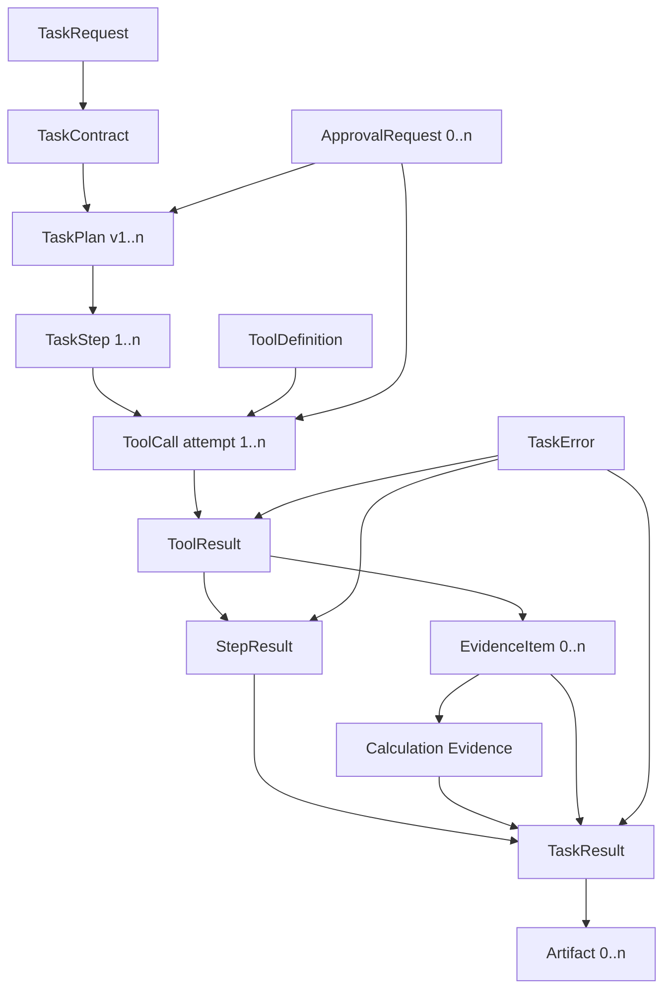

# 领域模型冻结设计 v1.0

## 1. 建模约定

- 所有标识符均为不可变、全局唯一的字符串；时间为 UTC、ISO 8601 格式。
- `metadata` 仅存放非核心扩展属性，不得替代显式字段、权限、审批或状态。
- Schema 使用 JSON 类型表述；对象默认拒绝未声明字段。
- 大型内容通过稳定引用和校验和持久化，避免在状态与审计记录中复制敏感原文。
- 状态只能由状态机事件改变；对象内容更新不能暗中改变生命周期。
- 用户原文、检索内容、工具输出均视为不可信数据，不具有指令或授权效力。

## 2. 核心对象

### 2.1 TaskRequest

用户提交的原始任务请求，是全链路不可变的审计起点。

| 字段 | 类型 | 必需 | 语义与约束 |
|---|---|---:|---|
| `id` | string | 是 | 请求唯一标识，创建后不可变 |
| `user_id` | string | 是 | 经认证的创建者；不可从 `raw_input` 提取 |
| `raw_input` | string | 是 | 原始请求，保留原貌并按数据分类控制访问 |
| `created_at` | datetime | 是 | 服务接收请求的 UTC 时间 |
| `metadata` | object | 是 | 允许的扩展信息，如客户端请求 ID、区域设置；不得包含密钥 |

创建者是 `user_id`，业务所有者为该用户所属租户中的任务发起方；平台托管其持久化副本。生命周期从接收开始，到关联任务依据保留策略删除或归档结束。该对象不可覆盖，只能附加合规的修订请求形成新请求。

### 2.2 TaskContract

将自然语言目标转化为可验证、可授权的执行边界。没有 Contract，计划无法判定是否满足目标，策略也无法确定范围，因此任务不得进入 `PLANNING`。

| 字段 | 类型 | 必需 | 语义与约束 |
|---|---|---:|---|
| `task_type` | enum | 是 | 固定为 `supplier_quality_analysis.v1` |
| `required_capabilities` | array[string] | 是 | 首版从 `knowledge_search`、`database_query`、`analysis_engine`、`report_generator` 中选择；验证能力必须存在 |
| `expected_output` | object | 是 | Artifact 类型、报告章节、语言、引用及格式要求 |
| `constraints` | object | 是 | 年份、季度、日期边界、供应商集合、租户、数据范围、指标口径、时限、最大成本 |
| `approval_requirement` | object | 是 | `required`、策略 ID、审批角色、受控范围；无审批时 `required=false` |

Contract 由任务理解节点创建、策略层确认，归属于 Task。执行开始后不可原地修改；用户补充范围或策略改变时产生新版本并重新规划、重新审批。

### 2.3 TaskPlan

Agent 为满足一个 TaskContract 生成的有向无环执行计划。

| 字段 | 类型 | 必需 | 语义与约束 |
|---|---|---:|---|
| `task_id` | string | 是 | 所属 Task 标识 |
| `steps` | array[TaskStep] | 是 | 非空、有序展示但按依赖执行；必须形成 DAG |
| `planning_version` | integer | 是 | 从 1 单调递增；每次重规划创建新版本 |
| `created_at` | datetime | 是 | 计划生成 UTC 时间 |

每个计划必须包含检索、查询、分析、报告和验证所需步骤，并通过依赖、能力、输入输出、风险及终止性校验。旧版本不可覆盖，保留用于审计。

### 2.4 TaskStep

计划中一个可调度、可单独记录结果的执行节点。

| 字段 | 类型 | 必需 | 语义与约束 |
|---|---|---:|---|
| `step_id` | string | 是 | 在 Task 内唯一且跨计划版本不可复用 |
| `task_id` | string | 是 | 所属 Task |
| `step_type` | enum | 是 | `KNOWLEDGE_SEARCH`、`DATABASE_QUERY`、`ANALYSIS`、`REPORT_GENERATION`；验证由状态机节点负责 |
| `input_schema` | JSON Schema | 是 | 输入形状；运行时输入必须通过验证 |
| `output_schema` | JSON Schema | 是 | 成功或业务结果的输出形状 |
| `dependency` | array[string] | 是 | 前置 `step_id`；空数组代表根节点；禁止环和跨任务依赖 |
| `retry_policy` | object | 是 | `max_attempts`、`backoff`、`retryable_error_codes`；总尝试次数有限 |

步骤归属于一个 TaskPlan。每次尝试产生独立 ToolCall 与 ToolResult；步骤的汇总状态记录于 StepResult。已成功步骤只有在输入、Contract 和工具版本均未变化时才可在恢复或重规划中复用。

### 2.5 TaskState

任务当前生命周期状态，是并发控制与恢复的权威快照。

| 字段 | 类型 | 必需 | 语义与约束 |
|---|---|---:|---|
| `task_id` | string | 是 | 所属 Task |
| `state` | enum | 是 | 下列冻结状态之一，只能由合法事件改变 |
| `version` | integer | 是 | 从 1 单调递增，用于并发比较并交换 |
| `updated_at` | datetime | 是 | 最近合法转换的 UTC 时间 |
| `last_event_id` | string | 是 | 产生当前状态的不可变审计事件 ID |

`state` 的允许值为：

`CREATED`、`UNDERSTANDING`、`PLANNING`、`EXECUTING`、`WAITING_APPROVAL`、`RETRYING`、`REPLANNING`、`VERIFYING`、`COMPLETED`、`FAILED`、`CANCELLED`。

`COMPLETED`、`FAILED`、`CANCELLED` 为终态。状态含义、合法事件和转换条件以 [状态机](state_machine.md) 为唯一规范。状态变更采用比较并交换或等效并发控制，并追加不可变状态事件。

### 2.6 StepResult

一个 TaskStep 当前最终尝试的归一化执行结论；重试历史通过关联 ToolResult 保留。

| 字段 | 类型 | 必需 | 语义与约束 |
|---|---|---:|---|
| `step_id` | string | 是 | 对应步骤 |
| `status` | enum | 是 | `SUCCESS`、`BUSINESS_FAILURE`、`TECHNICAL_FAILURE`、`TIMEOUT`、`PERMISSION_DENIED`、`CANCELLED` |
| `output` | object/null | 是 | 通过步骤输出 Schema 的归一化输出；非成功时通常为 null；业务空结果可有结构化输出 |
| `evidence` | array[string] | 是 | 本步骤产生的 EvidenceItem ID；失败时可为空 |
| `error` | TaskError/null | 是 | `SUCCESS` 时必须为 null；其他状态必须存在，业务空结果按成功处理且无错误 |

### 2.7 TaskResult

任务的最终对外结果，仅在终态生成。

| 字段 | 类型 | 必需 | 语义与约束 |
|---|---|---:|---|
| `task_id` | string | 是 | 对应 Task |
| `final_status` | enum | 是 | `COMPLETED`、`FAILED` 或 `CANCELLED`，须与 TaskState 一致 |
| `summary` | string | 是 | 对最终结果或终止原因的简明说明，不得包含无证据结论 |
| `artifacts` | array[string] | 是 | Artifact ID；失败或取消时可为空 |
| `evidence` | array[string] | 是 | 支撑结果的 EvidenceItem ID；完成时不得缺少必需证据 |

### 2.8 ToolDefinition

Agent 可调用能力的注册定义，不等同于某次调用。

| 字段 | 类型 | 必需 | 语义与约束 |
|---|---|---:|---|
| `tool_name` | string | 是 | 稳定名称；首版仅四个批准工具 |
| `description` | string | 是 | 有限用途和明确禁止事项 |
| `input_schema` | JSON Schema | 是 | 严格输入契约，拒绝额外字段 |
| `output_schema` | JSON Schema | 是 | 归一化成功/业务结果负载契约 |
| `risk_level` | enum | 是 | `LOW`、`MEDIUM`、`HIGH`；首版不注册高风险动作工具 |
| `timeout` | object | 是 | 单次超时秒数及整体截止约束 |
| `approval_policy` | object | 是 | 策略 ID、触发条件和所需审批角色 |
| `idempotency` | object | 是 | 是否幂等、幂等键构成、结果复用窗口和副作用说明 |

工具定义由 Tool Registry 所有并版本化。计划只能引用已注册且策略允许的定义。

### 2.9 ToolResult

一次工具调用尝试的不可变归一化结果。

| 字段 | 类型 | 必需 | 语义与约束 |
|---|---|---:|---|
| `tool_call_id` | string | 是 | 调用尝试唯一标识 |
| `status` | enum | 是 | `SUCCESS`、`BUSINESS_FAILURE`、`TECHNICAL_FAILURE`、`TIMEOUT`、`PERMISSION_DENIED` |
| `output` | object/null | 是 | 成功或业务结果负载；必须符合 ToolDefinition 输出 Schema |
| `error` | TaskError/null | 是 | `SUCCESS` 时为 null，其余状态必须有类型化错误 |

系统同时记录关联的 `task_id`、`step_id`、工具版本、开始/结束时间、尝试序号和安全参数摘要作为调用封套，而不改变上述业务负载字段。

### 2.10 EvidenceItem

证明事实或计算结论的不可变证据单元。类型仅为：`DOCUMENT`、`DATABASE`、`CALCULATION`。

| 字段 | 类型 | 必需 | 语义与约束 |
|---|---|---:|---|
| `source_type` | enum | 是 | `DOCUMENT`、`DATABASE`、`CALCULATION` |
| `source_reference` | object | 是 | 文档版本与片段、查询指纹与参数摘要、或算法版本与输入证据 ID |
| `content` | object | 是 | 最小充分摘录或结构化事实；带分类与校验和，不保存不必要原始数据 |
| `timestamp` | datetime | 是 | 证据被捕获或计算的 UTC 时间 |

每项证据另有不可变 `evidence_id`、`task_id`、`step_id` 和 `tool_call_id` 作为持久化标识与血缘封套。计算证据必须引用其数据库或文档输入证据，不得成为无来源孤岛。

### 2.11 ApprovalRequest

对已明确动作与范围发起的人类授权请求，不是普通对话确认。

| 字段 | 类型 | 必需 | 语义与约束 |
|---|---|---:|---|
| `reason` | string | 是 | 触发策略及业务原因 |
| `requester` | string | 是 | 发起审批的认证主体，通常为任务用户或服务主体 |
| `approver` | string/null | 是 | 决策前为 null；决策后为认证审批人且符合所需角色 |
| `status` | enum | 是 | `PENDING`、`APPROVED`、`REJECTED`、`EXPIRED`、`REVOKED` |

持久化封套还必须含 `approval_id`、`task_id`、动作指纹、范围、创建/决定/失效时间和审批策略版本。审批只覆盖绑定的计划版本、工具、参数范围和有效期；计划或范围实质变化后不得复用。

### 2.12 Artifact

任务生成的可交付物元数据；首版业务 Artifact 为质量分析报告。

| 字段 | 类型 | 必需 | 语义与约束 |
|---|---|---:|---|
| `type` | enum | 是 | `QUALITY_ANALYSIS_REPORT_PDF` 或 `QUALITY_ANALYSIS_REPORT_JSON` |
| `location` | string | 是 | 受控对象存储或 Artifact Repository 内的不可变位置，不使用任意外部 URL |
| `created_at` | datetime | 是 | 生成 UTC 时间 |

持久化封套还包含 `artifact_id`、`task_id`、媒体类型、校验和、大小、生成器版本和 EvidenceItem ID 集合。Artifact 由 Artifact Repository 管理，访问遵循任务租户和保留策略。

### 2.13 TaskError

跨节点和工具统一传递的安全、类型化错误。

| 字段 | 类型 | 必需 | 语义与约束 |
|---|---|---:|---|
| `error_code` | string | 是 | 稳定机器码，例如 `KNOWLEDGE_UNAVAILABLE` |
| `error_type` | enum | 是 | `BUSINESS`、`TECHNICAL`、`TIMEOUT`、`PERMISSION`、`VALIDATION`、`CANCELLATION` |
| `message` | string | 是 | 安全、可操作的说明；不得暴露密钥、SQL 原文或内部堆栈 |
| `recoverable` | boolean | 是 | 当前 Contract 和重试/重规划预算内是否可恢复 |

错误还通过事件封套关联 task、step、tool call、发生时间和因果错误 ID。`recoverable=true` 只是恢复资格，不会自行授权重试；状态机和 RetryPolicy 决定后续动作。

## 3. 对象关系与证据链

完整追踪键为：`request_id → task_id → planning_version/step_id → tool_call_id → evidence_id → task_result → artifact_id`。Artifact 内的引用指向 EvidenceItem，EvidenceItem 再指向不可变来源、查询指纹或输入证据。

## 4. Ownership、生命周期与持久化责任

| 对象 | 业务 ownership | 生命周期 | 持久化责任 |
|---|---|---|---|
| TaskRequest | 发起用户/租户 | 接收后不可变，随任务保留 | Task Repository |
| TaskContract | Task | 理解后创建；版本化，不覆盖 | Task Repository |
| TaskPlan / TaskStep | Task | 计划或重规划创建；历史版本保留 | Task Repository + Checkpoint Store |
| TaskState | Task | 事件驱动直至终态 | Task Repository；状态事件进入 Audit Repository |
| ToolDefinition | 平台能力治理方 | 注册、版本化、停用 | Tool Registry 配置存储 |
| ToolResult / StepResult | Task/Step | 每次尝试追加；步骤完成时汇总 | Task Repository + Audit Repository |
| EvidenceItem | Task，来源由数据所有者治理 | 产生后不可变；按数据分类保留 | Evidence Ledger |
| ApprovalRequest | Task；决定归属于审批人 | 待审批至决定/失效；不可改写决定 | Approval Repository + Audit Repository |
| TaskResult | Task | 进入终态时一次生成，不可变 | Task Repository |
| Artifact | Task/租户 | 生成后不可变；可按保留策略归档/删除 | Artifact Repository |
| TaskError | 发生错误的 Task/Step/Call | 随事件追加，安全摘要长期可审计 | Task/Audit Repository |

Checkpoint 仅保存恢复所需的对象 ID、版本、状态和安全摘要，不取代权威 Repository。审计记录只追加，任何重试、重规划、审批与取消均形成新事件。
