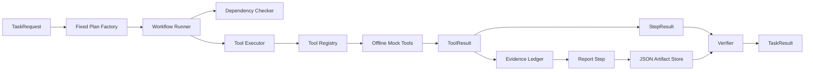

# Deterministic Supplier Quality Workflow

## Scope

This stage implements one offline, serial, deterministic execution path for the frozen
`supplier_quality_analysis.v1` scenario. It does not use an LLM planner, LangGraph, a real
knowledge service, a real database, or a real report service. The implementation exercises the
frozen contracts and governed runtime before autonomous planning is introduced.

The frozen v1.0 design remains authoritative. Consequently:

- the deliverable is `QUALITY_ANALYSIS_REPORT_JSON`, not Markdown, because v1.0 permits only PDF
  and JSON Artifacts;
- incomplete execution ends in `FAILED` while retaining completed Evidence, because
  `PARTIALLY_COMPLETED` is not a frozen Task state;
- a planned step stopped before invocation receives a `CANCELLED` StepResult plus a typed
  dependency/upstream error, because the frozen StepResult enum has no `SKIPPED` state;
- `material_id` is retained in immutable TaskRequest metadata but is not added to the approved
  `quality.v1` query schema, which scopes v1 by supplier and time;
- batch pass rate is not calculated because the frozen analysis contract permits only defect
  count, inspected count, defect rate, and period-over-period trend.

These choices are compatibility adapters, not silent contract changes.

## Architecture and Calling Direction



`WorkflowRunner` coordinates application behavior but never calls a concrete tool. Every attempt
follows `WorkflowRunner -> ToolExecutor -> ToolRegistry -> Tool`. The executor retains input/output
schema validation, policy authorization, timeout handling, typed failure normalization, Evidence
registration, latency measurement, and append-only tool audit.

The composition root in `copilot.bootstrap` creates the instance-scoped Registry, offline tools,
Executor, policy adapter, repositories, Evidence Ledger, Artifact Store, verifier, runner, and
service. Runner dependencies are constructor-injected.

## Fixed Plan

The stable template identifier is `supplier-quality-analysis-v1`, version 1. Actual TaskStep IDs
combine the unique Task ID with a stable suffix so that the frozen cross-task identity rule and
repeatable diagnostics are both preserved.

| Order | Stable suffix | Tool | Dependencies |
|---:|---|---|---|
| 1 | `retrieve-quality-policy` | `knowledge_search` | none |
| 2 | `query-supplier-quality-data` | `database_query` | none |
| 3 | `analyze-supplier-quality` | `analysis_engine` | database step |
| 4 | `generate-supplier-quality-report` | `report_generator` | knowledge and analysis steps |

The plan is a frozen `TaskPlan` tuple. Its Pydantic contract rejects duplicate IDs, missing
dependencies, cross-task steps, self-dependencies, and cycles. `PlanValidator` additionally checks
the plan version, maximum step count, exact Contract capabilities, final report step, registered
tool names, tool/type pairing, and equality with registered input/output schemas. No tool starts if
validation fails.

## TaskState and Execution Context

`TaskState` remains the small authoritative lifecycle snapshot: Task ID, frozen status, version,
UTC update time, and last state event ID. It is not used as a mutable object graph.

`WorkflowExecutionContext` is task-local runtime aggregation. It holds the immutable request,
contract, and plan; the current TaskState; StepResult and ToolResult collections; deduplicated
EvidenceItem objects; Artifact metadata; retry counts; and current step. The in-memory repository
commits TaskState transitions with compare-and-swap version checks and append-only state events.

The normal transition path is:

```text
CREATED -> UNDERSTANDING -> PLANNING -> EXECUTING -> VERIFYING -> COMPLETED
```

An eligible retry uses `EXECUTING -> RETRYING -> EXECUTING`. A non-recoverable result or exhausted
retry budget uses `EXECUTING -> FAILED`. Terminal states cannot re-enter execution.

## Dependencies and Evidence Flow

`DependencyChecker` requires every declared dependency to have a SUCCESS StepResult and normalized
output. It returns the exact missing/failed dependency IDs. A blocked step never reaches the
Executor, but it still receives a persisted StepResult and a zero-duration operational execution
record.

There is no global data exchange. `StepInputBuilder` connects explicit outputs and Evidence:

- Knowledge and database inputs come from authenticated request and Contract scope.
- Analytics receives database rows, the DATABASE Evidence ID, and its dataset checksum. It does
  not query data again.
- Report generation receives the successful analysis output and all DOCUMENT, DATABASE, and
  CALCULATION Evidence IDs.

Evidence is created only by `ToolExecutor` through the Evidence Ledger. The runner retrieves those
immutable objects by ID, deduplicates them without mutation, and passes stable IDs downstream.
Calculation Evidence references its DATABASE input. The report includes each Evidence ID, source
type, source step, and source tool call.

## Retry, Stop, and Outcome Rules

An attempt is retried only when all of the following are true:

1. the registered ToolDefinition is idempotent;
2. ToolResult is `TECHNICAL_FAILURE` or `TIMEOUT`;
3. TaskError is recoverable;
4. the exact error code is allowlisted by the TaskStep RetryPolicy;
5. both the step maximum-attempt limit and configured global retry limit have remaining budget.

Business failures, permission denials, validation failures, permanent technical errors, and
non-idempotent calls are never retried. Every attempt gets a unique ToolCall ID, the same
idempotency key, a persisted ToolResult, latency, attempt number, tool audit record, and workflow
audit events. Frozen per-step backoff remains 1/2 seconds; tests inject a no-op sleeper.

All four business steps are required. A critical step failure stops new calls and creates explicit
CANCELLED results for all unstarted steps. If any completed step produced Evidence, the terminal
TaskResult is still `FAILED` but retains those Evidence IDs and emits
`workflow_partially_completed`. No unverified Artifact is published in the TaskResult.

## Artifact and Verification

The offline report tool resolves Evidence through an injected reader and builds content from the
policy excerpts, database summary, deterministic metrics, scope, risks, recommendations, and
citations. It never uses a static input-independent report.

`LocalArtifactRepository` writes UTF-8 JSON under configured `ARTIFACT_DIR`, rejects absolute or
multi-component filenames, creates the root directory, writes a temporary file, fsyncs it, commits
with `os.replace`, and verifies size. The default filename is:

```text
supplier-quality-analysis-{task_id}.json
```

The verifier checks that all steps succeeded, all three Evidence types exist, the Artifact is
readable and non-empty, size and SHA-256 match, every Evidence ID is cited, and the JSON report
contains deterministic analysis results. Only then can the state enter `COMPLETED`.

## Audit and Current Limitations

Workflow audit is fail-closed and append-only. It records workflow start/finalization, state
changes, dependency decisions, step start/completion/failure/cancellation, each tool attempt,
retry scheduling, Evidence collection, and Artifact creation using identifiers and safe summaries
instead of full sensitive payloads.

The repositories, tools, policy decision, and Artifact Store are local implementations for this
stage. There is no human approval UI, cross-process recovery, distributed queue, dynamic
replanning, DAG parallelism, or external service access. The CLI composes a pre-authorized mock
scope only; it is not a production authorization implementation.

A future planner may replace `SupplierQualityAnalysisPlanFactory` with a dynamic TaskPlan producer.
The same plan validation, state machine, policy, Registry, Executor, Evidence, Artifact,
verification, audit, and frozen domain contracts remain downstream boundaries. LangGraph is not
needed to prove those invariants in this deterministic stage.
