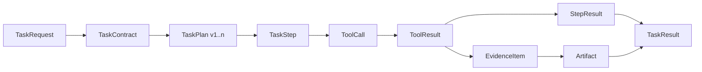
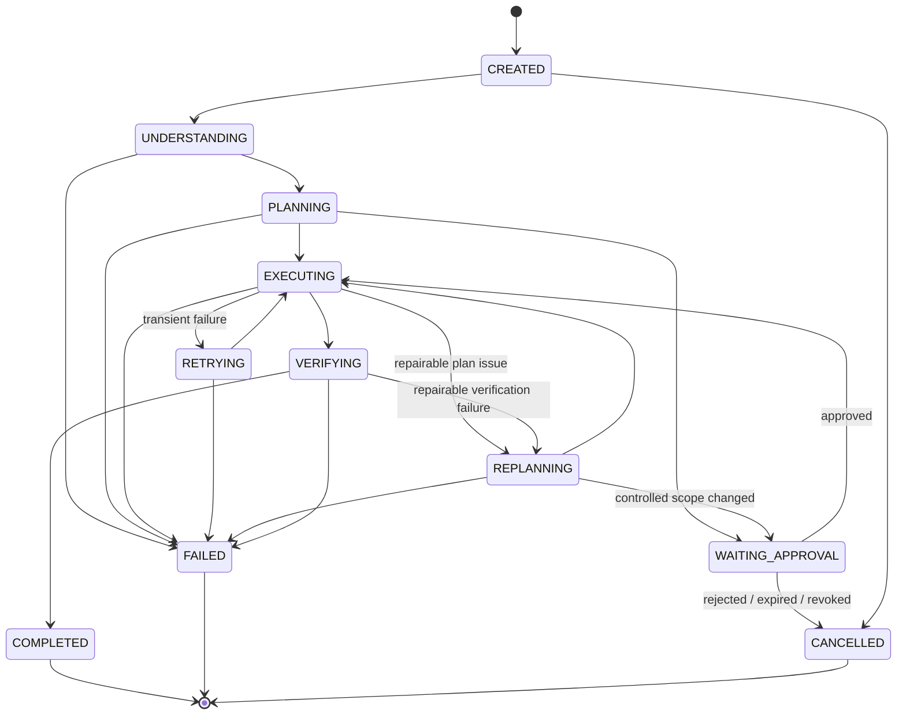

# Domain Contracts v1.0

## Why the domain layer exists

The Copilot must preserve business meaning while requests move through planning, governed tool
execution, evidence collection, verification, and recovery. Pydantic domain contracts provide the
stable typed boundary for that lifecycle. They reject undeclared fields, validate UTC timestamps,
preserve enum semantics, and round-trip through JSON without relying on model prompts or runtime
implementation details.

The implementation follows the frozen Supplier Quality Analysis v1.0 design. It is not a generic
agent contract and does not claim that the Agent Runtime, tools, persistence, or APIs are
implemented.

## Contract chain



- `TaskRequest` preserves the authenticated user's original request as an immutable audit input.
- `TaskContract` freezes the supported task type, capabilities, output, authorized scope, deadline,
  and approval requirement.
- `TaskPlan` is versioned and validates that all `TaskStep` dependencies form a DAG.
- `ToolCall` binds an invocation to a task, step, tenant, user, deadline, idempotency key, and any
  required approval.
- `ToolResult` distinguishes business, technical, timeout, and permission outcomes. Tool success
  never means that the task is complete.
- `EvidenceItem` records minimized content, source references, checksums, and lineage. Calculation
  evidence must reference its input evidence.
- `Artifact` describes an immutable report in governed storage. `TaskResult` references artifacts
  and evidence only after the task reaches a terminal state.

## Task lifecycle



`TaskState` is deliberately a small authoritative snapshot containing `task_id`, state, version,
UTC update time, and the last immutable event ID. Requests, plans, tool results, evidence, and
artifacts remain separate append-only objects rather than being duplicated inside mutable state.

## JSON example

```json
{
  "task_id": "T-001",
  "contract_version": 1,
  "task_type": "supplier_quality_analysis.v1",
  "required_capabilities": [
    "knowledge_search",
    "database_query",
    "analysis_engine",
    "report_generator"
  ],
  "expected_output": {
    "artifact_type": "QUALITY_ANALYSIS_REPORT_PDF",
    "required_sections": ["scope", "metrics", "findings", "limitations", "evidence"],
    "language": "zh-CN",
    "citations_required": true
  },
  "constraints": {
    "year": 2026,
    "quarter": 1,
    "start_date": "2026-01-01",
    "end_date": "2026-03-31",
    "supplier_ids": ["S-100", "S-200"],
    "tenant_id": "TENANT-A",
    "data_scope": ["quality.v1"],
    "metrics": ["defect_count", "inspected_count", "defect_rate"],
    "deadline_at": "2026-07-19T09:00:00Z",
    "max_cost": null
  },
  "approval_requirement": {
    "required": true,
    "policy_id": "quality-confidential-v1",
    "approver_role": "quality_data_approver",
    "controlled_scope": ["S-100", "S-200", "2026-Q1"]
  },
  "created_at": "2026-07-19T08:00:00Z"
}
```

Every contract supports `model_dump_json()` and `model_validate_json()`. Optional fields use
defaults so older JSON remains readable when a backward-compatible field is added. Unknown fields
remain forbidden; incompatible evolution requires a new contract version and design review.

