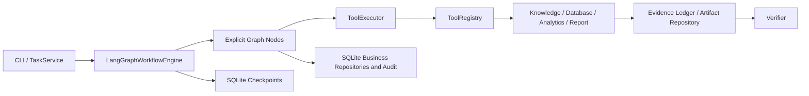

# Deterministic LangGraph Workflow

## Responsibility Boundary

LangGraph now owns node scheduling, conditional routing, bounded loops, checkpoints, and resume.
It does not own Supplier Quality business semantics. Frozen Pydantic contracts, the state machine,
fixed plan factory, policy boundary, ToolExecutor, Evidence Ledger, Report Tool, Artifact
Repository, and Verifier remain authoritative.



## Nodes and Frozen Ordering

The explicit nodes are:

```text
validate_request -> understand_task -> classify_task -> create_plan
-> validate_plan -> policy_check
-> execute_tool | generate_report -> aggregate_evidence
-> policy_check (while steps remain)
-> verify_result -> persist_result -> END
```

`generate_report` is a distinct graph node but still executes the registered `report_generator`
through ToolExecutor. The frozen lifecycle requires the report Artifact before verification, so
this implementation intentionally does not use the pre-report verification ordering shown in the
Stage 10 proposal.

The default offline composition keeps deterministic task understanding and plan creation. An
explicitly injected structured LLM service may instead generate the understanding and candidate
plan, use a separate bounded `repair_plan` node, and use the frozen `REPLANNING` path for eligible
verification failures. Every candidate still passes the same deterministic PlanValidator before
policy or execution. There is no multi-agent behavior. Stage 12 adds approval detail/resolution
API through `ApprovalService`, never as a direct route-to-tool path.

## State and Persistence

`TaskState` remains the authoritative compact lifecycle snapshot. `AgentGraphState` carries that
snapshot plus the immutable request, contract, plan, bounded normalized execution snapshots,
Evidence identifiers, current route, retry counts, replan count, executed-step count, deadline,
and resume count. It never embeds raw source documents, Artifact bytes, or full Evidence content.
Reducers deduplicate step results, tool attempts, Evidence identifiers, Artifact metadata, and
errors under node replay. The Evidence Ledger is read by identifier when later nodes need content.

`SqliteSaver` writes a checkpoint after each graph super-step using
`tenant_id:task_id` as the thread key. The same configured SQLite file contains separate business
tables for tasks, states, results, Evidence, Artifact metadata, audit, and execution leases.
LangGraph tables are never treated as the business system of record. Checkpoint deserialization
uses an explicit frozen-type allowlist with pickle fallback disabled.

Restart recovery loads both repositories and the latest checkpoint, validates task and tenant,
acquires the execution lease, and resumes the next checkpointed node. Successful nodes are not
replayed. If a crash occurs after an external call but before its commit, execution is
at-least-once; the stable idempotency key and unique ToolResult/Evidence/Artifact records reduce
duplicate effects. Exactly-once execution is not claimed.

When an exact action requires approval, `policy_check` first persists its immutable
ApprovalRequest, commits `WAITING_APPROVAL`, and leaves a checkpoint containing the approval and
step IDs plus complete proposed input. A valid approve/edit decision is committed before
`resume_approval()` uses `graph.update_state(..., as_node="policy_check")` to install the complete
resolved input and invoke the normal outgoing edge. Reject/expiry route to result persistence and
`CANCELLED`. The engine verifies that the target tool has not run; reducers and persisted business
records preserve successful predecessors, so they are not replayed after restart.

## Limits and Failure Semantics

- `MAX_TASK_STEPS` counts first entry into business tool steps, not graph node transitions.
- `WORKFLOW_MAX_RETRIES` is layered under each frozen `RetryPolicy`.
- `MAX_REPLAN_COUNT` is enforced, although Stage 10 never creates a replacement plan.
- `MAX_PLAN_REPAIR_ATTEMPTS` separately bounds pre-execution candidate repair.
- `MAX_STRUCTURED_OUTPUT_RETRIES` independently bounds incomplete/invalid Planner JSON recovery.
- `MAX_TOTAL_EXECUTION_SECONDS` creates the Task deadline checked before governed work.
- `GRAPH_RECURSION_LIMIT` is a final graph-level loop guard.
- Only idempotent, recoverable technical failures/timeouts with allowlisted error codes retry.
- Approval-required work stops in `WAITING_APPROVAL`; it is never auto-approved.
- Verification failure never produces `COMPLETED`.

SQLite leases reject simultaneous start/resume. TaskState compare-and-swap rejects stale
transitions both in the process view and in the SQL update predicate. Durable business writes
commit before their in-process views are updated. Terminal tasks cannot resume after their final
TaskResult has been committed; a crash between verification and that final commit remains
recoverable.

## Running and Testing

```bash
python scripts/run_task.py \
  --task supplier-quality-analysis \
  --supplier-id SUP-001 \
  --material-id MAT-001 \
  --time-range 2026-Q1

pytest tests/unit/agent
pytest tests/integration/test_langgraph_workflow.py
```
