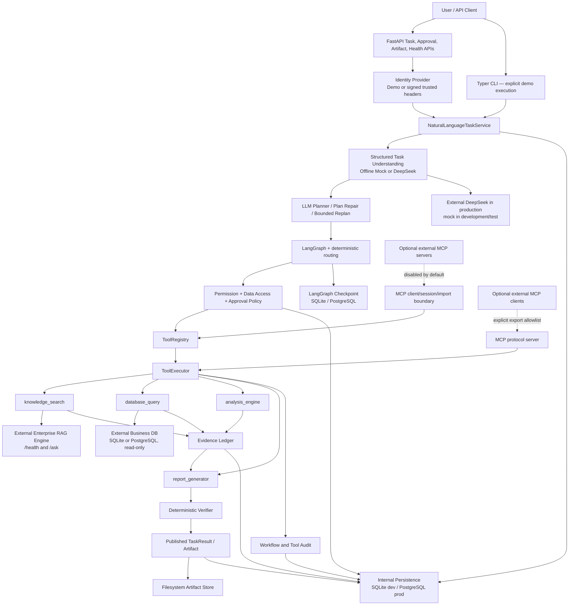
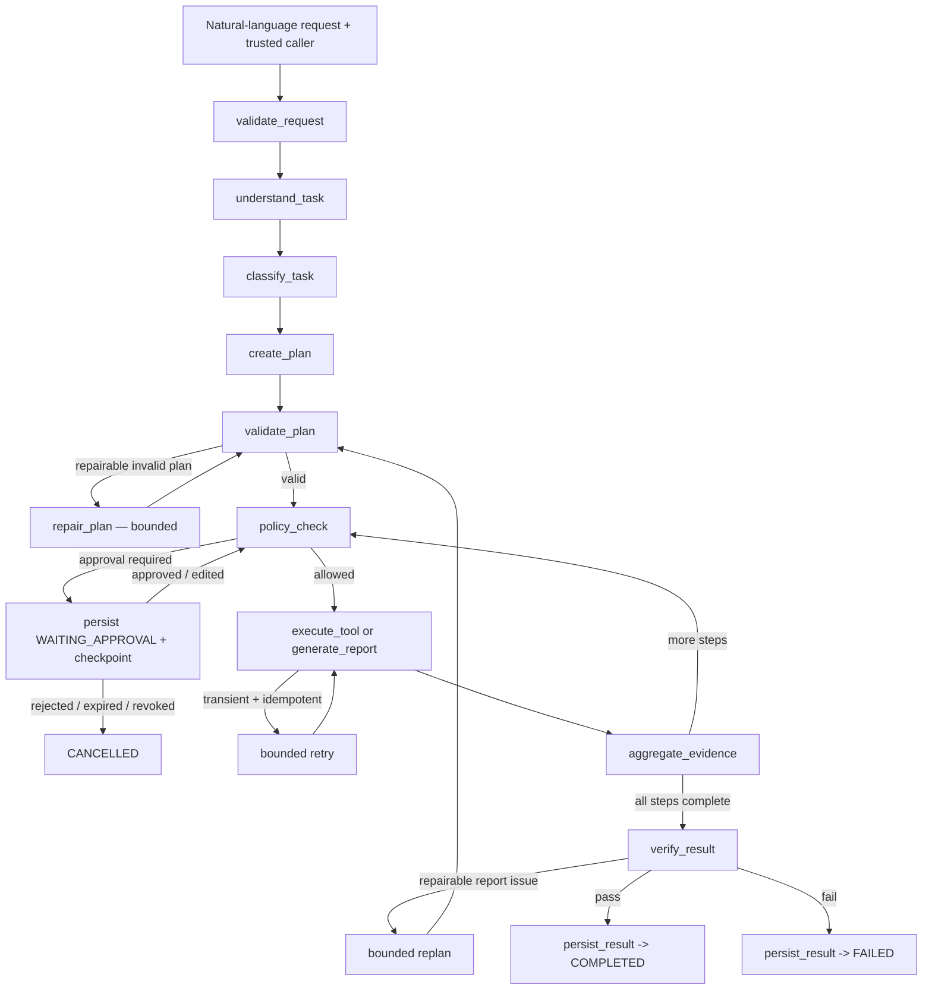
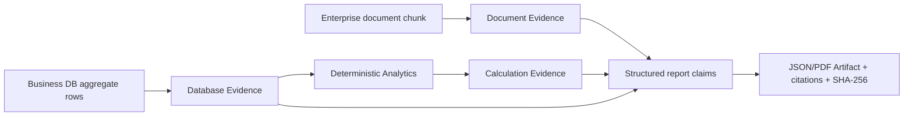

# Agentic Enterprise Knowledge Copilot

## Current Implementation, Capabilities, Limitations and Roadmap

> As-Is Engineering & Capability Report  
> 审计日期：2026-08-10（Asia/Shanghai）  
> 审计基线：`95015c468440b499387e42b62f977217b94c498e`  
> 项目版本：`0.1.0`  
> 审计原则：以当前代码、测试和本次实际运行结果为准；设计目标不等于已实现能力。

---

## 1. Executive Summary

Agentic Enterprise Knowledge Copilot 当前不是一个通用聊天机器人，也不是一个内置向量检索的 RAG 产品。它是一条针对 **Supplier Quality Analysis v1.1** 的单 Agent、受治理、可审计任务执行纵切：用户以自然语言提交明确的年份和季度，系统在可信身份与租户上下文中理解任务、由 LLM 生成受限结构化计划、通过 LangGraph 执行四个冻结工具，查询独立 Enterprise RAG 服务与只读业务数据库，确定性计算质量指标，生成 JSON 或 PDF Artifact，并在完成前验证证据、引用、数字、安全边界和文件完整性。

当前真实支持的业务范围很窄，但工程链路较完整：

- 接受自然语言供应商质量分析任务；年份和季度必须明确，供应商范围不能超出调用者授权范围。
- 使用结构化 LLM 输出完成任务理解和动态计划；开发/测试默认是确定性 mock，生产配置支持 DeepSeek HTTP Provider。
- 通过 Tool Registry、Tool Executor、权限、数据访问策略和可选人工审批统一执行工具。
- 查询独立 Enterprise RAG 的 `/ask` 接口，并把来源和上下文转换为 Document Evidence。
- 通过预注册 SQLAlchemy `Select` 模板只读查询 SQLite 或 PostgreSQL 业务数据库；调用者不能提交任意 SQL，也不能修改企业业务数据。
- 确定性计算缺陷数、检验数、缺陷率和环比变化，并记录公式、输入 Evidence 和数据校验和。
- 生成 JSON/PDF 管理报告，原子写入文件，记录 SHA-256、大小、上游 Evidence 与 Artifact 元数据。
- 使用完全确定性的 Verifier 检查 Artifact、Evidence 结构、交付物、引用、数字和安全约束；验证通过才发布完成结果。
- 持久化 Task、State、Plan、Step、Evidence、Approval、Artifact 元数据、Audit 和 Checkpoint；开发可用 SQLite，生产要求 PostgreSQL。
- 提供任务、审批、Artifact 和健康检查 HTTP API，以及显式 demo 模式 CLI。
- 提供可选、默认关闭的 MCP `2025-11-25` 客户端/服务端边界；它已经过真实 hermetic stdio、Streamable HTTP、JWT/OAuth 风格 Bearer 身份、导入/导出和安全测试，但没有进入当前供应商质量 Planner 的任务计划，也不是默认用户能力。

本次审计实际通过了 Ruff、格式、Mypy、文档治理、架构依赖、424 个单元测试（79% unit-suite coverage）、116 个集成/契约/Smoke 测试、21 个安全测试、30/30 离线 Agent 评估、MCP 13+12 两组协议/安全评估、真实 PostgreSQL 恢复测试、两套 Compose 配置、Python 发行包和 Docker 镜像构建。真实 Enterprise RAG、真实 DeepSeek、真实企业业务 PostgreSQL、生产流量、HA 和公有云部署未在本次环境中验证。

因此，本项目可以被判断为：**供应商质量分析场景的工程化纵切已经实现并在离线/容器环境中得到较强验证；它仍不是可直接大规模开放的通用企业 Agent 平台。** 最大的生产化缺口不是再增加一个工具，而是完成真实上游 IAM、真实 RAG/LLM/业务数据端到端验收、异步任务执行与崩溃自动恢复、共享 Artifact 存储、分布式可观测性、容量与灾备工程。

下一阶段最合理的投入顺序是：先完成真实依赖与生产运行闭环，再考虑扩大业务能力。MCP 可以作为受控集成边界继续产品化，但不应绕过现有 Registry、Policy、Approval、Evidence、Audit 和 Verifier。

### 1.1 术语与结论等级

本报告严格区分以下概念：

| 概念 | 本报告中的含义 |
|---|---|
| Implemented | 当前代码中存在可运行实现，并有相应测试或调用路径证据。 |
| Verified | 本次审计在当前提交上实际执行并成功；会明确列出命令和环境。 |
| Production Ready | 除实现和验证外，还具备真实身份、权限、依赖、持久化、恢复、部署、安全和运维闭环。 |
| Planned | 仅设计、ADR、路线图或空占位存在，不作为当前能力。 |

`Implemented ≠ Verified`，`Verified ≠ Production Ready`，`Planned ≠ Implemented`。例如 Docker 镜像构建已验证，但生产全栈没有启动；DeepSeek Provider 已实现，但真实 API 未验证；MCP 协议边界已实现并验证，但默认禁用且未进入当前业务 Planner。

---

## 2. Project Positioning

项目当前的准确定位是：

> 一个面向供应商质量季度分析的、证据驱动、策略约束、可审批、可恢复、可验证的企业任务执行系统纵切。

它位于以下演进链的后半段：

```text
Chatbot
  -> RAG Question Answering
  -> Tool-using Agent
  -> Governed Enterprise Task Execution System
```

与普通 Chatbot 相比，它不把多步骤工作隐藏在一次文本生成中；与普通 RAG 相比，它不仅检索知识，还查询结构化数据、执行确定性计算、生成 Artifact 和保存证据链；与函数调用 Demo 相比，它增加了计划校验、权限、数据范围、审批、超时/重试、Evidence、Verifier、租户隔离、持久化、审计、评估和部署边界。

但“平台”应谨慎使用：当前生产业务类型只有 `supplier_quality_analysis.v1`，执行计划必须使用冻结的四个工具，分析指标和报告结构固定，没有通用任务市场、任意工具组合、后台队列、Web UI 或多 Agent 协作。

关键设计权威是 `docs/design/` 下七份冻结 v1.1 文档；当前业务代码必须服从这一基线。Stage 18 的 MCP 是后续明确设计的可选协议边界，不改变 v1.1 业务范围。证据见 `AGENTS.md`、`docs/design/design_baseline.md`、`docs/adr/ADR-007-stage-18-mcp-readiness-boundary.md` 和 `docs/adr/ADR-008-mcp-protocol-2025-11-25.md`。

---

## 3. Problem the System Solves

传统企业 RAG 可以回答“质量政策说了什么”，但无法可靠完成“在指定季度内查询受限业务数据、计算 KPI、关联政策、形成管理报告、证明数字来源、等待必要审批并保存审计记录”这一完整任务。

本系统解决的是这个闭环中的工程问题：

1. 将模糊自然语言收敛为受类型约束的供应商质量任务合同。
2. 把 LLM 的计划视为候选输入，而不是执行授权。
3. 将文档检索、业务数据查询、计算和报告生成纳入统一工具控制面。
4. 使用确定性代码计算关键数字并验证结果，降低 LLM 数值幻觉。
5. 保存文档来源、查询指纹、数据快照校验和、公式和 Artifact 校验和。
6. 在数据库访问前执行权限、数据范围和必要的人工审批。
7. 为重启后的审批恢复、任务查询、Artifact 下载和审计提供持久化基础。

它目前只解决季度供应商质量分析，不解决开放域企业知识工作。

---

## 4. Current System Architecture

### 4.1 As-Is Architecture



### 4.2 Layer and dependency boundaries

- `api/` 和 `cli/` 是接口层；二者经 composition root 使用相同 Task Service 和 Agent Engine。
- `services/` 负责用例编排和可信输入收敛。
- `agent/` 负责 LangGraph、状态、节点和确定性路由。
- `contracts/` 是跨层稳定类型边界。
- `tools/` 是能力适配器；正常业务执行经 Registry 和 Executor。
- `policies/`、`security/` 在执行前做权限、数据访问、审批与输出安全控制。
- `evidence/` 保存证据和执行独立验证。
- `persistence/` 保存内部状态；它与企业业务数据库是不同的数据边界。
- `mcp/protocol.py` 是唯一允许直接导入官方 MCP SDK 的生产模块。

本次 `scripts/check_architecture.py` 验证了 domain、application、infrastructure、interfaces 和 bootstrap 的依赖约束。

---

## 5. End-to-End Task Lifecycle

实际主流程不是“先验证再生成报告”，而是先生成候选 Artifact，再对 Artifact 及其证据做独立验证，验证通过后发布：



状态枚举为 `CREATED`、`UNDERSTANDING`、`PLANNING`、`EXECUTING`、`WAITING_APPROVAL`、`RETRYING`、`REPLANNING`、`VERIFYING`、`COMPLETED`、`FAILED`、`CANCELLED`。关键实现见 `src/copilot/agent/graph.py`、`src/copilot/agent/runtime.py`、`src/copilot/agent/routing.py` 和 `src/copilot/agent/state.py`。

默认四步计划为知识检索、业务数据查询、确定性分析、报告生成。每一步前都重新执行策略检查，每个实际工具尝试都由 Executor 再授权。业务失败不会被随意重试；只有允许列表中的瞬时技术/超时故障、幂等工具和未耗尽预算时才重试。验证重计划只响应允许列表中的可修复验证问题，不是开放式“遇到任何失败都让 LLM 再想一次”。

当前没有独立 `PARTIALLY_COMPLETED` 终态。中途失败时，已生成的 Evidence、StepResult 和 Audit 可以保留用于诊断，但不会把未通过完整验证的候选报告作为成功交付物发布；系统选择明确失败而不是以不完整结果冒充完成。

---

## 6. Implemented Capabilities

### 6.1 Natural Language Task Intake

HTTP `POST /v1/tasks` 的最小业务输入是 `task` 文本；`output_format`、`max_steps`、`read_only`、`require_approval`、`session_id` 和受限 `metadata` 为可选控制项。调用者不需要预先填写 year/quarter/supplier IDs 的结构化字段，它们由 Task Understanding 提取。结构化控制只能收紧约束，不能放宽可信调用者的数据范围。

Task Intake 会验证长度、控制字符、metadata 大小和疑似凭据，并把不可信文本与可信身份分开。用户文本中的 tenant、role、scope 或 approval 指令不会成为身份事实。实现证据：`src/copilot/services/task_intake.py`、`src/copilot/services/task_service.py`、`src/copilot/api/schemas/tasks.py`。

限制是年份和季度必须明确；当前不会发起多轮对话补全。缺失时间范围会产生可恢复的 `TASK_INFORMATION_MISSING` 错误，但同步 API 当前把任务落为 `FAILED` 并返回澄清提示，用户需要重新提交。

### 6.2 Task Understanding

Task Understanding 是 **LLM 接口驱动、Schema 约束、业务规则收敛** 的组合：

- 开发/测试默认 `OfflineMockLLM`，以确定性规则提取年份、季度、供应商、语言和格式，但仍走相同结构化接口。
- 生产配置支持 DeepSeek Chat Completions，要求 JSON object 输出，并用 Pydantic 模型解析。
- 输出包括任务类型、时间范围、供应商范围、报告格式和缺失信息；它不能改变可信 tenant、数据权限、只读属性或执行预算。
- Provider 有超时、重试、token 上限和类型化错误；无效 JSON/Schema 不会直接执行。

当前只接受 `supplier_quality_analysis.v1`。实现见 `src/copilot/llm/planning.py`、`src/copilot/llm/schemas.py`、`src/copilot/llm/structured_output.py`、`src/copilot/llm/offline_mock.py`、`src/copilot/llm/deepseek.py`。

### 6.3 Planner

Planner 会从 ToolRegistry 生成 manifest，并要求 LLM 返回结构化 `TaskPlan`；因此它在接口意义上动态生成计划，而不是把一段自然语言直接当作执行指令。对当前冻结场景，动态空间又被严格限制：计划必须包含 `knowledge_search`、`database_query`、`analysis_engine`、`report_generator` 的完整集合和规定依赖。

Plan Validator 检查：

- task/plan 所有权、planning version 和最大步骤数；
- step/tool 名称、版本、输入/输出 Schema 与当前 Registry 一致；
- DAG 无循环、依赖存在且排序合法；
- DB 在 Analytics 之前，Knowledge 和 Analytics 在 Report 之前；
- 只能有一个最终报告步骤；
- 角色和工具权限满足冻结场景。

Plan Repair 最多两次，用于可修复的计划校验问题。Runtime Replan 最多两次，且只针对允许列表中的可修复验证问题；成功的非报告步骤可以保留。Planner 无法凭计划文本授权工具，后续 Validator、Policy 和 Executor 仍会独立拒绝越权。实现见 `src/copilot/services/llm.py`、`src/copilot/llm/manifest.py`、`src/copilot/agent/runtime.py`。

### 6.4 LangGraph Workflow

当前生产 workflow 使用 LangGraph StateGraph；节点、条件边和 checkpoint 均是实际实现，而非流程图占位。API 请求中的执行是同步的：提交请求会执行到终态，或在审批点返回 `202`/`WAITING_APPROVAL`。没有独立任务队列和后台 worker。

Checkpoint thread key 包含 `tenant_id:task_id`。开发使用 SQLite checkpointer，生产 PostgreSQL 使用 LangGraph PostgresSaver；禁用时可退化为内存 saver。Graph resume 会把 checkpoint 与权威 Task DB 状态、tenant、approval、step、plan version 和已执行步骤比对，防止错误重放。

### 6.5 Tool System

`ToolDefinition` 描述名称、版本、Schema、权限、风险、超时、重试/幂等和审批元数据。Registry 是实例级、线程安全、默认本地 allowlist 为四个冻结工具；同时支持 MCP 的 namespace、origin、provenance 和原子刷新/撤销。

冻结四工具当前只使用 LOW/MEDIUM 风险等级，没有 HIGH 风险业务动作；存在风险字段不代表系统已经支持高风险写操作。

标准执行链为：

```text
Plan step
  -> Registry lookup
  -> exact ToolCall + trusted ExecutionContext
  -> input JSON Schema validation
  -> authorizer / data policy / approval binding
  -> cancellation and deadline check
  -> bounded runner
  -> output guard
  -> output Schema validation
  -> Evidence recording
  -> audit persistence
  -> normalized ToolResult
```

`ToolExecutor` 统一映射业务失败、权限拒绝、技术失败和超时。重试由 Graph 编排而不是 Executor 私自循环。Audit 持久化失败时按 fail-closed 处理。

正常生产 Graph 只通过 Executor 调用工具。Python 层仍可直接实例化具体 Tool（单元测试这样做），因此“所有可能代码均物理不可绕过”并不成立；当前约束依靠 composition root、包依赖治理和调用规范。即使直接调用 Executor，也必须提供与 ToolCall 完全一致的可信 ExecutionContext，且会重新授权。核心证据：`src/copilot/tools/base.py`、`src/copilot/tools/registry.py`、`src/copilot/tools/executor.py`、`src/copilot/services/execution.py`。

超时是调用方边界：Tool 在 ThreadPool 中运行，Python 线程不能被强制终止；超时或取消后迟到结果不会提交。Analytics 支持 cooperative cancellation，Knowledge、Database 和 Report 当前标为不可协作取消。因此 cancellation 的可靠语义是“阻止后续提交/发布”，不保证底层 I/O 或线程立即停止。

### 6.6 Knowledge Tool

Copilot 本身不是 RAG。Enterprise RAG 是独立 HTTP 服务；Knowledge Tool 是受治理适配器：

- `GET /health` 用于 readiness 检查。
- `POST /ask` 请求只发送问题，严格验证 answer、sources、contexts、route、latency 和 `rag_trace_id` 响应族。
- 每次请求有超时，最多三次；只对 timeout、connection reset、502/503/504 等瞬时故障指数退避重试。
- 401/403、契约错误、不可用、超时和内部错误映射为安全类型化错误。
- 支持配置 trace header 和 User-Agent；当前没有独立 RAG bearer credential 配置，生产鉴权需要由网络或上游边界补足。

Knowledge Tool 最多保留 `top_k` 个来源/上下文，写入 Document Evidence：文档 ID、版本、chunk/page、RAG snapshot、RAG trace、classification、excerpt checksum。RAG 的自然语言 answer 不作为报告事实来源；报告引用来源片段。空匹配是成功但证据为空的合法结果。RAG 不可用时 readiness 返回不可接任务，当前任务在重试耗尽后失败；liveness 保持存活。实现见 `src/copilot/tools/knowledge/client.py`、`src/copilot/tools/knowledge/tool.py`。

### 6.7 Database Tool

必须区分两类数据库：

| 数据库 | 用途 | 写入能力 |
|---|---|---|
| Internal Persistence DB | Task、Plan、Evidence、Approval、Audit、Artifact 元数据、Checkpoint 等 | Copilot 按迁移写入；生产要求 PostgreSQL。 |
| Enterprise Business DB | 供应商质量业务数据 | 当前只读；Copilot 不能 INSERT/UPDATE/DELETE/DDL。 |

Business Database Tool 支持 SQLAlchemy SQLite 和 PostgreSQL，只提供 `supplier_quality_summary_v1` 与 `supplier_quality_trend_v1` 两个模板。调用者和 LLM 只能选择模板及绑定参数，不能提供原始 SQL。

安全控制包括：

- 只接受受信 SQLAlchemy `Select`；拒绝字符串/TextClause、多语句、通配列、未注册表/列/函数和缺少 LIMIT。
- 当前模板访问 `suppliers` 和 `incoming_inspections` 的批准字段；Schema registry 中存在其他模型不代表可查询。
- 绑定 tenant、时间范围和供应商范围；行数上限 10,000，超量截断；语句超时最大 8 秒。
- SQLite 使用 `query_only` 和 progress handler；PostgreSQL 每个事务执行 `SET TRANSACTION READ ONLY` 和本地 statement timeout。
- 空结果是成功，并生成 Database Evidence。

Database Evidence 保存 query fingerprint、schema snapshot、安全 DB 名、表/列、`SELECT`/read-only 标记、哈希化 tenant/supplier scope、row count、聚合内容和 dataset checksum；不保存原始 SQL、完整行集或凭据。

生产配置要求非 SQLite Business DB 和真实 SQLAlchemy adapter。仓库无法证明配置凭据本身是数据库级只读账号，但运行事务会强制只读；生产仍应使用真正最小权限凭据。实现见 `src/copilot/tools/database/`、`src/copilot/policies/data_access.py`。

### 6.8 Analytics Tool

Analytics 是确定性内存计算，不调用 LLM，也不允许任意 Python。当前真实指标只有：

1. `defect_count = sum(defect_count)`
2. `inspected_count = sum(inspected_count)`
3. `defect_rate = sum(defect_count) / sum(inspected_count)`
4. `period_over_period_trend = current defect rate - previous defect rate`

支持的维度只有 `supplier_id` 和 `period`，最多两个。它不支持任意 filter、mean、top_n、风险排名或脚本运算。

工具要求当前任务的 Database Evidence ID 和 dataset checksum 与原始数据一致；最多 10,000 行，验证非负数及 defect ≤ inspected。Decimal 采用 half-even 并规范到 4 位；零分母返回 `null` 和 warning，不产生 NaN；空数据返回空结果和 warning。Calculation Evidence 保存公式、engine version、输入 DB Evidence、dataset checksum、group_by、指标、warning 和行数。实现见 `src/copilot/tools/analytics/`。

关键数字不交给 LLM 计算，原因是公式、精度、分母、异常行为和输入血缘必须可重现、可测试、可验证。

### 6.9 Evidence Ledger

当前 Evidence 类型只有 `DOCUMENT`、`DATABASE`、`CALCULATION`，没有独立 `ARTIFACT` Evidence 类型。名为 `InMemoryEvidenceLedger` 的类在有 persistence repository 时会把记录持久化并可重新加载；名称反映缓存实现，不代表生产证据只在内存。

Ledger 特性包括 tenant/task scope、append-only、内容 SHA-256 去重、deep copy、数量限制、父子 lineage 校验、trace graph、Output Guard、prompt-injection finding、trust/quarantine metadata。

真实证据链是：



可追溯内容包括文档 chunk/page/version、查询指纹和字段范围、数据集校验和、计算公式与父 Evidence、报告 claim citation 和 Artifact checksum。仍不完全可追溯的是：报告中的固定规则型建议/限制不是逐条业务事实 Evidence；RAG answer 被丢弃而只保留来源；Artifact 没有独立 Evidence 类型；报告模型中的 `trace_id` 当前写成 task ID，并非请求实际 trace ID。

实现见 `src/copilot/contracts/evidence.py`、`src/copilot/evidence/ledger.py`、`src/copilot/evidence/lineage.py`、`src/copilot/evidence/workflow.py`。

### 6.10 Verifier

Verifier 当前完全由确定性代码实现，不依赖 LLM judge：

- **ArtifactIntegrityVerifier**：检查恰好一个 Artifact、归属、类型、读取、大小、SHA-256、Evidence 引用和可解析结构模型。
- **EvidenceStructureVerifier**：检查 task/tenant/step 归属、source metadata、Calculation 到 Database 的祖先关系。
- **DeliverableVerifier**：检查所需结构化章节和成功 producer。
- **CitationVerifier**：检查 claim 引用存在、类型兼容和 DB ancestry。
- **NumericVerifier**：把报告数字与 Calculation Evidence 对照，计数精确、比例按 Decimal/4 位容差、单位一致。
- **SafetyVerifier**：检查 Registry snapshot、plan/call/result lineage、allowlist、审批绑定、只读工具集、Database Evidence 的 SELECT/read-only、表/列范围、敏感字段和 quarantined Evidence。

Numeric Verifier 不重新查询 Business DB，也不从原始行重新计算；它验证报告与 Calculation Evidence 一致。因此它能防止“报告数字被改写”，不能独立证明最初业务数据库内容绝对正确。

只有 Verification Report 通过，Task 才能 `COMPLETED`。报告工具在验证前已创建文件；失败候选 Artifact 会保留用于内部诊断，但不会作为 TaskResult 发布。实现见 `src/copilot/evidence/validators.py` 和 `src/copilot/agent/runtime.py`。

### 6.11 Reporting

真实支持格式只有 **JSON 和 PDF**。Markdown、HTML、DOCX、XLSX 未实现。

Report Tool 是确定性 composer/renderer，不调用 LLM、不查询数据、不重新计算 KPI，也不发布到外部系统。它从 Task Contract、Knowledge/Database/Calculation Evidence 和分析结果构造固定报告模型，包含 scope、指标、文档引用、query fingerprints、公式/lineage、findings、risks、recommendations 和 limitations。当前没有实现最高风险供应商排名，ranking 保持空。

JSON 使用稳定排序、UTF-8、禁止 NaN。PDF 使用 ReportLab、A4 和中文 CID 字体，并嵌入规范 JSON 模型供 verifier 解析。文件采用临时文件、fsync、`os.replace` 原子提交，限制路径在 Artifact root 内，并记录 SHA-256 与 size。

Artifact 元数据包含 ID、type、path、media type、checksum、size、generator、Evidence IDs 和时间。公共 API 不暴露内部路径，下载时再次验证已发布 TaskResult、tenant/task、路径、大小和 checksum。

重启后是否可访问取决于 **数据库元数据和 Artifact 文件卷都仍存在**。仅有 PostgreSQL 元数据而文件卷丢失，Artifact 无法恢复。报告里的 `verification_status` 是生成时的 `PENDING`，因为独立验证发生在生成之后；这也是当前模型语义限制。实现见 `src/copilot/tools/reporting/`、`src/copilot/services/artifact_service.py`、`src/copilot/persistence/artifact_repository.py`。

### 6.12 Persistence

内部持久化支持 SQLAlchemy SQLite/PostgreSQL，生产采用 Alembic migration，不允许运行时自动建表。表覆盖：

- Task request、contract、plan、state、result、verification；
- state events、step result、tool result/execution、lease、plan/verification history；
- approval 和 approval history；
- evidence；
- artifact metadata；
- workflow/tool audit；
- MCP connection/session/invocation metadata。

Checkpoint 与业务状态分开但使用相同持久化目标：SQLite saver 用于开发，PostgresSaver 用于生产。迁移顺序是 Alembic 业务表后再初始化 LangGraph vendor checkpoint 表。生产 Compose 有独立 `migrate` 服务。

生产中的 Task 元数据进入 PostgreSQL，Artifact 字节进入文件卷。因此备份、恢复和灾备必须同时覆盖两者。实现见 `src/copilot/persistence/`、`migrations/versions/`、`src/copilot/persistence/migrate.py`。

### 6.13 Approval

当 Task Contract 要求审批时，Policy 在 knowledge_search 之后、第一次受控非知识步骤（正常为 database_query）前暂停。Approval 记录绑定：tenant、task、planning version、step、tool/version、input schema fingerprint、完整 arguments、controlled scope、required role 和 TTL。

API 支持查询及 `approve`、`edit`、`reject`。Edit 是完整参数替换，且当前只能缩小 `top_k` 或 `row_limit`；不能修改分析/报告字段。Resolution 使用原子 compare-and-set，重新校验 Registry、Schema、版本、checkpoint 和目标步骤未执行。Resume 后 Executor 对最终参数、fingerprint 和审批再次授权。

拒绝、过期或撤销导致取消。普通 `quality_analyst` 不能批准；需要 `quality_data_approver`。直接调用 Executor 也不能绕过 `approval_required`。实现见 `src/copilot/policies/approval.py`、`src/copilot/services/approval_service.py`、`src/copilot/api/routes/approvals.py`。

### 6.14 Security

主要安全边界包括：

- **身份**：开发/test 可用 DemoIdentity；生产强制 signed trusted headers，验证 HMAC、时间窗口、user、tenant、roles、scopes、supplier IDs 和 purpose。匿名、缺失或签名无效请求返回 401。
- **权限**：PermissionMatrix 区分 `quality_analyst` 与 `quality_data_approver`；未知角色和错误 purpose 默认拒绝。
- **数据访问**：DB 模板、表、字段、tenant、supplier scope 和只读事务均确定性约束。
- **Prompt injection**：用户、文档和工具输出被视为不可信；检测器记录 finding，控制权仍在确定性 Policy/Schema/Registry，而非提示词。
- **敏感信息**：SensitiveDataRegistry、OutputGuard 和日志清洗检测/阻断 credential、PII pattern、DB URL、private key、raw SQL、路径、traceback 和 system prompt。
- **审计**：记录 task、policy、tool、approval、evidence、artifact 关联及安全结果，不保存不必要的原始敏感 payload。

当前生产身份是“可信上游网关断言”的 HMAC 集成，不是仓库内完整 OAuth/OIDC/SSO、用户生命周期、吊销或细粒度 IAM。Prompt injection 检测为启发式，不应被描述为完全防御。实现见 `src/copilot/security/`、`src/copilot/policies/`、`src/copilot/services/identity.py`、`src/copilot/api/dependencies.py`。

### 6.15 Multi-Tenancy

Task、State、Evidence、Approval、Artifact、Audit、Checkpoint key 和 Tool ExecutionContext 都包含 tenant；repository 的关键 read/write 接口要求 tenant 过滤，迁移增加 tenant/task 复合外键和索引。Artifact download、approval resolution、resume 和 execution context 均重新校验 tenant。本次安全测试和真实 PostgreSQL 测试验证了跨租户查询拒绝。

这证明了 **应用层租户隔离已实现**，但不能等同于完整企业多租户平台：仓库没有 tenant provisioning/admin、数据库 Row-Level Security、每租户密钥、配额/账单、跨区域数据驻留、共享 Artifact object storage policy。故生产可用性仍为条件式。

### 6.16 Cancellation & Recovery

取消 API 会持久化 cancellation request、触发当前 invocation token、撤销 pending approvals，并在不存在结果时写入 `CANCELLED` TaskResult。终态保护防止迟到 Tool 结果改写取消状态。

Analytics 会协作检查 token；其他三个本地工具不能保证中断底层线程/I/O。ThreadPool timeout/cancel 后结果被丢弃。因此取消不仅是改数据库状态，但也不是所有工作都能立即硬停止。

审批中断后的重启恢复已实现：Task、Evidence、Approval、Artifact metadata、Audit 和 Checkpoint 持久化，批准后可继续，已成功步骤不重放。本次真实 PostgreSQL 测试验证了这一行为。

任意进程崩溃时的“自动恢复所有 EXECUTING 任务”没有实现：没有启动扫描器、队列 worker 或公开的通用 resume API。底层 engine 有一致性校验和 resume primitive，但当前用户可见恢复主要是审批 resume。故 checkpoint recovery 状态为 PARTIAL。

FastAPI lifespan 会关闭容器，Executor `cancel_all` 并非等待线程完全退出；Compose 给 30 秒 stop grace。没有显式 HTTP request draining/signal orchestration，主要依赖 Uvicorn 和运行平台。

客户端断开 HTTP 连接也没有被实现为可靠的 Task cancellation 信号；需要调用取消 API，或由服务/平台触发显式关闭流程。

### 6.17 Observability

已实现：

- JSON structured logging；字段包括 request/task/trace/session/tenant/user、node、step、tool、status、error、attempt、retry、latency 等。
- ContextVar correlation，边界清洗敏感值。
- process-local metrics registry、bounded in-memory spans、trace summary 和 performance analyzer。
- task/node/tool/retry/approval/replan/verification/MCP 计数和 latency 分布。
- `/health` 兼容端点、`/health/live` 进程存活、`/health/ready` 依赖就绪。

Readiness 动态探测内部 persistence、真实业务 DB、Artifact writable 和真实 RAG；故 RAG/PostgreSQL 故障时返回 503，不接受新任务，而 liveness 保持成功；依赖恢复后下一次 probe 自动恢复 ready。

未实现 `/metrics`、Prometheus exporter、OpenTelemetry exporter、外部 trace backend、告警和 dashboard。metrics/spans 随进程重启丢失；持久化 Audit 仍在。实现见 `src/copilot/observability/`、`src/copilot/services/health.py`、`src/copilot/api/routes/health.py`。

### 6.18 API & CLI

HTTP API：

| Method/Path | 作用 |
|---|---|
| `POST /v1/tasks` | 提交自然语言任务；终态返回 201，等待审批返回 202。 |
| `GET /v1/tasks/{task_id}` | 查询任务。 |
| `GET /v1/tasks/{task_id}/steps` | 查询步骤。 |
| `GET /v1/tasks/{task_id}/evidence` | 查询 Evidence。 |
| `GET /v1/tasks/{task_id}/artifacts` | 列 Artifact。 |
| `GET /v1/tasks/{task_id}/artifacts/{artifact_id}` | 校验并下载 Artifact。 |
| `POST /v1/tasks/{task_id}/cancel` | 请求取消。 |
| `GET /v1/tasks/{task_id}/approvals/{approval_id}` | 查询审批。 |
| `POST /v1/tasks/{task_id}/approvals/{approval_id}` | 批准、编辑或拒绝并恢复。 |
| `/health`, `/health/live`, `/health/ready` | 兼容、存活与就绪检查。 |

API route 很薄，调用相同的 NaturalLanguageTaskService。开发使用 Demo Identity；生产 `Settings` 会拒绝 Demo Identity，并要求 signed trusted-header provider。

CLI 通过同一 composition root 和 Task Service，但实际任务执行必须显式 `--demo`，生产模式要求使用 API。这避免把本地 CLI 身份误当生产认证。入口见 `src/copilot/bootstrap/api.py`、`src/copilot/bootstrap/cli.py`、`src/copilot/cli/main.py`。

### 6.19 Evaluation

Evaluation 不是 pytest 的替代品，而是从 Agent 行为层验证完整链路。30 个 `supplier_quality` v1.1.0 case 通过生产 Task Service/LangGraph 的 deterministic mock path，oracle 不进入 Agent 输入。

实际 evaluator 覆盖：Task Success、初始/最终 Plan Validity、Tool Selection precision/recall/F1、Tool Execution、Evidence Coverage、Citation Correctness、Numeric Accuracy、安全与授权、Prompt Injection/secret/sensitive leakage、Artifact authorization、Audit completeness、Replan Recovery、步骤数、延迟、token/cost metadata。

本次结果：30/30 passed，基线 gate passed；Task Success 1.0，Plan Validity 1.0（24 个适用 case），Tool Selection Accuracy 1.0（15 个适用 case），Tool Execution Success 65/70（预期瞬时/拒绝尝试保留在分母），Evidence Coverage 28/28，Citation Correctness 56/56，Numeric Accuracy 4/4，Safety Violation 0/21，Attack Block 10/10，Replan Recovery 1/1。p50/p95 102/150 ms 仅代表本机 mock，不能外推生产。

MCP 评估另运行真实 SDK hermetic servers：互操作组 13 tests、安全组 12 tests 均通过。它不联系公共 MCP server，因此不能代表第三方兼容矩阵。

限制：live evaluation 明确未实现；mock token/cost 与语义质量不代表真实 DeepSeek/RAG；检索 Recall@K、真实文档质量、开放式报告质量、生产延迟/成本仍未评测。实现见 `evaluation/`、`evaluation/datasets/supplier_quality_v1.jsonl`、`evaluation/evaluators/`。

### 6.20 Deployment

Dockerfile 为 Python 3.11 multi-stage build，运行用户 `appuser`（UID/GID 10001），只复制运行所需包、Alembic 和 migrations，并用 `/health/live` 做镜像 healthcheck。

开发 Compose 包含 PostgreSQL 16.4、外部 RAG image、migration、RAG health 和 Copilot API，使用 PostgreSQL 与 Artifact named volumes。生产 Compose 要求不可变 Copilot/RAG image、生产 Settings、PostgreSQL、migration、RAG health、API 和 Artifact volume，并设置 stop grace。

本次已验证两份 Compose 配置和镜像构建，镜像内包版本 `0.1.0` 且运行用户是 `appuser`。没有启动完整生产栈，因为真实 RAG image、DeepSeek credential 和企业业务 PostgreSQL 不在审计环境中。

该容器化边界为 ECS/EKS/EC2 提供基础，但仓库没有 Terraform/CloudFormation/CDK、ALB、RDS、S3、CloudWatch、Secrets Manager 或 AWS 发布流水线，因此 **AWS deployment 未实现**。

### 6.21 Optional MCP Interoperability

Stage 18 已经超出“空目录/占位”阶段：

- 官方 MCP SDK 仅封装在 `src/copilot/mcp/protocol.py`，固定 revision `2025-11-25`、SDK `>=1.29,<2.0`。
- Client 支持 stdio 和 Streamable HTTP、初始化/协商/发现、独立 server session、连接策略、credential reference、origin/namespace/provenance、重连/撤销和幂等受控重试。
- 发现的 external tool 经 normalization 和明确 `MCPAccessRule` 后，以稳定 namespace 导入同一个 ToolRegistry，通过现有 Executor、Evidence、Audit 和 Output Guard 执行。
- Server 通过 JWT 验证和 `MCPExportRule` deny-by-default 导出本地工具，仍走现有 Executor；resource/prompt provider 支持显式 allowlist，但默认 composition root 导出空集合。
- Sampling、elicitation、roots、progress/notification primitives 有策略门控和测试；默认关闭高风险能力。
- 连接、session 和 invocation metadata 持久化，不保存 token。

然而，MCP feature flags 默认关闭；主 FastAPI 没有 MCP connection-management API；当前 Supplier Quality Plan Validator 要求精确四工具，PermissionMatrix 也限制冻结业务工具，因此导入的 MCP 工具不会被当前自然语言 Planner 选择。MCP server 由单独脚本启动，必须显式配置 allowlist、tenant、issuer、audience、signing key。

结论：MCP Client/Server 是 **IMPLEMENTED + VERIFIED + DISABLED BY DEFAULT** 的可选协议边界，不是当前业务 Agent 的通用扩展能力，也尚不能称为第三方生态 production ready。

---

## 7. What the System Can Do Today

在配置正确的真实 RAG、只读业务数据库、DeepSeek 和可信身份网关后，系统能够完成这一类受限任务：

> “分析 2026 年 Q2 我有权限查看的供应商质量，结合公司质量政策，计算缺陷数、检验数、缺陷率和季度变化，并生成 JSON 或 PDF 管理报告。”

系统真实执行：

1. API 接收自然语言和可信 caller，不从文本接受身份。
2. Intake 固化 tenant、user、roles、supplier/data scope、purpose、deadline 和只读约束。
3. LLM structured output 提取 year/quarter/supplier/output；Pydantic 校验。
4. Planner 从 Registry manifest 生成四步 Plan；Validator 检查 DAG、Schema、工具和权限。
5. 每步执行 Policy；若合同要求，在数据库读取前持久化审批并暂停。
6. Knowledge Tool 查询外部 RAG，保存 Document Evidence。
7. Database Tool 用批准模板和绑定参数只读查询业务 DB，保存 Database Evidence。
8. Analytics Tool 确定性计算四个 KPI，保存 Calculation Evidence。
9. Reporting Tool 从合同和 Evidence 生成 JSON/PDF Artifact，记录 checksum。
10. Verifier 检查文件、证据、引用、数字和安全。
11. Task、Plan、Step、Evidence、Approval、Artifact metadata、Audit、Checkpoint 持久化。
12. 用户通过 API/CLI 获取结果；API 可下载已验证 Artifact。

它不能可靠完成“自动识别最高风险供应商并排序”，因为当前 Analytics 没有风险评分/排名；报告只会呈现实现过的指标和固定规则型观察。也不能接受未指定季度的开放问题并自动追问。

---

## 8. Example End-to-End Tasks

### Example 1 — Quarterly Supplier Quality Summary

**User Request**

```text
Analyze supplier quality for Q2 2026, compare it with the previous period,
check the quality policy, and generate a JSON management report.
```

**System Execution**

提取 `2026/Q2`，生成并验证四步计划；Knowledge 查询质量政策；Database 执行 summary/trend 模板；Analytics 按 supplier/period 计算四个指标；Report 生成 JSON；Verifier 后发布。

**Tools Used**：`knowledge_search`、`database_query`、`analysis_engine`、`report_generator`。

**Evidence Produced**：Document Evidence、Database Evidence、Calculation Evidence；Artifact 引用这些 Evidence。

**Final Deliverable**：带 scope、指标、政策引用、query fingerprint、公式、limitations 和 SHA-256 的 JSON Artifact。

### Example 2 — Authorized Supplier-Scoped Investigation

**User Request**

```text
For supplier SUP-001, analyze Q3 2026 inspection defects against the approved
supplier quality policy and produce a PDF report.
```

**System Execution**

Task Understanding 提取 supplier/year/quarter/PDF；Intake 将供应商请求与 caller 的 supplier scope 取交集。若 SUP-001 不在授权范围，任务在工具执行前被拒绝；在范围内则执行同一受控链。

**Tools Used**：冻结四工具。

**Evidence Produced**：含文档 chunk/page 的 Document Evidence；含哈希化 supplier scope、查询指纹和 dataset checksum 的 Database Evidence；含公式与 DB 父证据的 Calculation Evidence。

**Final Deliverable**：经 checksum 和结构验证的 PDF；不包含任意 SQL 或未授权供应商原始行。

### Example 3 — Approval-Gated Data Access and Report

**User Request**

```text
Analyze Q4 2026 supplier quality and generate a JSON report.
Require approval before controlled data access.
```

**System Execution**

Knowledge step可以先执行；在 database_query 前，系统创建与精确 arguments/schema/step/tenant 绑定的 approval，持久化 checkpoint 并返回 `WAITING_APPROVAL`。有 `quality_data_approver` 角色的用户可批准，或只缩小 row limit；系统重新校验后 resume。拒绝/过期则取消。

**Tools Used**：批准前 `knowledge_search`；批准后其余三个工具。

**Evidence Produced**：批准前 Document Evidence 保留；批准后增加 Database/Calculation Evidence，并保存 approval history 和 audit。

**Final Deliverable**：批准且验证通过后才发布 JSON；服务在等待期间重启仍可从 PostgreSQL/checkpoint 恢复。

---

## 9. Capability Matrix

状态只使用规定枚举；“Production Usable”表示在明确外部依赖和运维条件下是否可开放，不等于本次仅在 mock 中通过。

| Domain | Capability | Status | Production Usable | Evidence |
|---|---|---:|---:|---|
| Intake | Natural-language task submission | IMPLEMENTED | CONDITIONAL | `services/task_intake.py`, task API tests |
| Intake | Interactive clarification/resume | NOT_IMPLEMENTED | NO | Missing info ends current task as FAILED |
| Agent | Structured task understanding | IMPLEMENTED | CONDITIONAL | `llm/planning.py`, `llm/schemas.py` |
| Agent | DeepSeek provider | IMPLEMENTED | NOT VERIFIED LIVE | `llm/deepseek.py`, mocked HTTP tests |
| Agent | Dynamic structured planning | IMPLEMENTED | CONDITIONAL | Registry manifest + LLM Plan + validator |
| Agent | Plan repair | IMPLEMENTED | CONDITIONAL | Bounded repair path/tests |
| Agent | Verification-triggered replan | IMPLEMENTED | CONDITIONAL | allowlisted, bounded; evaluation 1/1 |
| Agent | Open-domain/long-horizon planning | NOT_IMPLEMENTED | NO | Exact v1.1 capability set required |
| Workflow | LangGraph execution | IMPLEMENTED | CONDITIONAL | `agent/graph.py`, integration tests |
| Workflow | Retry | IMPLEMENTED | YES | transient + idempotent + bounded only |
| Workflow | Background queue/workers | NOT_IMPLEMENTED | NO | API execution is synchronous |
| Knowledge | Enterprise RAG HTTP adapter | IMPLEMENTED | NOT VERIFIED LIVE | client/tool + mocked contract/integration |
| Knowledge | RAG authentication header/token | NOT_IMPLEMENTED | NO | No credential setting in HTTP client |
| Database | SQLite read-only query | IMPLEMENTED | DEV/TEST | SQLAlchemy adapter/tests |
| Database | PostgreSQL read-only business query | IMPLEMENTED | NOT VERIFIED AGAINST REAL BUSINESS DB | adapter/read-only transaction code |
| Database | PostgreSQL internal persistence | IMPLEMENTED | CONDITIONAL | Real PostgreSQL test passed |
| Database | Enterprise DB mutation | NOT_IMPLEMENTED | NO | only trusted SELECT templates |
| Analytics | Deterministic KPI calculation | IMPLEMENTED | YES | 4 metrics, Decimal, tests |
| Analytics | Risk scoring/ranking/top-N | NOT_IMPLEMENTED | NO | no operation in current analytics |
| Evidence | Document/Database/Calculation Ledger | IMPLEMENTED | CONDITIONAL | persistent ledger + tests |
| Evidence | Artifact Evidence type | NOT_IMPLEMENTED | NO | Artifact is separate metadata model |
| Verification | Artifact/evidence/deliverable verification | IMPLEMENTED | YES | deterministic verifier suite |
| Verification | Numeric report-to-calculation verification | IMPLEMENTED | YES | `NumericVerifier` |
| Verification | Independent DB recomputation | NOT_IMPLEMENTED | NO | does not re-query raw source |
| Reporting | JSON report | IMPLEMENTED | YES | renderer, artifact tests |
| Reporting | PDF report | IMPLEMENTED | YES | ReportLab, render/parse tests |
| Reporting | DOCX/XLSX/HTML/Markdown | NOT_IMPLEMENTED | NO | no renderer |
| Security | Signed trusted-header identity | IMPLEMENTED | CONDITIONAL | requires trusted upstream gateway |
| Security | Full OAuth/OIDC/SSO IAM | NOT_IMPLEMENTED | NO | outside repository |
| Security | Prompt-injection/output guardrails | IMPLEMENTED | CONDITIONAL | layered deterministic controls/tests |
| Security | Secret/log redaction | IMPLEMENTED | YES | security/observability tests |
| Governance | Policy and data allowlists | IMPLEMENTED | YES | policy modules + security tests |
| Governance | Human approval and exact resume binding | IMPLEMENTED | CONDITIONAL | API/integration/PostgreSQL recovery tests |
| Multi-tenancy | Application-layer tenant isolation | IMPLEMENTED | CONDITIONAL | repositories/context/security tests |
| Multi-tenancy | RLS/provisioning/tenant operations | NOT_IMPLEMENTED | NO | no platform layer |
| Persistence | Task/plan/step/evidence/audit persistence | IMPLEMENTED | CONDITIONAL | SQLite/PostgreSQL repos + migrations |
| Persistence | Durable Artifact bytes on filesystem | IMPLEMENTED | SINGLE SHARED VOLUME | local path + volume |
| Runtime | Cancellation and late-result suppression | PARTIAL | CONDITIONAL | cooperative only for analytics |
| Runtime | Approval checkpoint recovery | IMPLEMENTED | YES | real PostgreSQL restart test |
| Runtime | Automatic crash recovery for arbitrary tasks | PARTIAL | NO | no startup sweeper/queue runner |
| Observability | Structured logs/local metrics/spans | IMPLEMENTED | CONDITIONAL | process-local only |
| Observability | OpenTelemetry/Prometheus backend | NOT_IMPLEMENTED | NO | no exporter or `/metrics` |
| API | Task/Approval/Artifact/Health APIs | IMPLEMENTED | CONDITIONAL | route and contract tests |
| UI | Web UI | NOT_IMPLEMENTED | NO | no frontend |
| Evaluation | Deterministic offline Agent evaluation | IMPLEMENTED | YES FOR REGRESSION | 30/30 current run |
| Evaluation | Live LLM/RAG evaluation | NOT_IMPLEMENTED | NO | CLI explicitly rejects live mode |
| Deployment | Docker image | IMPLEMENTED | CONDITIONAL | build/run verified this audit |
| Deployment | Dev/production Compose topology | IMPLEMENTED | CONDITIONAL | config verified; full prod not run |
| Deployment | AWS infrastructure/deployment | NOT_IMPLEMENTED | NO | no IaC/release path |
| MCP | Client import boundary | DISABLED | CONDITIONAL/SEPARATE | real SDK tests, feature flag off |
| MCP | Server tool export boundary | DISABLED | CONDITIONAL/SEPARATE | explicit allowlist + JWT tests |
| MCP | Resources/prompts exported by default | DISABLED | NO | composition root uses empty sets |
| MCP | Third-party/public ecosystem validation | NOT_IMPLEMENTED | NO | hermetic repository servers only |
| Agent | Multi-agent collaboration | NOT_IMPLEMENTED | NO | single LangGraph agent |

---

## 10. What the System Cannot Do

| Capability | Current Status | Reason |
|---|---|---|
| 修改企业业务数据库 | NOT IMPLEMENTED | Business DB 只接受批准的 SELECT template，并强制只读事务。 |
| 自动发送 Email/Teams/Slack | NOT IMPLEMENTED | 没有外部消息 action tool。 |
| 创建采购订单、CAPA、供应商状态变更 | NOT IMPLEMENTED | 无 ERP/QMS 写工具，也不在冻结范围。 |
| 任意 SQL | NOT IMPLEMENTED | 调用者不能提交 SQL，只能选择两个模板。 |
| 任意 Python/代码执行 | NOT IMPLEMENTED | Analytics 仅四个确定性指标。 |
| 自动最高风险供应商排名 | NOT IMPLEMENTED | 没有风险评分、top-N 或 ranking 算法。 |
| 未指定时间范围的自动追问 | NOT IMPLEMENTED | 当前返回失败/澄清信息，需重新提交。 |
| 开放域企业任务 | NOT IMPLEMENTED | 仅 `supplier_quality_analysis.v1`。 |
| Multi-Agent 协作 | NOT IMPLEMENTED | 当前是一张单 Agent LangGraph。 |
| Web 搜索 | NOT IMPLEMENTED | 只有批准的 Enterprise RAG，不含互联网搜索。 |
| Web UI | NOT IMPLEMENTED | 只有 HTTP API 和 CLI。 |
| DOCX/XLSX/HTML/Markdown 报告 | NOT IMPLEMENTED | 只有 JSON/PDF renderer。 |
| 后台长任务、队列和水平 worker | NOT IMPLEMENTED | API 同步执行，无 broker/worker。 |
| 任意崩溃任务自动恢复 | PARTIAL | 有持久状态/checkpoint/resume primitive，但无自动扫描调度。 |
| 对所有 Tool 硬取消 | PARTIAL | Python 线程和部分 I/O 不可强杀，只丢弃迟到结果。 |
| 完整企业 SSO/IAM | NOT IMPLEMENTED | 生产依赖上游签名身份断言。 |
| Prometheus/OpenTelemetry | NOT IMPLEMENTED | 只有进程内 metrics/spans。 |
| 多节点共享 Artifact | NOT IMPLEMENTED | 当前 Artifact bytes 是文件系统路径。 |
| AWS production deployment | NOT IMPLEMENTED | 无 AWS IaC、服务配置或发布验证。 |
| MCP 自动进入自然语言 Planner | DISABLED | 协议已实现，但当前 v1.1 Validator/Permission 只允许冻结四工具。 |
| 真实 LLM/RAG 质量结论 | NOT VERIFIED | 本次无真实 Provider/RAG credentials；evaluation 是 mock。 |

---

## 11. Current Safety Boundaries

安全调用链为：

```text
Planner proposes
  -> Plan Validator checks registry/schema/DAG/scope
  -> Policy checks permission/data/approval
  -> Approval persists exact action when required
  -> Tool Executor re-authorizes exact ExecutionContext
  -> Output Guard + schema validation
  -> Evidence + audit
  -> Safety Verifier before publication
```

当前强边界：deny-by-default tool/role、可信身份与不可信文本分离、tenant/supplier scope、SQL template/table/field allowlist、read-only DB、approval fingerprint、Artifact checksum、敏感数据与日志清洗、Evidence quarantine、终态与迟到结果保护。

当前弱边界或外部责任：

- HMAC trusted-header 的上游网关、密钥轮换和 principal lifecycle 不在仓库内。
- RAG 服务鉴权未在 Knowledge client 中实现。
- Prompt injection 检测不是形式化安全证明；安全主要依赖工具和策略隔离。
- 业务 DB 凭据最小权限、TLS、network policy 和 secret manager 属于部署责任。
- MCP external server metadata 仍是不可信数据；只有显式 connection/capability/export rule 才可用。
- Tool concrete class 在 Python 层可直接实例化；架构治理不能替代 code review 和 package boundary。

---

## 12. Current Data Boundaries

| Data class | Flow | Stored data | Current boundary |
|---|---|---|---|
| User request | Client -> API/CLI -> Task Service | request/contract、hash、受限 metadata | 不从文本接受身份/权限；扫描 credential-like 内容。 |
| Identity | Trusted gateway/CLI demo -> ExecutionContext | user/tenant/roles/scopes/data scope/purpose | 生产禁用 demo；仓库不实现完整 IAM。 |
| RAG content | External RAG -> Knowledge Tool | 来源 metadata、受限 excerpt/checksum、RAG trace | 内容不可信；answer 不作为最终事实。 |
| Business data | Read-only DB -> DB Tool -> Analytics | 聚合 rows、query fingerprint、checksum、范围 metadata | 不保存 raw SQL/credentials；不允许 mutation。 |
| Calculation | Analytics -> Evidence | metrics、formula、input Evidence、checksum | Decimal、有限指标、可重现。 |
| Artifact | Report Tool -> filesystem | JSON/PDF bytes + DB metadata/checksum | 文件卷与 DB 必须一起备份；API 重校验。 |
| Operational state | Agent/Services -> internal DB | Task/Plan/Step/Approval/Evidence/Audit/Checkpoint | SQLite dev，PostgreSQL prod，tenant-filtered。 |
| Telemetry | Runtime -> logs/local metrics/spans | correlation/latency/error/IDs | 清洗 payload；metrics/spans 非持久。 |
| MCP | External server/client <-> protocol edge | minimized connection/session/invocation metadata | token runtime resolve，不持久；origin/provenance 保留。 |

保留期限、删除工作流、legal hold、encryption-at-rest、每租户密钥和对象存储生命周期未形成完整实现，生产上线前必须定义。

---

## 13. Testing and Quality Evidence

### 13.1 本次实际运行结果

审计环境：macOS/Darwin，项目 `.venv` Python 3.12.13；项目最低版本 Python 3.11。除特别注明外，基线均为当前提交 `95015c4`。

| Gate | Result | Detail |
|---|---:|---|
| `actionlint -color` | PASS | GitHub Actions workflow 无问题。 |
| `ruff check .` | PASS | All checks passed。 |
| `ruff format --check .` | PASS | 381 files already formatted。 |
| `mypy` | PASS | 377 source files，0 issues。 |
| `scripts/check_docs.py` | PASS | 文档治理检查通过。 |
| `scripts/check_architecture.py` | PASS | 五类依赖边界通过。 |
| Unit tests | PASS | 424 passed；`copilot` coverage 79%。 |
| Integration + Contract + Smoke | PASS | 116 passed，2 skipped；23.56s。 |
| Security | PASS | 21 passed。 |
| Real PostgreSQL | PASS | 1 passed；Alembic、checkpoint、approval restart recovery、tenant isolation。 |
| Offline Agent evaluation | PASS | 30/30；baseline regression gate passed。 |
| MCP evaluation | PASS | interoperability 13/13；safety 12/12。 |
| Distribution build/install | PASS | sdist + wheel built；wheel reinstall/import version 0.1.0。 |
| Dev Compose config | PASS | `docker compose config --quiet`。 |
| Production Compose config | PASS | `docker-compose.production.yml` config。 |
| Docker image build | PASS | `enterprise-copilot:audit` built。 |
| Docker image runtime check | PASS | `user=appuser`；container import reports 0.1.0。 |
| Full production stack | NOT VERIFIED | 缺少真实 RAG image/service、DeepSeek credential、企业 Business DB。 |
| Live RAG integration | NOT VERIFIED | 集成 suite 中按环境条件 skip。 |
| Live DeepSeek | NOT VERIFIED | 未提供真实 API key；单元测试使用 stub HTTP。 |

集成测试首次在文件/网络沙箱内运行时，有 3 个 MCP HTTP 用例因禁止绑定 `127.0.0.1` 得到 `PermissionError`。同一未修改测试集在允许本机回环端口后复跑通过，故不计为产品失败。原始 suite 的两个 skip 是 live RAG 和未配置 PostgreSQL；随后 PostgreSQL 通过一次性 PostgreSQL 16.4 容器单独验证，live RAG 仍未验证。

### 13.2 覆盖类型

- **Unit**：合同、状态、路由、SQL validator、指标、Evidence、Verifier、Provider parsing、Registry/Executor、策略、安全、配置。
- **Integration**：完整 LangGraph、自然语言 intake、API、审批、Tool->Evidence、迁移、MCP real protocol。
- **Contract**：Task API、Knowledge、LLM Provider、Evaluation、MCP revision/SDK boundary。
- **Smoke**：CLI、Knowledge、Analytics、Approval、Evaluation、MCP client、quality-gate availability。
- **Security**：identity、tenant、approval bypass、cancellation、observability boundaries、MCP threats。
- **Evaluation**：行为级正确性、证据、数字、安全、恢复和效率，不只检查函数断言。

### 13.3 仍缺少的质量证据

- live DeepSeek + live RAG +真实业务 PostgreSQL 的生产样本验收；
- 检索 Recall@K/Precision@K、真实文档引用质量；
- 并发、负载、长时、故障注入、chaos、容量和成本测试；
- 多实例、共享 checkpoint/artifact、滚动发布和灾备恢复演练；
- 第三方 MCP server/client 兼容矩阵；
- 公有云、TLS、secret manager、WAF/rate limit 和安全扫描流水线。

---

## 14. Deployment and Operational Model

### 14.1 Development

默认配置使用 mock LLM、mock Knowledge、mock/SQLite Business DB、SQLite persistence/checkpoint 和本地 Artifact。CLI 任务需要显式 `--demo`。开发 Compose 可拉起 PostgreSQL、外部 RAG、migration 和 API，但 RAG image 由外部提供。

### 14.2 Production configuration guardrails

`Settings` 在 production 要求：debug=false、signed trusted headers 和至少 32-byte signing secret、显式 PostgreSQL persistence URL、关闭 auto-create、启用 checkpoint、非 SQLite business DB、真实 SQLAlchemy adapter、非 loopback HTTP RAG、非 mock DeepSeek 与 API key。MCP 如启用还要求固定 revision、角色 flag、host/origin/JWT 配置。

### 14.3 Startup and failure behavior

1. `migrate` 先运行 Alembic 和 PostgreSQL checkpoint schema。
2. RAG health 成功后启动 API。
3. API readiness 动态检查内部 DB、业务 DB、Artifact 和 RAG。
4. 依赖故障使 ready=503，但 live 仍成功；依赖恢复后 ready 可自动恢复。
5. 等待审批的任务可跨重启恢复；普通执行中任务不会被后台自动拾取。
6. shutdown 取消活跃 token 并关闭 clients/DB；完整 request draining 依赖 Uvicorn/平台。

### 14.4 Data durability and scaling

PostgreSQL 保存权威状态和 checkpoint，filesystem volume 保存 Artifact bytes。单机/共享卷部署可工作；水平扩展前需要共享对象存储、分布式执行 lease 验证、worker queue、幂等、backpressure 和统一 telemetry。备份必须同时覆盖 PostgreSQL 和 Artifact，否则恢复不完整。

---

## 15. Engineering Strengths

1. **合同优先且安全边界确定性**：LLM 输出先进入 Pydantic/Schema/Validator，不能直接成为权限或 SQL。
2. **业务纵切完整**：从自然语言到 Artifact，包含工具、证据、审批、验证、持久化和 API，而不只是函数调用演示。
3. **关键数字可重现**：Analytics 使用 Decimal 和明确公式；报告数字由独立 verifier 对照 Calculation Evidence。
4. **企业数据库边界清晰**：内部状态写入与业务数据只读严格区分；SQLAlchemy template 和 allowlist 限制明显。
5. **Evidence 是一等对象**：来源、query fingerprint、dataset checksum、formula、lineage 和 citation 贯穿执行与交付物。
6. **审批绑定精确**：approval 与 exact action/schema/version/tenant/step 绑定，edit 只能收紧，resume 重新授权。
7. **失败和恢复有类型**：明确 task/tool status、重试预算、验证 replan、checkpoint 和终态保护。
8. **测试不止 pytest 成功路径**：有安全、Evaluation、迁移、MCP real protocol 和 Docker gates。
9. **生产配置 fail-fast**：生产拒绝 demo identity、mock provider、SQLite persistence 和隐式建表。
10. **MCP 没有另建旁路**：导入/导出复用 Registry、Executor、Policy、Evidence、Audit 和 Observability。

---

## 16. Known Limitations

### 16.1 Functional and Agent limitations

- 任务类型、工具集合、计划依赖、指标和报告结构高度固定。
- 没有交互澄清、长期记忆、开放式自适应 replan、多 Agent 或长时后台任务。
- 报告没有风险排名，固定建议也不是独立业务推理引擎。
- Planner 的“动态”主要是结构计划生成，不代表可自由选择任意企业能力。

### 16.2 Production limitations

- 真实 DeepSeek、RAG 和业务 DB 的端到端正确性未验证。
- API 同步执行，无 queue、worker、rate limit、backpressure 和全局成本控制。
- 崩溃中的任务没有自动拾取；取消不能硬停止所有底层调用。
- identity 依赖自建 HMAC upstream assertion，不是完整企业 IAM。
- Artifact 是 filesystem，不适合无状态多副本和跨区域恢复。
- metrics/traces 进程内，不支持集中观测、SLO 和告警。
- 缺少 retention/deletion、object storage、DR、HA、load/chaos 测试。

### 16.3 Evidence/report limitations

- Numeric verifier 不重新查询/重算原始源数据。
- 无 Artifact Evidence；Artifact 通过独立 metadata/citation 表达。
- 报告 `trace_id` 当前等于 task ID，不是实际请求 trace ID。
- 生成模型里的 verification status 是 `PENDING`，最终验证结果在外部 Task/Verification record。
- RAG natural-language answer 不进入事实链；这降低幻觉，但也丢失可能有用的综合语义。

### 16.4 MCP limitations

- 默认关闭，主业务 API 无连接治理端点，当前 Planner 不消费导入工具。
- 默认不导出 resource/prompt；sampling/elicitation 默认关闭。
- 一条活跃 namespace 在 manager 中绑定一个 tenant session；并发多租户需不同 connection/namespace 或隔离 worker。
- 只与仓库 hermetic servers 验证，未覆盖广泛第三方实现。

### 16.5 Documentation / Implementation Gaps

| 文档声明 | 实际实现 | 差异/风险 | 建议 |
|---|---|---|---|
| `docs/database-tool.md` 将业务 DB 描述为 SQLite-only、PostgreSQL 为未来工作 | 当前 connection/query template 已支持 PostgreSQL readonly transaction | 运维者可能低估现有能力或配置错误 | 更新文档并明确“业务 DB readonly”和“内部 persistence PostgreSQL”。 |
| `docs/evidence-and-verification.md` 仍称 LLM planner/replan/human approval 在 Stage 8 范围外 | 当前均已有实现和测试 | 读者会错误判断治理闭环缺失 | 按现有 graph 和 verifier 更新。 |
| `docs/api.md` 将 current identity adapter 主要描述为 demo | 当前 production 有 signed trusted-header identity | 可能错误配置生产认证 | 补充签名格式、gateway 责任、rotation/runbook。 |
| `docs/security-model.md` 仍称无 MCP execution | Stage 18 已实现可选 MCP client/server | 威胁模型和运行手册不一致 | 指向 MCP security/ADR，并说明默认禁用。 |
| 冻结 v1.1 文档称 MCP future | Stage 18 是后续已实现协议边界 | 若不区分版本，容易把 MCP 误认为 v1.1 业务能力 | 保持冻结基线不改，在总览中明确 Stage 18 不改变 v1.1。 |

本任务不修改这些文档或业务代码，只在本报告记录差异。

---

## 17. Production Readiness Assessment

### 17.1 Maturity scores

| Dimension | Score | Rationale |
|---|---:|---|
| Architecture | 4/5 | 层次、contracts、composition root、Tool/Evidence/Policy 边界清晰且有自动检查；仍是单进程纵切。 |
| Core Functionality | 3/5 | 冻结供应商质量流程完整；业务面非常窄，缺真实依赖验收。 |
| Agent Intelligence | 3/5 | structured understanding/planning/repair/replan 已实现；计划空间固定、无澄清/记忆/长时自治。 |
| Data & Analytics | 3/5 | 只读模板、PostgreSQL、Decimal 指标可靠；只有两个查询模板和四个指标。 |
| Evidence & Verification | 4/5 | lineage、citation、numeric、artifact、安全验证突出；不独立重查源、缺 Artifact Evidence。 |
| Security | 3/5 | 多层 deterministic controls 和安全测试强；完整 IAM、RAG auth、secret/network runtime 未落地。 |
| Governance | 4/5 | policy-before-action、exact approval、audit、deny-by-default 完整；企业角色治理仍简化。 |
| Persistence | 4/5 | SQLite/PostgreSQL、迁移、checkpoint、重启审批恢复实测；Artifact 仍为文件系统。 |
| Observability | 3/5 | 结构日志、correlation、health/local metrics/spans 完整；无集中 exporter/SLO/alert。 |
| Testing | 4/5 | 563 个分类测试执行、79% unit coverage、真实协议/PostgreSQL/容器 gates；缺负载/chaos/live。 |
| Evaluation | 4/5 | 行为、数字、证据、安全、恢复和基线 gate 完整；仅 30 个 mock case，无 live/retrieval quality。 |
| Deployment | 3/5 | non-root image、migration、两套 Compose 和 health 经过构建验证；未运行真实生产栈/云。 |
| Enterprise Integration | 2/5 | RAG、业务 DB、可选 MCP 边界存在；无完整 IAM、SaaS/ERP connector、对象存储。 |
| Production Readiness | 2/5 | 可以进入受控试点集成，但不宜直接大规模开放；缺真实依赖验收、异步恢复、HA/DR/telemetry。 |

### 17.2 如果今天交付企业

**可用于受控开发/试点：**

- synthetic 或隔离的只读供应商质量数据；
- 经过批准的 RAG endpoint；
- 可信网关后的小规模 API；
- JSON/PDF 证据型报告；
- 审批、租户边界和审计验证；
- 单实例或共享 PostgreSQL/Artifact volume；
- MCP 在专门 security review 后做独立 interoperability pilot。

**不能直接开放：**

- 生产企业数据的无监督广泛访问；
- 任意业务任务或任意工具调用；
- 数据写入、Email、ERP/CAPA 外部动作；
- 多实例大并发和长任务 SLA；
- 依赖当前本地 metrics 作为生产监控；
- 未经第三方测试的 MCP server/client；
- 宣称完成 AWS/HA/DR/SSO 合规部署。

---

## 18. Future Expansion Directions

### 18.1 Capability Expansion

可选扩展包括 DOCX/XLSX、风险评分、CAPA/采购/Email/Jira 等，但任何外部写操作都必须新增 typed contract、风险级别、幂等、审批、回滚、Evidence 和评价数据。PDF 已实现，不应列为未来能力。优先级应由真实业务价值决定，而非工具数量。

### 18.2 Agent Intelligence

- 交互式 clarification 和可恢复的 missing-info state；
- 更丰富但仍可验证的 domain plan templates；
- 失败分类驱动的 adaptive replan；
- 长任务记忆、budget 和 human handoff；
- 在指标/工具扩展后增加更真实的 planner evaluation。

Multi-Agent 不应因“更先进”而加入。只有当单图中出现明确、可度量的职责冲突（例如并行调查、独立审计或专业模型隔离），且单 Agent 无法满足质量/时延目标时才考虑。

### 18.3 Enterprise Integration

可能的边界有 SAP/QMS、Snowflake、Databricks、SharePoint、Confluence、Jira、ServiceNow、Microsoft 365。优先复用 Registry/Executor；每个 connector 必须明确 tenant、scope、read/write、approval、credential、rate limit、audit 和 retention。

### 18.4 MCP Interoperability

当前不需要重新“实现 MCP”，而要把已有边界产品化：连接管理 API/配置审批、明确 tenant namespace model、外部 schema review、资源/提示是否允许、operation health、第三方 compatibility matrix、revocation/runbook、Planner opt-in 设计。任何 imported capability 必须继续走 Registry/Policy/Approval/Evidence；不能建立第二条调用旁路。

### 18.5 Cloud Deployment

AWS 方向可以演进为 ECS/EKS + RDS PostgreSQL + ALB + Secrets Manager + S3 Artifact + CloudWatch/OpenTelemetry。需要 IaC、private networking、TLS、IAM roles、migration job、autoscaling、backup/restore、rollout/rollback 和 cost controls。这里是架构方向，不代表现有支持。

### 18.6 Production Hardening

必要项包括 queue/background worker、任务 lease/heartbeat、自动恢复、共享 object storage、HA PostgreSQL、集中 tracing/metrics/logs、rate limiting/backpressure、secret rotation、retention/deletion、backup/DR、load/soak/chaos、安全扫描和 incident runbook。Redis 是否必要应由 queue/coordination 选型决定，不应预设。

---

## 19. Recommended Roadmap

### 19.1 Near Term — Necessary Production Hardening

| Goal | Why | Dependencies | Engineering Work | Risk | Expected Value |
|---|---|---|---|---|---|
| 真实依赖端到端验收 | 当前最大证据缺口 | 真实 DeepSeek、RAG、只读业务 DB、测试 tenant | live staging、golden cases、RAG auth、数据校验、延迟/成本基线 | 敏感数据与外部不稳定 | 证明系统在真实条件下正确，而非只在 mock 中正确 |
| 完整企业身份接入 | HMAC 断言不是完整 IAM | 企业 IdP/API gateway | OIDC/OAuth validation、role/scope mapping、revocation、rotation、audit | 错误映射导致越权 | 可安全开放 API |
| 异步执行与自动恢复 | 同步请求和崩溃恢复限制 SLA | PostgreSQL、queue/broker 选型 | submit/worker 分离、lease/heartbeat、idempotency、startup recovery、backpressure | 状态机和重复执行复杂 | 支持长任务、滚动发布和可靠恢复 |
| 共享 Artifact + 备份 | filesystem 阻碍多副本和 DR | S3-compatible store/KMS | storage port、signed download、checksum、retention、DB/object atomicity、restore drill | 元数据/对象不一致 | 水平扩展和可恢复交付物 |
| 集中可观测性和 SLO | 本地 metrics/spans 无法运维 | telemetry backend | OpenTelemetry、Prometheus metrics、dashboards、alerts、trace propagation 修复 | 高基数/敏感数据 | 可定位生产故障并管理 SLA |

### 19.2 Mid Term — Production Completeness and Controlled Expansion

| Goal | Why | Dependencies | Engineering Work | Risk | Expected Value |
|---|---|---|---|---|---|
| 数据治理与生命周期 | 企业上线必需 | IAM、object storage | retention/deletion、classification、encryption、legal hold、tenant offboarding | 合规错误 | 可审计的数据生命周期 |
| 真实 Agent/RAG evaluation | 当前 mock 指标不能代表生产质量 | staging dataset、sanitized documents | live dataset、retrieval metrics、semantic report rubric、cost/latency gates | dataset leakage/漂移 | 可量化模型和检索质量 |
| 风险分析能力 | 当前不能回答最高风险排名 | 业务定义与标签 | typed risk model、deterministic formula、Evidence、Verifier、evaluation | 错误排名影响决策 | 提高报告业务价值 |
| MCP 产品化试点 | 已有实现但无治理面 | connection owners、security review | management API、approval workflow、compatibility matrix、health/runbook | 外部 server trust | 低耦合集成批准能力 |
| HA/DR 和性能验证 | 生产规模未知 | async runtime、shared storage | load/soak/chaos、RPO/RTO、multi-instance、rolling deployment | 隐藏竞态 | 上线信心与容量模型 |

### 19.3 Long Term — Optional Capability Expansion

| Goal | Why | Dependencies | Engineering Work | Risk | Expected Value |
|---|---|---|---|---|---|
| 新业务场景/企业 connectors | 扩大价值面 | 每个场景 owner 和策略 | contract-first connector、policy、approval、evidence、evaluation | 平台泛化过早 | 复用现有治理骨架 |
| 外部写操作 | 形成闭环行动 | 强审批/回滚/幂等 | command contracts、dry-run、two-person approval、compensation | 财务/运营影响高 | 从分析走向受控执行 |
| 更长视野 Agent | 处理复杂工作 | async/recovery/eval 已成熟 | memory、hierarchical plan、budget、human handoff | 自主性扩大攻击面 | 提升复杂任务完成率 |
| 条件式 Multi-Agent | 仅在职责瓶颈明确时 | 单 Agent 性能证据 | isolation、coordination contract、independent verification | 成本和故障模式陡增 | 并行/专业化但不牺牲治理 |
| 云平台化 | 规模化运营 | IaC、HA、IAM、telemetry | ECS/EKS/RDS/S3/Secrets/IaC、multi-region 可选 | 运维复杂度 | 可复制部署和企业 SLA |

---

## 20. Final Assessment

### 20.1 当前到底是什么？

它是 Supplier Quality Analysis v1.1 的单 Agent 受治理任务执行系统：自然语言入口、结构理解、受限动态计划、LangGraph、四个受控工具、证据、验证、审批、持久化、API、评估和容器部署构成一条完整纵切；不是通用 Agent 平台。

### 20.2 已能完成哪些真实业务任务？

在明确 year/quarter、授权 supplier scope 和正确外部依赖下，它能检索企业质量政策、只读查询供应商检验数据、计算缺陷数/检验数/缺陷率/环比、生成并验证 JSON/PDF 管理报告；可选择在数据库访问前等待人工审批。

### 20.3 自然语言到 Artifact 发生了什么？

可信身份收敛 -> structured understanding -> LLM Plan -> deterministic validation -> policy/approval -> Registry/Executor -> RAG + read-only DB + deterministic analytics -> Evidence lineage -> deterministic report -> Artifact/numeric/citation/safety verification -> persistence/publication。

### 20.4 与普通 RAG 最大区别是什么？

普通 RAG 主要返回有来源的文本；本系统还执行受控结构化数据查询、确定性计算、审批、Artifact 生成、证据血缘、数字/交付物验证和状态恢复。RAG 是它的一个外部工具，不是系统本身。

### 20.5 与普通 LLM Tool Calling Demo 最大区别是什么？

LLM 只提出结构化理解和计划，不能授权执行。Registry、Schema、Policy、Data Access、Approval、Executor、Evidence、Audit 和 Verifier 形成确定性控制面；结果和失败可持久化、恢复和评估。

### 20.6 当前最重要的工程能力是什么？

最重要的是 **从工具执行到 Evidence、Verifier、Approval 和 Audit 的治理闭环**，尤其是只读 DB + 确定性 Analytics + Calculation Evidence + Numeric Verification，使关键数字不依赖 LLM 自由生成。

### 20.7 当前最大的能力边界是什么？

仅支持一个冻结业务场景、四个工具、两个查询模板、四个指标和两种报告格式；没有通用任务、风险排名、写操作、交互澄清、Web UI、多 Agent 或开放式工具选择。

### 20.8 当前最大的生产化限制是什么？

真实依赖端到端未验证，且运行模型仍是同步单进程：没有后台队列、普通崩溃任务自动恢复、共享 Artifact、集中 telemetry、完整 IAM、HA/DR 和容量证据。

### 20.9 今天交给企业，哪些可用、哪些不能开放？

可以在隔离 staging 或小规模受控试点中使用只读分析、审批、Evidence、JSON/PDF 和审计。不能立即向全企业开放任意数据/任务，不能执行外部写动作，不能承诺多副本 SLA/灾备，也不能把 mock evaluation、Compose 文件或 MCP hermetic tests 当作生产合规证明。

### 20.10 下一阶段最值得投入的 3–5 个方向是什么？

1. 真实 DeepSeek/RAG/业务 DB 的端到端 staging 与 live evaluation。
2. 企业 OIDC/OAuth/IAM、RAG auth、secret/network policy 的完整身份与依赖安全。
3. 异步 worker、lease/heartbeat、自动 crash recovery、rate limit/backpressure。
4. S3-compatible Artifact、HA PostgreSQL、备份/恢复和 retention/deletion。
5. OpenTelemetry/Prometheus/SLO/告警，加上负载、soak、chaos 和 DR 演练。

### 20.11 Overall conclusion

项目已经跨过“RAG 问答 Demo”和“LLM Function Calling Demo”阶段，形成了一条有真实代码、测试和运行证据的 governed enterprise task execution vertical slice。其强项是工程控制和可追溯性，而不是任务广度或模型自主性。

最准确的成熟度结论是：**Implemented and strongly verified for a narrow offline/controlled scenario; conditionally pilotable; not yet production ready at enterprise scale.**
