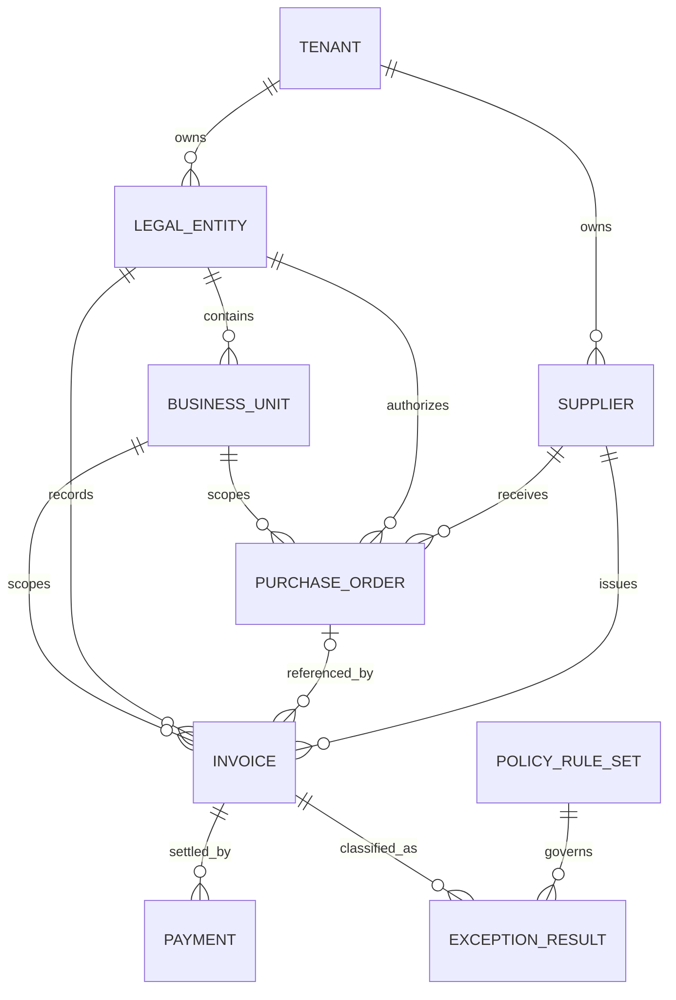

# Domain Model and Frozen Business Scope

## 1. Task type and business boundary

The canonical name is `accounts_payable_analysis.v1`. It names the business function directly,
leaves “investigation” as the governed workflow behavior, and avoids implying that invoice
approval, payment execution, or a generic finance assistant is supported.

The analysis population is invoices whose `invoice_date` falls within the inclusive Task
`time_range`, then constrained by trusted tenant, legal-entity, business-unit and supplier scopes.
Payments after the end date may be joined to those invoices at the frozen `snapshot_at`; this is
necessary to assess terms without changing the invoice cohort. Data arriving after `snapshot_at`
is outside the reproducible dataset.

## 2. Exception taxonomy

| Exception | Classification | v1 rule |
|---|---|---|
| `EXACT_DUPLICATE_INVOICE` | `IN_SCOPE_V1` | Deterministic exact key; group size at least two |
| `POSSIBLE_DUPLICATE_INVOICE` | `PLANNED_V1_1` | Requires separately evaluated explainable similarity algorithm |
| `PO_AMOUNT_VARIANCE` | `IN_SCOPE_V1` | Eligible single-invoice PO; signed and absolute variance versus controlled tolerance |
| `MISSING_REQUIRED_PO` | `IN_SCOPE_V1` | Rule requires PO and no valid approved exception exists |
| `LATE_PAYMENT` | `IN_SCOPE_V1` | One settled payment after due date |
| `MATERIAL_EARLY_PAYMENT` | `IN_SCOPE_V1` | One settled payment earlier than controlled day threshold |
| `OVERPAYMENT` | `IN_SCOPE_V1` | One settled payment exceeds invoice gross amount plus tolerance |
| currency mismatch | `PLANNED_V1_1` | v1 emits a data-quality exclusion warning; no cross-currency arithmetic |
| tax mismatch | `OUT_OF_SCOPE` | No tax-rule engine in v1 |
| vendor bank account change | `OUT_OF_SCOPE` | Bank data is deliberately unavailable to v1 |
| three-way match failure | `PLANNED_V1_1` | Requires PO lines, invoice lines and goods receipts |
| duplicate payment | `PLANNED_V1_1` | Requires multi-payment semantics |
| unapproved vendor | `PLANNED_V1_1` | Requires supplier approval history |
| split invoice / threshold avoidance | `OUT_OF_SCOPE` | Cross-record intent inference not approved |
| suspicious round amount | `OUT_OF_SCOPE` | Heuristic risk scoring not approved |
| weekend payment | `OUT_OF_SCOPE` | No business-calendar risk rule |

Detection and materiality are separate. Every qualifying record remains an `exception`; the
effective materiality rule labels it `WARNING` or `FINDING`. Materiality never suppresses an
exception from evidenced totals.

## 3. Core entities



`TENANT` is trusted platform context, not a new business table. `LEGAL_ENTITY` and `BUSINESS_UNIT`
are tenant-owned authorization dimensions. The existing `suppliers` table remains the supplier
master. `PURCHASE_ORDER`, `INVOICE`, and `PAYMENT` are operational facts in the separate enterprise
business database. `POLICY_RULE_SET` is a controlled versioned manifest, not user prompt data.
`EXCEPTION_RESULT` is a typed analytics output persisted through Calculation Evidence; it is not
an operational database table.

### Entity eligibility

- Invoice: `STANDARD`, positive `gross_amount`, supported currency, status `POSTED` or `PAID`.
- PO variance: referenced PO exists, tenant/supplier/legal entity/currency agree,
  `matching_basis=SINGLE_INVOICE`, and `approved_amount > 0`.
- Payment terms/overpayment: exactly one `SETTLED` payment and no additional non-void payment.
- Missing PO: `STANDARD` invoice with no PO; evaluated against the applicable policy and approved
  no-PO exception reference.
- Unsupported records remain in coverage counts with a reason-coded exclusion; they are not
  silently coerced into normal or exception status.

## 4. Roles and scopes

Three platform roles are sufficient for v1:

| Enterprise persona | Platform role | Default action boundary |
|---|---|---|
| AP Analyst, Finance Analyst, Procurement Analyst | `finance_analyst` | submit and inspect tasks within detailed authorized scope |
| AP Manager, Finance Manager, Approver | `finance_approver` | analyst actions plus resolve AP controlled-action approvals |
| Auditor | `finance_auditor` | read assigned tasks, Evidence and Artifacts; no task execution or approval |

Roles authorize actions; scopes authorize data. `finance:ap.aggregate` exposes only aggregate
Evidence/report views. `finance:ap.detail` permits invoice identifiers and amounts after tenant,
legal-entity, business-unit and supplier filters. `finance:ap.artifact:download` is required for
download. The auditor is aggregate-only unless explicitly granted detail. No role can approve or
execute a real invoice/payment transaction because no such tool exists.

## 5. Policy and rule model

The controlled `PolicyRuleSet` has:

```text
rule_set_id
rule_set_version
effective_from / effective_to
tenant_id
policy_document_bindings[]
rules[]
manifest_checksum
approved_by / approved_at
```

Each rule has a stable `rule_id`, `rule_version`, applicability predicates (invoice type, legal
entity, currency and effective date), deterministic values, and a binding to document ID/version,
chunk/page and excerpt checksum. The v1 rule kinds are `PO_REQUIRED_AMOUNT`,
`PO_VARIANCE_TOLERANCE`, `MATERIALITY_AMOUNT`, `MATERIAL_EARLY_DAYS`, and
`OVERPAYMENT_TOLERANCE`.

Policy documents explain scope, ownership, exceptions and formal language. The rule manifest
supplies executable thresholds. An ingestion/release consistency check must prove that every
active rule binding resolves to the exact indexed document version/checksum. A task fails
`POLICY_RULE_UNAVAILABLE` or `POLICY_RULE_BINDING_MISMATCH` rather than using stale thresholds.

## 6. Canonical output objects

`APExceptionRecordV1` contains:

```text
exception_id
exception_type
invoice_record_key
supplier_id
legal_entity_id
business_unit_id
currency
observed_values
threshold_values
status = WARNING | FINDING
rule_id / rule_version / rule_set_version
database_evidence_ids
calculation_evidence_id
reason_codes
```

The stable `invoice_record_key` is a one-way or opaque record identifier suitable for lineage. It
is not the raw invoice number. Detailed reports may display a policy-authorized masked invoice
number; aggregate views do not.

## 7. Explicitly excluded entity complexity

`purchase_order_lines`, `invoice_lines`, and `goods_receipts` are analyzed as future entities but
are not v1 tables or contracts. They become necessary only for quantity/price/tax or three-way
matching and will require a versioned migration and new templates. Multiple/partial payments and
credit notes likewise require a later settlement-allocation model. Their exclusion is a frozen
v1 choice, not an implementation placeholder.
